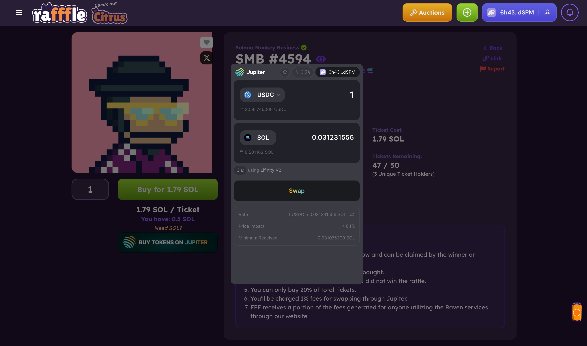

## Introduction
Calling all Jupiter Space Catdets, welcome to the Jupiter Planetary Developer Week!

We've been working really hard to bring you fantastic new features that will make it even easier for you to create amazing liquidity use cases on Solana.

This is a whole week dedicated to Solana developers, where we will unveil major improvements to our tools, just in time for the Breakpoint conference.

So, get ready to supercharge your **BUIDLing** journey with us!

## Day 1 - V6 Quoting API Official Release
Today, we are happy to announce the official release of our v6 API! This is DeFi’s most powerful and comprehensive liquidity API and will power the development of sophisticated use cases and complex DeFi processes on Solana.


This announcement comes on the heels of 2 months of relentless stability and feature-level improvements, helped immensely by key early adopters, including [Solend](https://solend.fi/), [Mango](https://mango.markets/), [Drift](https://drift.trade/), [Birdeye](https://birdeye.so/), [Hawksight](https://www.hawksight.co/), [Sphere](https://spherepay.co/), and [Kamino](https://kamino.finance/) who not just helped to iron out a lot of the kinks for any new infrastructure service, but also guided us towards specific improvements to make it possible for them to use Jupiter for their use cases.

In this article, we will go through key upgrades made for v6 to make building liquidity use cases much more powerful and easier:
- Upgrade to use the Metis Algo for higher liquidity to support key use cases
- Using shared intermediate token accounts for integration simplification and cost savings
- Token ledger for increased swap success rates
- A brand new referral fees system

In addition, we will also show advanced usage patterns, examples of how our partners are using it.

*This launch of the v6 API is part of a series of developer announcements we are rolling out to enhance the liquidity infrastructure landscape for Solana. Stay tuned!*


## Key features for V6 Quoting API

### Metis Algo As Backbone For v6 Routing

Three months ago, we launched Metis on our homepage. It's an innovative new algorithm with real time streaming and discovery, with the routing engine also completely rewritten in Rust. This heavily modified variant of the Bellman-Ford algorithm incorporates key features such as incremental route building, combined route generation and quoting, and it's also future-proofed for much better scalability as we add more DEXes and tokens.

The previous version of the API utilized an older version of the algorithm that had significant limitations. Most notably, it did not provide efficient routing for large trades, which constrained its applicability for major use cases such as margin trading and liquidations. Moreover, it employed the former JavaScript engine, resulting in inconsistent API performance.


With the v6 API now using Metis, all partners can enjoy a far higher level of liquidity for key use cases. For example, Solend which is using it for margin trading, where the trading amount is often much larger and requires deeper liquidity.

On the backend, we are constantly upgrading the API and making incremental improvements to deliver an easier, smoother and more efficient liquidity infrastructure for our partners.

### Shared Intermediate Token Accounts For Integration Simplification and Cost Savings
The idea of Shared Intermediate Token Accounts came about because there was an increasing number of intermediate token accounts to be created in order for a swap to be successful, which increased integration complexity and cost for users that needed to be addressed.

Previously:
- Integrators needed to create every single intermediate token account before integrating and obtaining quote routes, to make sure that the swaps were executed without any disruption. Any token accounts that were missed out would lead to swap errors.

- In Solana, an account rent fee is incurred for every Solana account to store data on the blockchain. With a large number of intermediate token accounts to be created per protocol, users incur a sizable amount of rent.

With the Shared Intermediate Token Accounts, Jupiter creates and maintains a set of Associated Token Account *(ATA)* contracts for intermediate token accounts. These shared accounts are global and shared among all protocols and partners integrated with Jupiter. Integrators now only need to ensure they have the final output token account to receive tokens for every swap.

On top of this, OpenBook Open Orders accounts are no longer required as well, because all orders accounts are also globally initialized and shared amongst integrators.

For instance, when swapping from Token A → Token B → Token C, instead of having to create accounts for Token B and Token C, integrators will only need to set up for the final out token *(Token C in this case)*. Any intermediate tokens in between, regardless of the number of token hops, are automatically initialized and managed by Jupiter’s pre-established shared token accounts.

Creating individual token ATA accounts incurs account rent fees, which accumulate over time due to the growing number of intermediate tokens. With fewer intermediate token accounts required, users benefit from not having to incur account rent fees for maintaining their individual token ATA accounts with each protocol they swap on.

We also see a much simpler integration process for partners and integrators, as the need to create and manage numerous intermediate token ATA accounts via route maps is eliminated.

Integrators can also better compose swap instructions that fit within a single transaction size limit, as the number of accounts to pass through in each instruction is streamlined with these shared ATA accounts.

### Token Ledger For Increased Swap Success Rates

It is very important to have a good swap success rate for a great experience for users as well as integrators. Token Ledger was developed because the common way of relying on simulation to facilitate swaps is not always reliable and can lead to swap failures especially during times of market volatility. A method that is based on actual amounts transacted, and combined into a single transaction is greatly needed, leading to the birth of The Token Ledger.

The Token Ledger is a collection of three instructions *(Set Token Ledger, Send Instruction, Swap Instruction)* that consolidate withdrawal and swap instructions into a single transaction. Integrators/partners can now effortlessly instruct a swap to be executed based on the actual sent amount, after taking into account fees and slippages.

Before the introduction of the Token Ledger, swap instructions relied on a simulation-driven approach to approximate the amount deducted from a user's wallet to facilitate the swap. This estimation approach often ended up with discrepancies between the estimated and actual amounts, especially during periods of market volatility with high slippages, leading to swap failures.

Consider this scenario where a user intends to withdraw 1,000 USDC from Meteora’s USDC vault into wBTC. Note that users hold vUSDC LP tokens in Meteora vaults.

1. In the first instruction, the Token Ledger will verify and record the user’s initial USDC balance within their wallet. For the purpose of this example, let’s assume the initial balance is 100 USDC.
2. In the second instruction, an amount equivalent to 1,000 USDC in vUSDC is withdrawn from Meteora vaults into USDC, and we examine the user’s balance. Due to factors like slippage, the USDC balance is found to be 1090 USDC.
3. For the third instruction, subtracting the initial 100 USDC from the current 1090 USDC balance, it’s evident that the user has effectively withdrawn 990 USDC, which will then be utilized to swap for wBTC as the final output token.

Without the Token Ledger, the previous swap method relied on estimated amounts, which could fluctuate due to market volatility and performance variations, frequently resulting in suboptimal user experiences.

With the Token Ledger, integrators can issue swap instructions based on actual amounts that have taken into account slippage and related fees. This eliminates the need for simulation and significantly increases the success rate of swaps, all within a single transaction.

The Token Ledger caters to a wide range of use cases, which include but are not limited to:

- Withdrawing assets from a protocol to any desired token, such as converting to USDC from a wBTC vault.
- Supporting protocols that transition positions to a different token from their original position, as seen in Perpetuals.
- Facilitating the exchange of NFTs for tokens other than SOL.

Read more about the Token Ledger:
https://station.jup.ag/docs/apis/swap-api#using-token-ledger-instruction

### Referral Fees Program to Simplify Fee Collection
In our pursuit of making life easier for our partners, we've streamlined the process of charging referral fees with the new referral fees program.

In the past, setting up referral fees for our partners was not straightforward. Distributing referral fees to Referrer A and Jupiter required adding two more accounts to the instruction. It was also challenging to accommodate varying percentages of referral fees for different partners, needing to pass more accounts into the instruction to calculate these fees.

The motivation behind building the referral fees system was to automate the process of calculating all these fees, while providing a user-friendly interface to set up referral accounts and claim the referral fees collected.

#### Referral Fees System Features
- Set up referral accounts with Jupiter via a simple interface requiring only a few clicks.
- Only 1 single referral account is needed across the different Jupiter products.
- Checking on the total fees collected across the token accounts with an easy button to claim them

The partner journey is now hyper easy - They head over to Jupiter, create a referral account, and then plug the referral account parameters into their integration. It's that simple!

Give our dashboard a spin here: https://referral.jup.ag

Read here on how to add your platform fees to Jupiter Swap : https://station.jup.ag/docs/apis/adding-fees

More info on Jupiter Referral Program: https://station.jup.ag/docs/additional-topics/referral-program


## Performing Advanced Swaps with Jupiter v6

### Cross Program Invocation (CPI) & Flash-fill
The Cross Program Invocation (CPI) and Flash-fill are two approaches to integrate Jupiter swap with your protocol. In Jupiter v6 API, we have made CPI calls much easier to use by turning transaction payload into instructions for API users.

#### CPI Approach
To better understand how to swap via CPI, let us walk through an example of utilizing Jupiter Swap via CPI to swap from any tokens to SOL even if the user has insufficient SOL.

For CPI to work, the transaction will be composed of these instructions:
1. Borrow enough SOL from the program to open a wSOL account that the program owns.
2. Swap X token from the user to wSOL on Jupiter via CPI.
3. Close the wSOL account and send it to the program.
4. The program then transfers the SOL back to the user.


Read more here: https://station.jup.ag/docs/apis/cpi

The CPI approach is not without its limitations - because of Solana’s transaction limit of 1232 byte size, lookup tables cannot be used within a CPI call, swaps via CPI can fail at runtime since Jupiter routes may involve multiple DEXes in order to reduce price impact. Instead, we recommend taking the “flash-fil” approach to utilizing Jupiter Swap.

#### Flash-Fill Approach
The “Flash-fill” approach is a way to integrate your program with Jupiter swap without the limitations of CPI. Flash-filling allows the use of Versioned Transactions in combination with Address Lookup Tables to include more accounts per transaction while keeping within the 1232 bytes limit.

To understand the Flash-Fill approach, we will walk through the same example of utilizing Jupiter swap via Flash-Fill to swap from any token to SOL even if the user has insufficient SOL. Note that Flash-Fill can facilitate swaps from any token to any token, not limited to SOL.

For Flash Fill to work, the transaction will be composed of these instructions:
1. Borrow enough SOL from the program to open a wSOL account that the program owns.
2. Create the wSOL account for the borrower.
3. Swap X token to wSOL
4. Close the wSOL account and send it to the borrower.
5. Repay the SOL for opening the wSOL account back to this program.

This approach entirely bypasses the need for CPI calls, effectively sidestepping the constraints imposed by CPI.

To delve deeper into these two approaches, check out our documentation here: https://station.jup.ag/docs/apis/flash-fill

## Partners Using v6 API
A big shout out to our key early adopters for running our v6 API and helping us improve our stability and features. Check out how they are using Jupiter to power their use cases.
- [Drift](https://drift.trade/) leveraged swaps utilise the power of “flash loans” to allow traders to increase their spot buying or selling potential by up to 5x. These leveraged swaps are powered by Jupiter, to find the best price routes and get access to deep liquidity across Solana.
- [Solend](https://solend.fi/) Margin Trading is an extension of their lending where it combines flash loans, swapping, and depositing the proceeds back into Solend all in a single transaction. The trading view features a swap UI powered by Jupiter.
- [Birdeye](https://birdeye.so/) is an on-chain trading data aggregation platform that utilize Jupiter Swap for all SPL tokens including the latest Token2022. With the latest v6 upgrade, it offers more improved speed that enhances trading experience on Birdeye.
- [Hawksight](https://www.hawksight.co/) integrated Jupiter v6 for their auto-swap deposits, making it super easy for users to maximise yield through auto-compounding and auto-rebalancing their LP positions efficiently.
- [Ultimate Wallet](https://ultimate.app/) integrated Jupiter into their native in-wallet swap. With the upgrade from v4 to v6, Token2022 is fully supported and the latest Metis algorithm expanded the price routes, enabling their users to swap over the widest range of tokens and access even better price quotes for their users.
- [Sphere](https://spherepay.co/) is a payments platform and API for digital currencies, where businesses can start accepting card, ACH, wire, stablecoins, and other digital currencies in a single universal checkout page. Jupiter provides the swap infrastructure for the built-in token swap.
- [Sollinked](https://sollinked.com/) is a social app designed for gated communities, offering a platform for newsletters or "paid" email inboxes that can be prioritized through incentives. Sollinked utilizes Jupiter to facilitate payments for emails and reservations using all SPL tokens.

## Day 1 Ending Notes
**Jupiter’s goal is to provide the best possible liquidity infrastructure for Solana.**

With this major v6 upgrade, we are confident we have taken a major step in this direction. As always, we would love feedback and your thoughts on how we can improve, please join our feedback conversations on [Discord](https://discord.gg/jup)!


<!-- **Stay tuned for Day 2 of the Jupiter Planetary Developer Week where we are going to talk about Jupiter and payments!** -->

---


## Day 2 - Jupiter for Payments v2
Today, we are thrilled to dive into the world of Jupiter for payments, where we will introduce you to the upgraded ExactOut API. Join us as we delve into the improvements we have made to our ExactOut API, and how we have been facilitating online and offline payments in recent months.

A big shout out to [**Sollinked**](https://sollinked.com/), [**CandyPay**](https://candypay.fun/), [**Sphere**](https://spherepay.co/) and [**Helio**](https://www.hel.io/) for integrating Jupiter swap into their payment systems. These are super exciting times as we break down the barriers separating the world of crypto from traditional finance.

So, without further ado, let's get started!

## ExactOut v2 API to Power Payments
ExactOut is an important feature, particularly in supporting payment use cases within any ecosystem. Jupiter's ExactOut API allows users to specify the precise amount of output tokens they require, with the input token amount being calculated accordingly. For instance, with ExactOut integrated, a protocol’s user can indicate they wish to receive exactly 100 USDC in exchange for SOL via Jupiter, instead of having to manually calculate and input the amount of SOL required to swap for an approximate amount of 100 USDC.

In the initial release of ExactOut v1, we could only support direct routes, limiting token selection and routing options that can be used. However, in Jupiter v6 API, our program has been updated to conduct on-chain calculations, thus enabling multi-hop routes for ExactOut v2.

This upgrade significantly broadens the range of supported routes from around 20 to over 400 trading pairs, enhancing route options and price selections. With 20 times more available price routes, aggregated across our partner platforms like Raydium and Orca, users can expect considerably better prices for their ExactOut swaps.


### How ExactOut is used
ExactOut is particularly useful in scenarios involving the purchase of NFTs, allowing users to make payments with any tokens they possess. To illustrate, let's consider a situation where an NFT Marketplace has integrated ExactOut on its platform. You wish to buy your favorite NFT which is priced at 40 SOL, but most of your liquid assets are in BONK. Without ExactOut, you would need to estimate the amount of BONK required to obtain 40 SOL and manually swap on an external platform to convert BONK into SOL.

The good news is that since the NFT Marketplace has integrated ExactOut into its interface, you can simply purchase the 40 SOL NFT and Jupiter swap would automatically calculate the most optimal amount of BONK required to purchase the 40 SOL NFT. This is achieved in a single click, eliminating the need to leave the site or perform additional calculations, while ensuring that you receive the best possible price through Jupiter.
This is extremely important to Solana as payments are a crucial part of bridging crypto with real-life applications, ultimately contributing to the mainstream adoption of the Solana ecosystem.

Read more about ExactOut here: https://station.jup.ag/docs/apis/payments-api

### ExactOut Showcase #1 - Sollinked

Sollinked is a social app designed for gated communities, offering a platform for newsletters or "paid" email inboxes that can be prioritized through incentives. Sollinked utilizes Jupiter to facilitate payments for emails and reservations using all SPL tokens.

See how Sollinked users make payments with various SPL tokens to bump up their newsletters and emails, even though payments are primarily denominated in USDC. This is possible through the integration with Jupiter ExactOut.


### ExactOut Showcase #2 - CandyPay Coffee

Candy Pay has integrated Jupiter to power built-in swap transactions to facilitate payments in SPL tokens. Users can now make purchases with any token they have in their wallets.

Check out this demo of a user buying a cup of coffee priced in USD with their SAMO tokens. How cool is that!

https://twitter.com/JupiterExchange/status/1638799925348794369


### ExactOut Showcase # 3 - Helio

Helio, the leading payments app for Solana, powers sales for +3,000 creators & merchants who sell NFTs, digital content, e-commerce and more with the power of blockchain payments. Helio partnered with Jupiter to power seamless token swaps inside the Helio checkout flow. Buyers can spend SOL or any token, while merchants always receive USDC or their asset of choice.

`"The future of commerce is based on lightning fast blockchain payments and one of the key advantages is that buyers can spend any token while merchants instantly receive their own currency of choice. Jupiter has abstracted the complexity of a DEX and given us a few simple lines of code to help us deliver on this promise"` **CTO - Jim Walker**


### ExactOut Showcase # 4 - Sphere Pay
Sphere is an end-to-end payments API for digital currencies, offering on-ramp, multi-chain and fiat payments, to off-ramp in a single integration.

Sphere uses Jupiter to enable “universal settlement”, where customers can pay in whichever currency they want, and merchants will receive any currency of their choice — with Jupiter handling the ExactOut swap behind the scenes at the best possible rates.

Here is an example of how Sphere users can select to pay in any currency of their choice, with merchants receiving any currency they wish. Thanks to v6, these swaps are blazing fast, and shared ATAs and versioned transactions/lookup tables allow all of this to be bundled into a single transaction.


### Ending Words

With Jupiter providing the essential infrastructure support for payments, we see Jupiter playing an important role in helping support the payment and fees infrastructure of Solana.

If you have any feedback and product improvements, do feel free to swing by and share them on our [**Discord**](https://discord.gg/jup)!

<!-- **Stay tuned for Day 3 of the Jupiter Planetary Developer Week where we are going to talk about the much anticipated Terminal v2!** -->

---

## Day 3 - Jupiter Terminal v2

Today we will be unveiling the brand new Jupiter Terminal V2! It is the smallest, fastest and easiest way to add Jupiter to your dApp with just a few lines of code!


A big shout out to [**Meteora**](https://app.meteora.ag/), [**MarginFi**](https://www.marginfi.com/), [**FamousFoxFederation**](https://famousfoxes.com/) and [**Bonk**](https://www.bonkcoin.com/) for being one of the early adopters of Terminal V2, seamlessly implementing swap functionality for their users without the need to navigate away from their pages.

In this update, we will go through key upgrades made for Terminal v2 to make implementing swap functionality for your dApp better, easier and just more fun:

- Terminal v2 is now equipped with the latest v6 API, featuring Metis
- Cross app state sharing with Jupiter Terminal
- Unified Wallet Kit integration
- Fee support for partners and integrators
- Improved UX enhancements

Let’s dive in!


### What’s new in Terminal V2
Terminal is a very popular way to integrate Jupiter into various platforms and applications, enabling protocols to seamlessly implement swap functionality for their users. It is also super easy to customize, from configuring input/output mint states, exact output mode, displaying tokens from Jupiter’s strict token list, all these are toggled on and off with just a few clicks to generate the code snippet.

Here are the details of what’s new in v2:

- Jupiter Terminal v2 is upgraded to v6 API that is running Metis, bringing to you the most powerful price quote engine for the best prices and best token selection, with the best user experience.

- We introduce cross app state sharing with Jupiter Terminal through the new syncProps() API function:
    - Starting with wallet Passthrough, syncProps() API will make sure your wallet states are always in sync, and Terminal can also callback to your dApp to request for wallet connection.
    - We are actively working on implementing cross-app state syncing for slippage, verTx, priority fees, as well as input mint and amount.


```js
import { useWallet } from '@solana/wallet-adapter-react'; // Or @jup-ag/wallet-adapter;

const passthroughWalletContextState = useWallet();
useEffect(() => {
  if (!window.Jupiter.syncProps) return;
  window.Jupiter.syncProps({ passthroughWalletContextState });
}, [passthroughWalletContextState.connected, props]);
```

- Terminal v2 is using the [Unified Wallet Kit](https://unified.jup.ag/) - an open-sourced wallet adapter, that incorporates wallet standards and passthrough wallet capabilities. It seamlessly interfaces with many well used wallets out there, to give the best wallet experience for your users.

- Jupiter Terminal now offers fee support for partners and integrators. Partners can choose to enable platform fees on top of the swaps. To facilitate this, partners need to create token fee accounts to begin collecting platform fees. The Jupiter Referral Dashboard allows partners and integrators to monitor and claim these fees conveniently.

- We have also enhanced the user experience by implementing additional error and warning messages to guide users. There is now a built-in RPC monitor that notifies users of any RPC abnormalities or degradation in the Solana network.


### Terminal Showcase
Check out this mini showcase of how our partners have integrated Terminal to provide swap functionality for their users:

#### Terminal Showcase #1
[Meteora](https://app.meteora.ag/)'s mission is to grow liquidity on Solana by building dynamic liquidity protocols - including stablecoin liquidity, LST liquidity and multi-token pools. Idle capital is dynamically distributed to various lending protocols to earn additional yield on top of swap fees and rewards. Meteora’s keeper - Hermes will continuously watch lending pool utilization rates and reserve levels, ready to withdraw the funds for safety.
Terminal v2 has been integrated on Meteora via the widget approach to let their users easily swap on-site for the required tokens to participate in liquidity provisioning.


#### Terminal Showcase #2
[FamousFoxFederation](https://famousfoxes.com/), an NFT and gaming project, offers raffles and sweepstakes to participate in their NFT events. Users are able to both auction and trade their NFTs through raffle events, as well as stand a chance to win NFTs through the sweepstakes.
FamousFoxes has seamlessly integrated Jupiter Terminal into their raffle platform via the Modal approach to let their users stay on the site and effortlessly swap for the tokens required to buy the raffle tickets.



#### Terminal Showcase #3
[MarginFi](https://www.marginfi.com/) is one of the leading lending/borrowing protocols in Solana. It offers users a comprehensive platform where they can seamlessly borrow, lend, and even stake SOL for LSTs – all within a unified environment.
MarginFi integrated Jupiter Terminal via the Integrated mode, rendering the swap as part of its dapp, on a dedicated page. Their users can stay on the site to also swap their tokens on top of participating margin trading.


### Ending Words
Terminal v2 is like the magic wand for adding swap superpowers to your Solana dApp in the most hassle-free and elegant way. If you haven't given it a spin yet, now's the perfect time to unlock its awesomeness and inject some fun and additional functionality into your project!

https://terminal.jup.ag/

<!-- Stay tuned for Day 4 of the Jupiter Planetary Developer Week where we are going to introduce the Unified Wallet Kit! -->

---

## Day 4 - Unified Wallet Kit

Today, we will be introducing the [Unified Wallet Kit](https://unified.jup.ag/), which was born out of our desire to help developers build more easily on Solana, fast tracking through all the challenges we faced in trying to support the majority of the wallets out there and building a great wallet UI/UX.


Unified Wallet Kit is an open-sourced, Swiss Army Knife wallet adapter, striving for the best wallet integration experience for developers, and best wallet experience for your users.


Along with [Terminal](https://terminal.jup.ag/), it's the fastest way to get started on Solana.

Let’s learn how.

### Unified Wallet Kit to make BUIDLing Easier

To bootstrap a dApp with a wallet, we often find ourselves repeating the same setup, such as getting the various wallet adapters (both Solana Wallet Standard and custom wallets) installed, building notifications for wallet state (selected, connected, disconnected etc.), auto-reconnecting to the last connected wallet, adapting to a mobile-first responsive design, theming etc., over and over again.

This is our biggest motivation in building the Unified Wallet Kit - to have all these essential yet repetitive basic building blocks provided in a simple package that anyone can just plug and play.

Being one of the most used dApps on Solana, where we facilitate the majority of liquidity exchange in the ecosystem, we built our own world-class wallet adapter to support the majority of wallets for access to this liquidity. This wallet adapter includes all the important blocks mentioned above and more, to provide users with the best wallet experience.

Now, we want to give back to the developer community. We hope that by bringing our world class wallet adapter open-source, we will allow any developers to fast track and bootstrap their projects in no time!

### Features of Unified Wallet Kit
- Main ESM bundle at a compact 94KB (~20KB gzipped)

- Built-in Wallet Standard, Mobile Wallet Adapter support

- Abstracted wallet adapter, with a Bring Your Own Wallet (BYOW) approach where you can select the wallets your dapp wishes to support. This allows you to add custom and legacy wallets.

- Mobile responsive

- Smart notification system where you can either plug in your own notification system or use it by itself. This notification system does not interfere with your dapp.

- Internationalization with language support for English, Chinese, Vietnamese, French, Japanese, Bahasa Indonesia and Russian

- Theming - select from light, dark and Jupiter modes. More customisation to come.

- Pluralization for i18n

- New user onboarding

The Unified Wallet Kit will allow integrators to very quickly enable these features and let wallets connect to their dApps with only a few lines of code. It can’t get any easier than this.


Similarly with Terminal, the live playground is available at https://unified.jup.ag. Come swing by and check it out.

### Quick Notes on Unified Wallet Kit

1. Unified Wallet ships with WalletStandard and Mobile Wallet Adapter by default as we echo the push for the Wallet Standard specification. However any additional wallets or custom implementations can still be added easily with the Bring Your Own Wallet (approach) so that it does not bloat your dapp.

2. We understand that different dapps have their own notification implementation, therefore the notification system is optional and can be plugged in with your existing notification system.

3. The Unified Wallet Kit is currently used on [Meteora](https://www.meteora.ag/), do give it a spin.


### Ending Words
Jupiter is dedicated to help make BUIDLing easier for everyone. Developers should have zero friction building on Solana, we believe that having this great developer experience is important to help attract even more brilliant people to come build together and drive innovation. This is just the beginning, and we are excited to introduce more open-source projects in time to come.

Let’s keep moving forward together!

<!-- **Stay tuned for Day 5 of the Jupiter Planetary Developer Week where we are going to delve into the world of Jupiter for Gaming, announced in collaboration with MagicBlock.** -->

---

## Day 5 - Jupiter Gaming Unity SDK


Today, we are excited to delve into the world of Jupiter for gaming, where we will look at how Jupiter has been facilitating in-game swaps and enabling gaming use cases through the integration with the [Solana.Unity-SDK](https://solana.unity-sdk.gg/), developed by the talented team at MagicBlock. This post is brought to you in collaboration with [MagicBlock](https://www.magicblock.gg/).

Live Demo: https://magicblock-labs.github.io/Solana.Unity-SDK/


**In this post, we will learn about:**
- Why Solana is the major blockchain for on-chain games
- Solana.Unity-SDK and its main features
- Jupiter’s role in supporting gaming, use cases that the Jupiter x Solana Unity SDK powers, and a partner showcase

Before anything else, a big shout out to [Star Atlas](https://staratlas.com/), [Guac](https://www.guacamole.gg/),[Genopets](https://www.genopets.me/), [DefiLand](https://defiland.app/) and [FamousFoxes](https://famousfoxes.com/) for integrating Jupiter and enriching the gaming experience of their users, by providing a seamless and immersive swap experience.

Without further ado, let’s dive in.


### Solana, the major blockchain for on-chain gaming

On-chain games are introducing a paradigm shift in the way players interact, own and experience new forms of entertainment. It’s no surprise Solana stands out as a major blockchain for on-chain gaming, thanks to its high throughput, low transaction fees, and robust ecosystem. Its ability to process thousands of transactions per second ensures that gamers experience minimal latency, creating a seamless and enjoyable gaming experience.

Furthermore, Solana’s vibrant community and extensive developer tools make it an attractive platform for game developers of all sorts, from those looking to infuse their game with on-chain assets to the ones pushing the boundaries with fully-on-chain games.

Solana is also designed to be interoperable with other blockchain networks. This means game developers can easily add Solana-based games to other blockchain platforms, allowing for seamless user experience.

As the gaming sector grows, Solana is poised to take the lead in on-chain gaming over all the other chains.

### Solana Unity SDK and its main features

[**MagicBlock**](https://www.magicblock.gg/), the team behind the Solana Unity SDK, is an end-to-end infrastructure provider for on-chain gaming on Solana, empowering developers to create a new category of composable and permissionless gaming experiences.

The Solana Unity SDK simplifies the integration of Solana-based NFTs, tokens, and on-chain programs into Unity games, making it easier for game developers to create web3 games and experiences.

**Some features of Solana.Unity-SDK:**

- Full JSON RPC API coverage
- Transaction and message decoding/encoding from base64 and wire formats
- Non-custodial Solana wallet setup in Unity, supporting Solana Wallet Adapter (Phantom, Backpack, Solflare...) and Web3auth (Social login)
- TokenWallet object for sending and receiving SPL tokens and JIT provisioning of Associated Token Accounts
- Additional capabilities include NFT support, compiling games to xNFTs (Backpack), native DEX operations (Orca, Jupiter), and websockets for custom events, along with Solana Mobile Stack support


With the Unity-SDK game developers can easily create seamless onboarding flows with wallets, social authentication and gasless API. Now, they can also provide a seamless trading experience with Jupiter swap!

Give the SDK a spin here: https://github.com/magicblock-labs/Solana.Unity-SDK

### Jupiter x Solana.Unity-SDK Native Integration to Power Gaming

As the liquidity infrastructure of Solana, Jupiter provides the best rates and deep liquidity from across the ecosystem. This is important in gaming contexts where gamers trade in-game assets frequently, especially rare assets that are very valuable. The best prices and higher liquidity makes it much easier for the gamers to stay within the game to trade these assets, improving the overall gaming experience.

Jupiter is natively supported in the Solana.Unity-SDK and runs the v6 Quote API and ExactOut v2 API for the best swap prices.

The integration features:

- Utility methods to easily retrieve tokens information, get swap quotes and perform swaps. Game developers can easily integrate Jupiter swaps in their games and compile cross platforms without changing a single line of code.
- A native integration that ensures a smooth and uninterrupted game experience for the players where users can exchange assets from the game UI, without annoying popups or embedded iframes.
- Furthermore, you can effortlessly combine Jupiter with other instructions through the SDK, such as Session Keys, which eliminates the need for manual transaction approvals and ensures uninterrupted gameplay.

This integration caters to a wide range of use cases, which include but are not limited to:
- Marketplace purchases
- In-game payment with any coin
- Asset swaps
- Gamified trading experiences

Ready to include Jupiter into your game? Check out the docs here: https://docs.magicblock.gg/SolanaUnitySDK/guides/jupiter

### Showcase - DeFi Land

[DeFi Land](https://defiland.app/) is a multi-chain agriculture-simulation game created to gamify Decentralized Finance. While there are games that make use of the blockchain, DeFi Land takes DeFi as a whole and aggregates the various actions that can be taken on each DeFi platform and turns them into an interactive game that can be played.

Check out how Defi Land has integrated Jupiter to power their in-game Market, taking the entire experience of DeFi swaps to the next level.


DeFi Land is built with the Unity Engine 2021.2.1 and uses the IDexAggregator interface in the SDK to create their Market.

The interface provides convenient methods for performing swaps and accepting payment - while working seamlessly on any platform. Most notably, DeFi Land is also available as xNFT where players directly leverage Backpack to perform in-game swaps, powered by Jupiter.

### Ending Words

Jupiter is Solana's liquidity hub, offering the best prices and deep liquidity, strongly supporting diverse use cases and enhancing the gaming experience. We believe that Solana is the best place for web3 gaming, with amazing infrastructure support from teams like MagicBlock with their Solana Unity SDK, the perfect foundation for game development.

**We can’t wait to see the brilliant game creations of the builders of Solana!**

---

This marks the end of our inaugural Jupiter Planetary Developer Week. It was an amazing week of developer focused updates where we unveiled the spanking new v6 API with Metis for routing, Referral Fees System for easy fee management, ExactOut v2 for Payments, Terminal v2 for the easiest way to integrate Jupiter, Unified Wallet Kit for the best wallet integration experience and showcasing Jupiter for games. We are committed to making things easy for you to create awesome liquidity use cases.

All these just in time for the Breakpoint Conference happening next week! Thanks for following through all days of our massive update, we hope you had supercharged your BUILDling journey with us.

**Come talk to us and join our upcoming talks at Breakpoint**


