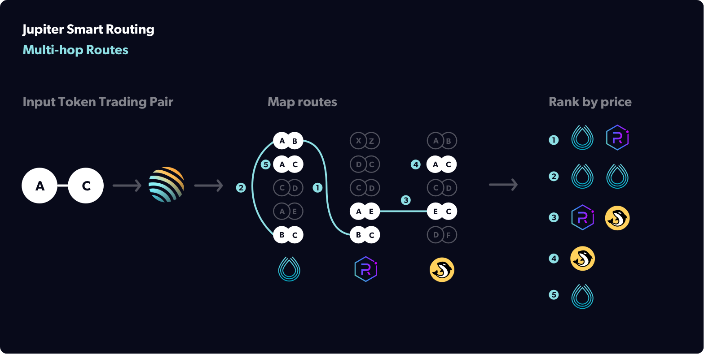
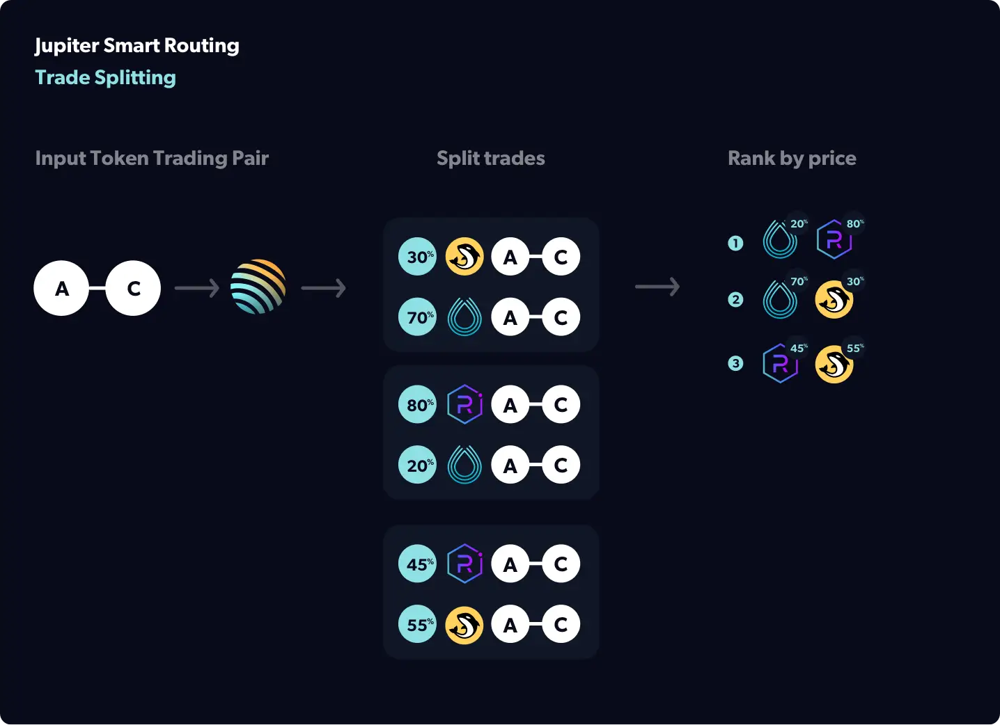

# How Does Jupiter Work?

## Under the Hood

The price for a token can change quickly at any point in time. So the best priced trade is not always on one DEX and may involve a combination of trades across many DEXes.
Here are some key features for how Jupiter discovers the best priced trades.

## Smart Routing

Jupiter directly connects all DEX markets and AMM pools together no matter the provider and will find all direct and multi-hop routes between any two tokens on Solana.

### Multi-hop Routes

Not only does Jupiter compare the prices between markets on different DEXes but often the best priced routes are not direct markets. Instead, Jupiter may find the best price by routing through an intermediary token, e.g. *USDC-mSOL-SOL* instead of *USDC-SOL*. This may be due to price inefficiencies and/or volatility in the various markets that Jupiter routes through.

### Trade Splitting

Jupiter will split your trade into smaller trade sizes. For example, if you want to make a 100 USDC-SOL trade, it may distribute your trade into a 30 USDC-SOL trade on Raydium and a 70 USDC-SOL trade on Orca. The % distribution of the trades is dynamically determined to give you the best price. Trade splitting helps get better prices for large size trades and trades with tokens where there is shallow liquidity spread out across a number of DEXes.

## Other Key Features of Jupiter

### Automatically lists new tokens

The number of new tokens being added is increasing at an ever faster pace. Jupiter automatically lists any tokens as long as their have [reached enough liquidity](/docs/get-your-token-onto-jup). This means you can be assured that you'll be able to trade new tokens as they launch on Solana.

### Automatically lists new markets

The number of markets and liquidity pools that are launching is also increasing. Jupiter automatically picks up any market or pool for any of the DEXes it currently aggregates. This ensures that Jupiter always has the latest liquidity for any token that is listed as soon as it is available.

### Swap in single transaction

Jupiter has worked to optimize its swap aggregation so that it all fits with the transaction limits so that swapping can be done in one transaction. This is important to handle cases where the price for the token you are buying has changed and no longer fits your slippage limit. If Jupiter cannot make the trade with your slippage limit, it will rollback the transaction and return an error.

### The basic flow

1. User enters in the **tokens they want to trade**.
2. User enters in the **amount of tokens** they want to trade for.
3. Jupiter **calculates out all the possible routes** for the token trade.
4. Jupiter **fetches the quotes** for each of those routes and returns the amount of tokens you will receive per route. This includes all fees.
5. Jupiter **ranks each route** by most tokens you will receive.
6. User can select any route but the first route offers the most tokens.
7. User clicks to trigger a swap.
8. User approves the Jupiter transactions from their wallet
9. Jupiter executes the trade.