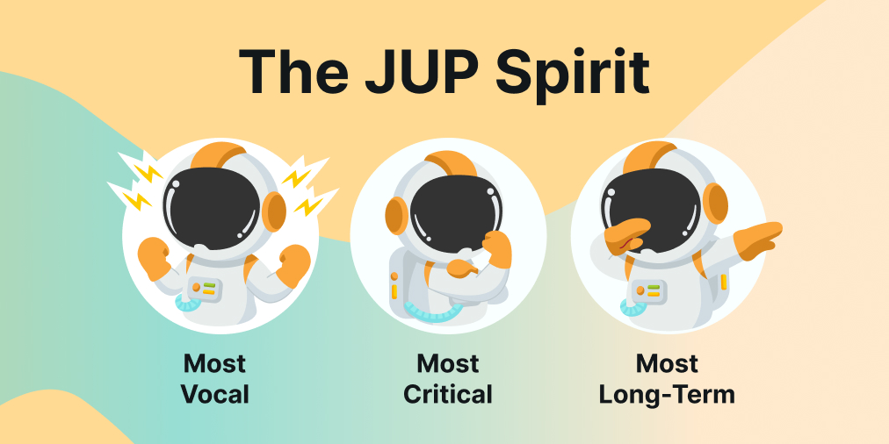

We spent the last 2 weeks sharing an ethos for Jupiter’s community and debated how we can best rally and recognize what is important to us. You showed up with passion and ideas. And together, we thought really hard as a community about what matters to us. 

The essence of why community is important is captured here: Without a community, we are just a website and code, much like how the body is just flesh and blood. The soul gives us life, and the community brings Jupiter alive.

<!--truncate-->

---

## The JUP Spirit

With that in mind, we are excited to unveil the JUP Spirit! It will be the guiding force behind our community as we work together to bring decentralized liquidity to everyone.

**Most Vocal, Most Critical, Most Long Term**

Yup. The JUP Spirit may be simple but it covers so much of what we care about. It captures the essence of being there for Jupiter in the most helpful and genuine way. This is also a massive improvement over the first draft, pointing to the importance of community in co-creating a vision with us.

Just like how the JUP Promise of Best Tokens, Best Price and Best UX helped us to create one of the top products in DeFi, the JUP Spirit of Most Vocal, 
Most Critical and Most Long-Term is a rallying cry to create one of the most active and helpful communities around!

**Most Vocal:** A vocal community does what they can to support and spread Jupiter far and wide. After all, what’s the point of building something great if no one knows about it? Yes, go forth and activate all of the viral dark arts you know.

**Most Critical:** It is very difficult to build a leading aggregator and to stay ahead. The community is out there and we need all of your eyes and ears to help us be the very best. We hope you can give us feedback on all kinds of issues, large or small.

**Most Long-Term:** So much of crypto is plagued by short-termisms – in tokenomics, product and more. We don’t like that. We want to build the most sustainable product and organic community that gives a shit regardless of whether the market is up or down, left or right.

---

## Unleashing The Jup Spirit

Now that we spent a very productive 2 weeks discussing the JUP Spirit, we are focusing the next 2 weeks on working out how we can unleash the JUP Spirit in our community!

Here’s what you can look forward to:

**1/ Discord Revamp:** To make it easier for you to participate, we will cut back on some channels that are no longer relevant and open some new ones. It’s day 1 again!

**2/ New Experimental Activities:** We will pause our current set of events (quizzes, weekly winners) to make it easier for new community-led activities in line with the JUP Spirit to arise.

**3/ Rework of Roles:** We will begin to rework roles and incentives to recognize and reward our people, starting with folks who are the most JUP Spirited. 

**4/ Updated Community Content:** We will refresh some content like FAQs and invite you to help. 

To kick off this new period, a community call will be held **this Friday, 2pm UTC on our discord** to celebrate the very beginnings of our JUP Spirit bonfire!! It will be a chat with friends and not a 1-way speaking street, so we hope you come and participate actively.

# Buckle up Jupinauts
Together, we hope to build a Jupiter that belongs to all of us. This is the start. 

And yes, this is alpha and financial advice. 

**Let's UNLEASH the JUP Spirit! (🦄​ ,🪐​)**

---

*P.S.: Shout out to these amazing people who contributed to the conversation! We are so, so happy to meet and hear from you.*

**THANK YOU** *pixel, cryptoRon, Humprey1 | Jupiter, LJQZZZ, scot, Surime, thimerosa, binlxyz, Timoon_21, Bentley, tikijiu | Jupiter, Aremia Vincenzo, dendaMx0, freaky, MANHJUPI, Surime, Drswagoon, Morty | from Jupiter, yukaz, UP | Jupiter, Zhing Richard, !spice, silver | popbone, snow, tralava, bruda.sol, sadovnik, msNik,  clara, Stand, Loyal, Optimus prime, abuwazir, zeck, ushenry, smarty, poopo, lucha, Peterpan, hopper255, summertime, Poseidon, akashc8, Belami, jentelo*