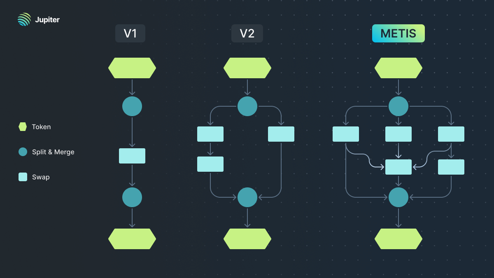
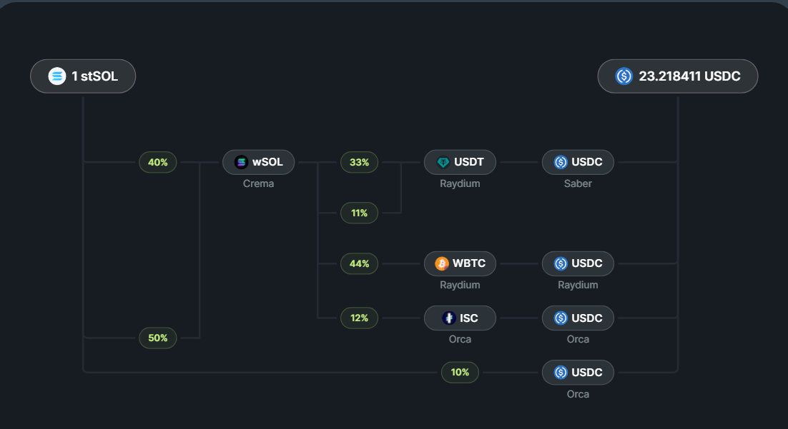
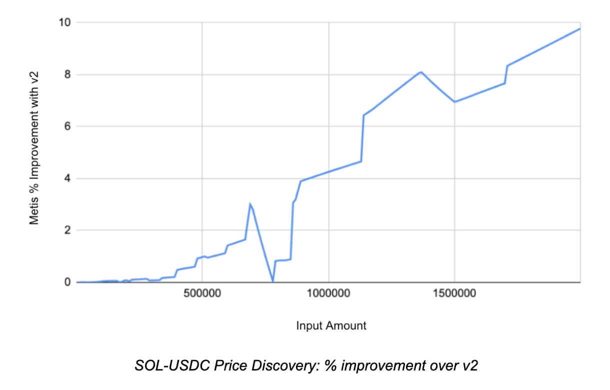
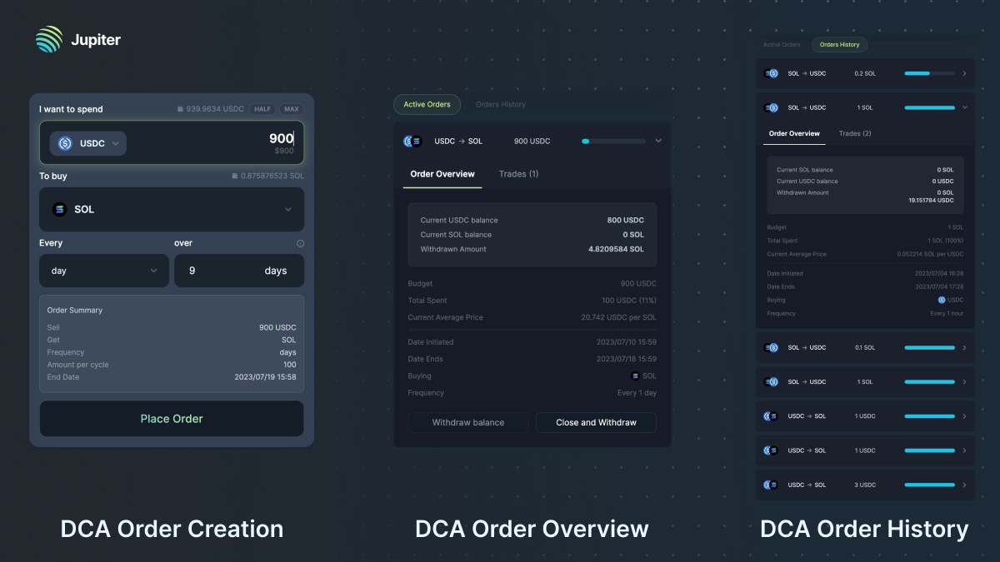
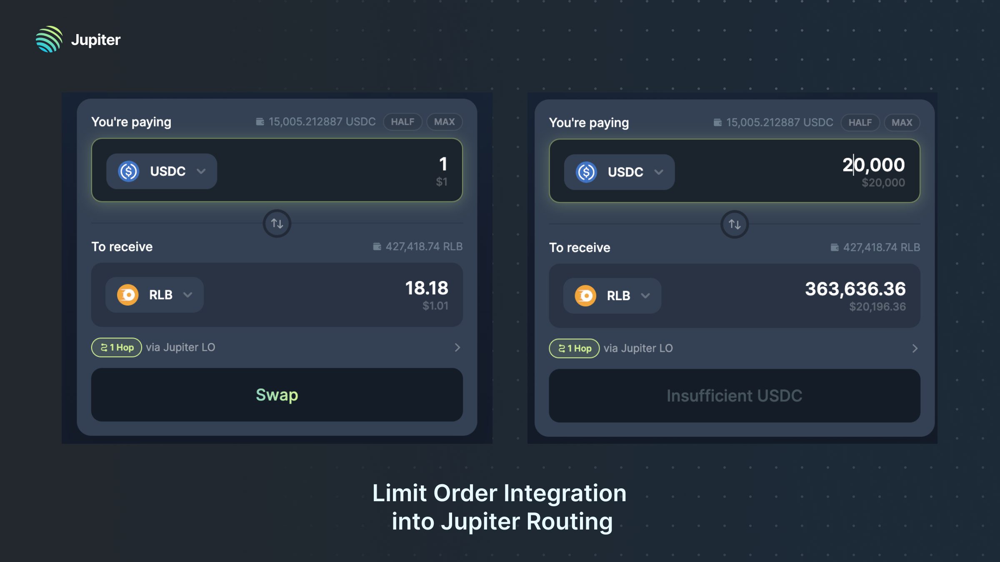
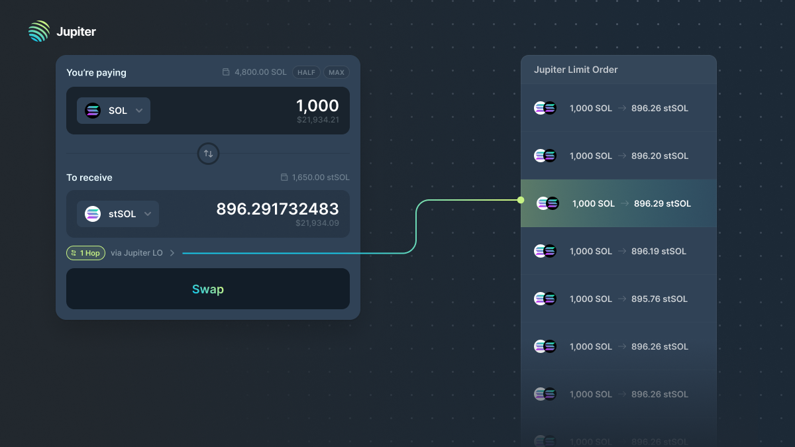
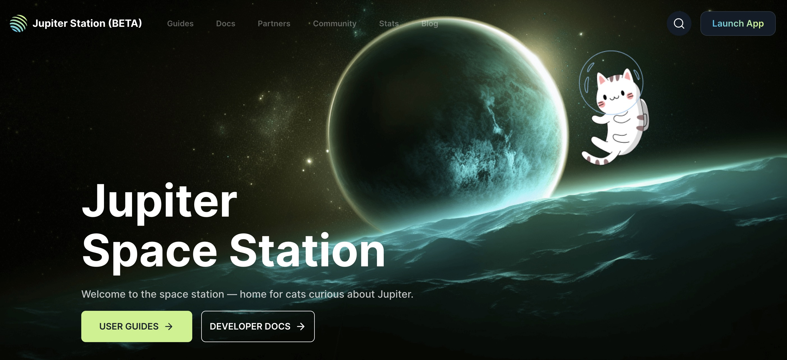
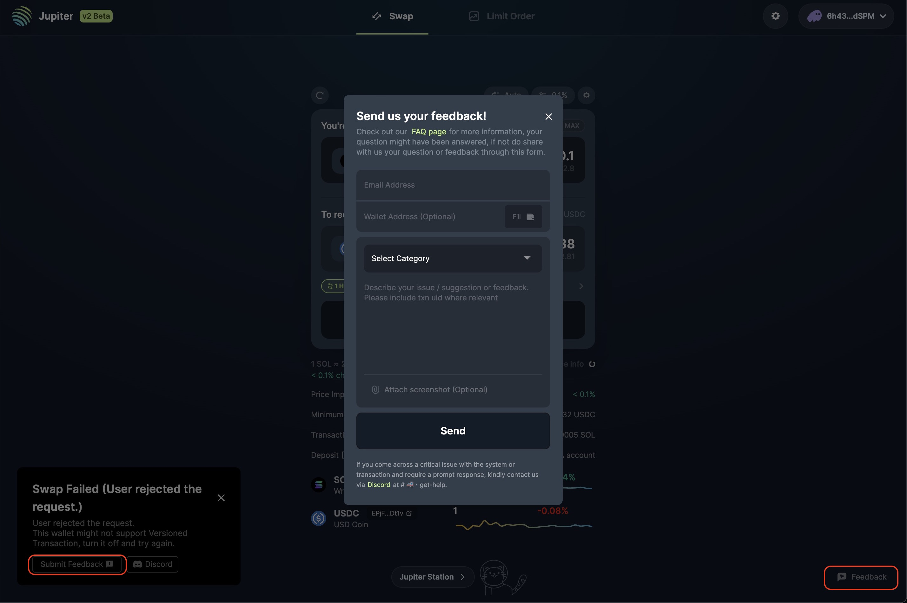
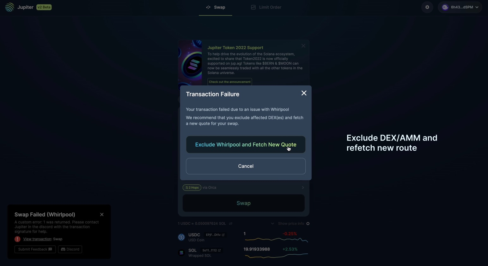

Today, we are excited to announce Jupiter v3, which introduces Metis, a novel routing algorithm that further enhances our industry leading aggregator. Metis significantly improves route discovery for all pairs, substantially reduces slippage for large trades, and offers vastly improved scalability in preparation for upcoming Solana upgrades and new DEXs.

In order to be able to support Metis to run on Solana’s hyper fast blocktimes, we have also made major improvements to our backend infrastructure. In addition, we also introduce the Dollar-Cost Averaging beta, the testing of a new contract that removes the need for users to have intermediate token accounts, integrations of Limit Orders into our routing, the Jupiter space station and several new features that’s based on user feedback.

The upgrade, coming only a few months after v2, embodies our efforts to push the boundaries of Solana to offer the most powerful yet simple experience in all of crypto, and build a genuine CEX replacement to help with the inevitable migration to come.

This is obviously a mega update so let’s dive right in!

## [**Metis**](https://en.wikipedia.org/wiki/Metis_(moon))

Today, we introduce Metis, our new advanced routing algorithm, a heavily modified variant of the [Bellman-Ford algorithm](https://en.wikipedia.org/wiki/Bellman%E2%80%93Ford_algorithm) catered for the key requirements of offering best price routing at scale in a very dynamic operational space.

### Key Features

### Incremental Route Building 

To find the best price, Metis streams the input tokens to incrementally build a route to split and merge at any stage. By generating the routes for each split iteratively one after another, we can also use the same DEX in different splits - allowing us to find routes with better prices with more complex trades.

### Combine Route Generation and Quoting

To improve the efficiency of the algo, we combine route generation and quoting into a single step, allowing us to avoid generating and using bad routes, which besides improving the efficiency, also allows us to use a larger set of tokens as intermediaries.

### Future Proofing

v2 runs fast when the total number of DEXs used is small since Solana limits us to use at most 4 DEXs in a swap *(due to the account lock limit of 64)*. Future Solana upgrades will relax this limit and allow more DEXs to be used in a single transaction. In addition, we foresee the continued growth of the Solana DeFi ecosystem, which means there will be many more DEXs emerging. 

With Metis, we are well equipped to be able to handle both these trends, since the algorithm is able to scale to include more DEXs in a route when account lock limits are increased, and can support more DEXs with only a modest increase in running time.

### Infra Upgrade 

In addition, determining the cost per hop for various amounts of splits is obviously a major challenge, since there are many potential outputs for different amounts, including for vastly different liquidity venues like CLOBs and CLAMMs, and getting quotes from lots of AMMs is slow, which limited the scalability of the system.  To resolve this, we embarked on a major infra upgrade to refresh quotes in parallel and in real time.

### Performance Improvements

The system has undergone rigorous testing over the past few weeks in production. At the same time, we have been benchmarking the performance of the algorithm. On average, Metis quotes prices that are 5.22% better than our v2 engine, with the improvements increasing sharply based on the trade size.

### Powering Liquidity On Solana

And of course, this kind of insanely powerful engine will be completely out of reach for the average user in most other platforms, given the high level of gas cost this will incur. On Solana, the cost to the user will remain small and miniscule. 

In addition, an great routing engine is crucial for DeFi in so many ways - liquidations require single transactions for large amounts to be as efficient as possible, new DEXs need a fair chance to be leveraged for volume as the more established ones, and of course, we need to keep on pushing the limits of Solana, so more people understand how powerful shit can get!

---

## DCA (Dollar-Cost Averaging)

Secondly, we are also delighted to introduce our DCA Beta, a non-custodial, on-chain dollar cost averaging solution to automate the purchase or sale of any token.

### How it works

If you choose to use USDC 900 to buy SOL daily over 9 days, 900 USDC will be transferred from your wallet to the non-custodial program and executed over the next 9 days.

1. Your first order to sell 100 USDC for SOL will take place immediately at the best price available then.
2. Your second order to sell the next 100 USDC for SOL will take place approximately 24 hours after the initial order at the best price available then
3. Subsequently, 7 more orders will all take place approximately 24 hours after the previous order until the full DCA order has been executed. 

### Ease Of Use
As with all Jupiter systems, we aim to make very complex transactions as simple as possible. You will automatically receive purchased tokens in your wallet within the same transaction of each order and a link to the blockchain transaction will be visible to you on [jup.ag](https://jup.ag/).

Also, during the last order of your DCA, any remaining tokens will be sent to you and all program related accounts opened for your DCA will be closed and the rent returned to you automatically.

### Notes
- To ensure best price execution, DCA keepers use Jupiter and also perform price checks against an external price data provider i.e. Birdeye.
- To prevent people from querying and hijacking the order right before the order is about to be executed, orders have a + 2 ~ 30 second variability.
- Note that there is a 0.1% keeper fee for DCA order executions, only taken upon successful completion.
- You can read more about key details like fees and technical implementation here
- For the Beta phase, we’re limited to trade only the Top 20 tokens, with a cap of $5,000 USD for each DCA order. We will progressively increase the number of support tokens and lift the order size limit as we move out of beta. 

:::tip Beta phase!
DCA is still in beta! So please give us as much feedback as possible to help us help everyone accumulate as much SOL as possible! :D
:::

---

## Limit Order Integration Into Jupiter

At Jupiter, we aim to build the easiest limit orders in DeFi. Over the last couple of months, we have been steadily improving Jupiter limit orders behind the scenes, particularly on vastly improving the efficiency of the path discovery and order execution. Now, we are happy to share that Jupiter Limit Order has been integrated into Jupiter. 

Jupiter will now compare Jupiter LO orders with the quoting engine quote price to provide users with the best possible price. This feature is especially useful for large limit orders, as they can be split, quoted, and filled by multiple Jupiter swaps. This improves the fulfilment of orders at the best price from both ends.

For example, there is a 20k USDC - RLB sell order here, being matched directly with one of the Jupiter Limit Order. Since this is the best price possible in the whole market, anyone will be able to take this order with zero slippage if they want to buy RLB.

We will continue to make major improvements to the limit orders over the next few months - improving it in terms of functionality, order discovery and usability. We cannot wait to make the easiest limit orders in DeFi even better than ever!

---

## Jupiter Space Station

Jupiter Space Station is a comprehensive resource for everything related to Jupiter, all in one place for easy access!

**Our station includes:**
- Statistics about Jupiter
- Guides to using Jupiter Products
- Development docs
- Integration guidelines
- List of partners

### Open Contribution

In addition, it is an open-source system that allows anyone to contribute. You can add your protocol to the partners page, create an ELI5 user guide, or report an error in the syntax. Contributing is easy - simply add a pull request to our GitHub repository and help us make Jupiter Station even better.

Here are some examples of how our friends and users have contributed so far:

- An insightful [article](https://station.jup.ag/guides/community/verify-swaps-with-SolanaFM) authored by SolanaFM on how to verify transactions using block explorer.
- Sphere [adding](https://github.com/jup-ag/space-station/pull/125) their protocol into the partners page.
- Enhancing our homepage with more [content](https://github.com/jup-ag/space-station/pull/128).

We will be constantly improving this page, in our quest to make this the all in one and most helpful resource for everyone. In particular, we will be adding a community section too, to share a lot more about how the community can contribute!

---

## New Improved Features 

Jupiter v3 also features a number of smaller but important improvements based on user and developer feedback.

### Feedback Mechanism

We have a direct feedback channel on top of our Discord support. Whenever a transaction or swap fails, there will be a quick button that prompts a feedback form. This allows users to inform us of any issues they are facing. If you miss the toast message, you can find the feedback form on the bottom-right of the site. The feedback form goes directly to the team. If you require a prompt response, please reach out to us through our official Discord channel.

### Fallback Mechanisms

Aggregator works with a dozen DEXs and AMMs, and sometimes, DEX/AMM errors can cause certain routes to fail, resulting in the swap failing to go through. To improve this, our fallback mechanism will exclude any affected DEX/AMM causing errors in our trading routes and immediately refetch a new quote. Traders can then execute the new route and perform the swap without any issues. We have extended this mechanism to both Ver. Txn and Legacy routes to ensure a seamless trading experience for all our users. 

### Expanded Market Selection

To optimise for a safer and more robust trading experience, we previously set a strict criteria for the pools and markets where we stimulate swaps between $250 worth of tokens, with no more than a 70% loss/price difference. In our latest update, we are also including tokens that have already had liquidity elsewhere, as well as markets with single-sided liquidity of $1,000 within 20% of market price.

### Shared Intermediate Token Accounts

We are testing a new contract that will leverage shared intermediate token accounts. The need for manually opening up intermediate token accounts has been a pain point for users given the initial setup cost and high number of potential swap failures. The new shared account feature streamlines the integration process and brings cost-saving benefits to partners and users alike.

## Summary

With v3, we carry on the 3 core Jupiter traditions:

- **Upholding the JUP Promise (Best price, Best selection, Best UX)**
- **Pushing the limits and possibilities of Solana**
- **Introducing super easy to use, yet powerful features for the user**

Again, nothing will ever be perfect or done, so your feedback is super important to helping us improve - the good, bad and ugly. We will work with everyone to ensure that no matter what, Solana will be home to the very best swap experience in all of DeFi and beyond.
