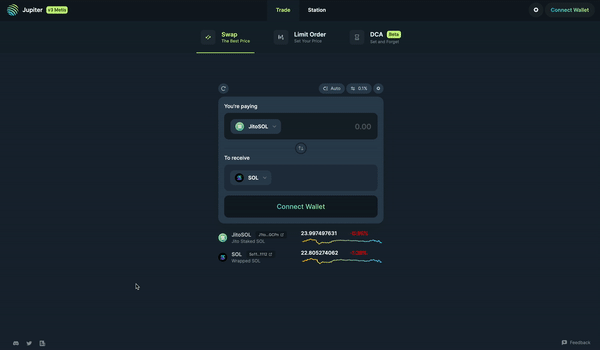

# Unlocking The Potential Of LSTs With The Sanctum Integration

In order to maximize the adoption of LSTs *(Liquid Staking Tokens)* with users and protocols alike, we have integrated [Sanctum](https://www.sanctum.so/) into our routing system, allowing users to swap from xSOL-SOL with the best possible rates, regardless of trade amount.

This integration coincides with the formal launch of Sanctum and its reserve pool with over 200K SOL - meaning large amounts of xSOL can be immediately swapped for tokens like USDC via the pool and Jupiter.

## Key Features of the Sanctum

- **Instant Unstaking:** Leveraging Sanctum’s SOL reserve pool, users can instant unstake LSTs. Unlike traditional LST <--> SOL pools that fragment liquidity, Sanctum services every staked pool with one SOL pool, enabling every stake pool token to be accessible across DeFi.

- **Improved Validators Experience:** Validators can easily launch stake-pools-of-one by tapping into Sanctum's shared liquidity. This reduces concerns about sourcing liquidity and unlocks a substantial portion of staked SOL for use in Solana's DeFi ecosystem.

- **Competitive Pricing:** Sanctum routing provides a pricing edge for smaller stake pool tokens and transactions, shifting away from heavy reliance on liquidity provision to AMMs.

## Three Main Functions on Jupiter

- **SOL - xSOL:** Direct staking through Sanctum, allowing SOL deposits into stakepools, with users receiving corresponding LSTs.
- **xSOL - xSOL:** Support for LSTs trading, with partial support for various xSOL routes.
- **xSOL - SOL:** Integration with Sanctum enables instant unstaking and liquidity access for staked SOL.

## Benefit To The Ecosystem

LSTs have always held great potential for use by both users and DeFi protocols as a valuable source of yield. However, they've been hindered from mass adoption due to the challenge of instantly liquidating large LST amounts. Liquidity in standard markets is insufficient for large traders or liquidators who need rapid liquidity exit.

With this launch and integration, many of these problems are mitigated. Liquidators can now efficiently liquidate both small and large xSOL positions, leveraging Jupiter’s liquidity routes that include the Sanctum SOL reserve pool and other integrated liquidity sources instantly, with optimal prices and minimized price impact and slippage.

This unlocks LST adoption, introducing more tradable assets to Solana that can significantly increase TVL, unlock $9B in staked DeFi capital, and most importantly, enable protocols to maximize their capital efficiency and yield without typical cooldown or liquidity constraints. This pivotal step is a game-changer, and we eagerly anticipate the innovative products to be built upon this foundation.
