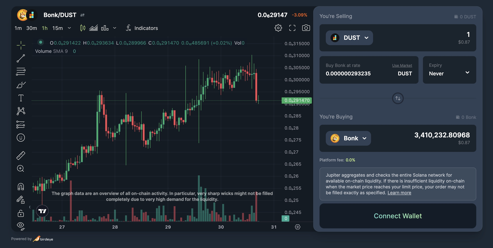
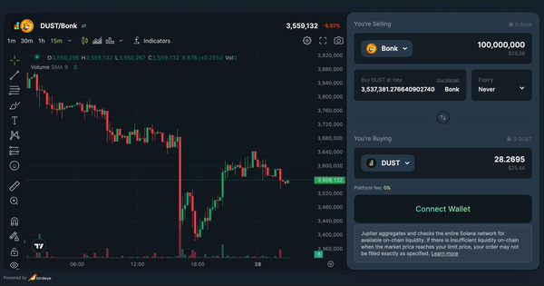

Today, we’re introducing the key upgrades to Jupiter Limit Order, with features like **any-to-any tokens trading**, **fee removal** and **enhancements** that will elevate your trading experience and open up exciting new possibilities.

Let’s dive into more details:

## Any-to-any Token Trading

Responding to user feedback and demands, we're thrilled to unveil any-to-any token trading within Jupiter Limit Order. Unlike before, where it was restricted to specific base tokens like USDT, USDC, and SOL, this update leverages an upgraded Limit Order contract and Jupiter's latest routing algorithm to empower trading of any token pairs. This expansion broadens the scope, providing users with even more trading options and opportunities.

## TradingView Chart

Empowering your Jupiter Limit Order experience further, we've integrated our trading chart with TradingView, utilizing data from BirdEye. This integration offers a comprehensive TradingView chart within our platform, making it much easier to perform technical analysis and place limit orders with a few clicks through the interface.

*It's important to note that while this integration offers exceptional functionality, some low liquidity token pairs might face limitations due to insufficient historical data.*

## Keeper/Taker guideline

We are coming up with a comprehensive guidelines for users and developers interested in running their own keepers or takers, complete with example code. This initiative will empower more participants in the system to efficiently run and execute orders, potentially benefiting from order profit execution and positive slippage.

The taker code facilitates keepers in accessing, filtering, and sorting open orders on-chain based on price. Furthermore, keepers can gather quotes from the Jupiter Swap API to evaluate trade profitability. Notably, this integration also enables the merging of Jupiter Swap Instructions with Limit Order Instructions, streamlining execution.

*This enhancement enables a broader group of keepers to participate in executing Jupiter Limit Orders, thus enhancing order execution and decentralization.*

[Check out GH Repo here](https://github.com/jup-ag/limit-order-taker-example)

## 0% Fees for placing orders

Considering all these updates, we're making a significant alteration to the fee structure: reducing **Jupiter Limit Order fees to 0% for placing orders**. This strategic move aims to encourage heightened usage of Limit Order. This not only encourages order placement but also improves order matchability with swaps as active orders increase.  We are also working on a more streamlined referral fees structure for partners and integrators which we will be releasing more details in the upcoming developer-focused updates.

Your feedback is invaluable to us, and we're dedicated to refining your trading experience on Jupiter. These enhancements mark the beginning of an exciting journey. Our unwavering commitment to delivering even more remarkable features in the future remains steadfast. We encourage you to continue sharing your suggestions and feedback; your insights greatly contribute to our progress. Connect with our active community on Discord.

[Join our Discord community](https://discord.gg/jup)

Lastly, we're excited to announce a series of trading campaigns, commencing with $SOL. As we align with the evolving ecosystem, we're gearing up to roll out campaigns in collaboration with our partners. Stay tuned for more updates and let's embrace the momentum together by placing those limit orders!

**Trade now:** https://jup.ag/limit/USDC-SOL 

