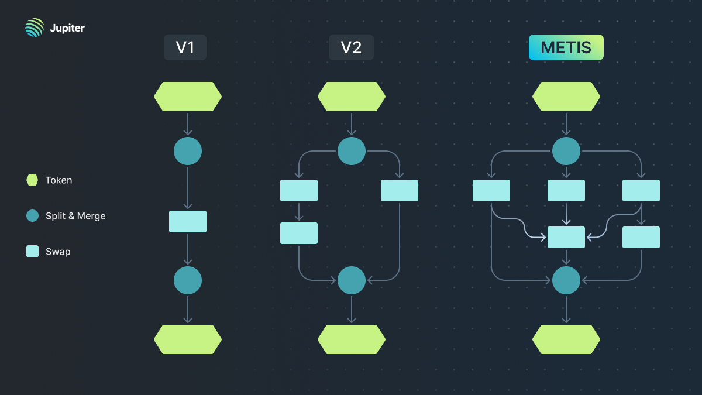
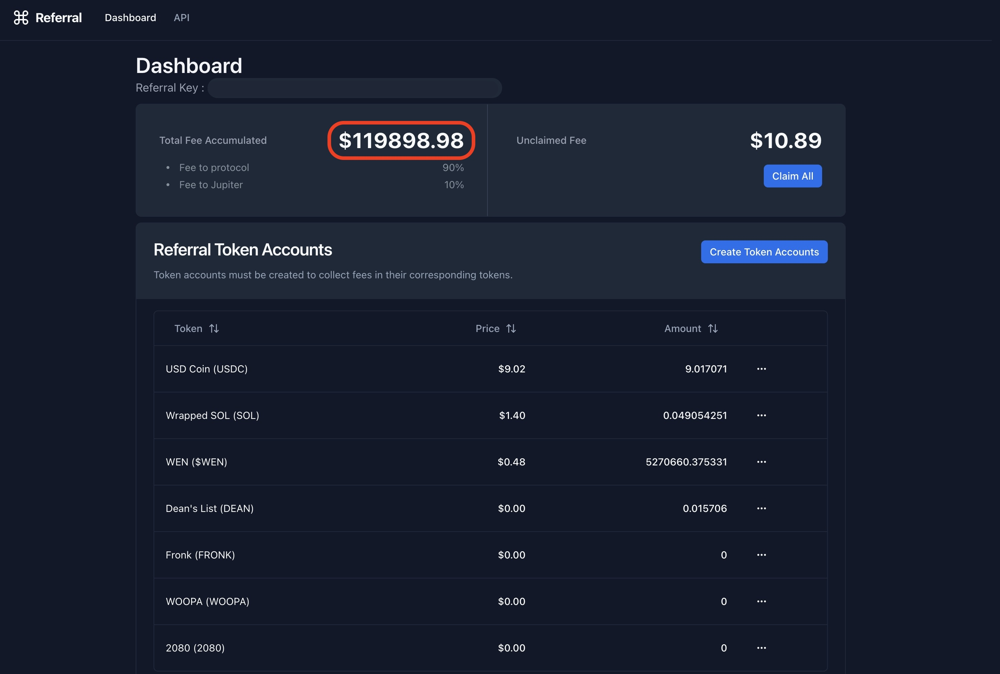

## Introduction
Calling all Jupiter Space Catdets, welcome to the Jupiter Planetary Developer Week! 

We've been working really hard to bring you fantastic new features that will make it even easier for you to create amazing liquidity use cases on Solana. 

This is a whole week dedicated to Solana developers, where we will unveil major improvements to our tools, just in time for the Breakpoint conference. 

So, get ready to supercharge your **BUIDLing** journey with us!

## Day 1 - v6 API Official Release
Today, we are happy to announce the official release of our v6 API! This is DeFi’s most powerful and comprehensive liquidity API and will power the development of sophisticated use cases and complex DeFi processes on Solana.

This announcement comes on the heels of 2 months of relentless stability and feature-level improvements, helped immensely by key early adopters, including [Solend](https://solend.fi/), [Mango](https://mango.markets/), [Drift](https://drift.trade/), [Birdeye](https://birdeye.so/), [Hawksight](https://www.hawksight.co/), [Sphere](https://spherepay.co/), and [Kamino](https://kamino.finance/) who not just helped to iron out a lot of the kinks for any new infrastructure service, but also guided us towards specific improvements to make it possible for them to use Jupiter for their use cases.

In this article, we will go through key upgrades made for v6 to make building liquidity use cases much more powerful and fun, a brand new referral fees system, advanced usage patterns, and examples of how our partners are using it. 

*This launch of the v6 API is part of a series of developer announcements we are rolling out to enhance the liquidity infrastructure landscape for Solana. Stay tuned!*

## Key features for v6

### Metis Algo As Backbone For v6 Routing 

The very first version of Jupiter was written in JavaScript and ran a brute-force heuristic optimization algorithm to search for price routes. As Javascript is single-threaded, it limited scalability and it quickly became apparent that this approach wasn't scalable as Solana's automated market makers multiplied. We hit performance bottlenecks with the increasing number of permutations needed to perform a trade. 

To overcome these limitations, we decided to rewrite the algorithm in Rust, a move that resulted in a remarkable tenfold improvement in performance. We had experimented with the Uniswap algorithm but it still did not solve the issue of scaling with large liquidity trades. 

Undeterred, the team persisted and eventually crafted the innovative Metis algorithm, a heavily modified variant of the Bellman-Ford algorithm. This approach allowed Jupiter to adjust our quoting strategies dynamically based on trade sizes.

Key features of Metis include the following:

- #### Incremental Route Building
Generating routes for each split iteratively one after another allowing the use of the same DEX in different splits. This leads us to find routes with better prices with more complex trades.

- #### Combining Route Generation and Quoting
Route generation and quoting are combined into a single step, allowing us to avoid generating and using bad routes. This improves efficiency and lets us use a larger set of tokens as intermediaries. 

- #### Future Proofing
Future Solana upgrades will allow more DEXs to be used in a single transaction. Metis is equipped to handle and support more DEXs in a route with only a modest increase in running time. 

Read more about Metis here: https://station.jup.ag/blog/jup-v3-metis-routing-algo

### Metis and the Ecosystem
Jupiter plays an important role in powering liquidity on Solana and the greater defi ecosystem. That is why it is very important for us to continuously innovate and improve our tech stack that eventually resulted in Metis. 

Such an insanely powerful engine will be completely out of reach for the average user in most other platforms given the high level of gas fees and average transaction time required. This is only possible on Solana, because it powers blazing transaction speeds, at a fraction of cost to the user.

A great routing engine is crucial for DeFi in many ways:

- #### Efficient Trade Execution
DeFi platforms involve complex trading strategies and require the ability to execute transactions across multiple liquidity sources. A routing engine optimizes the path and execution of trades, ensuring that users obtain the best possible prices while minimizing transaction costs.

- #### Liquidity and Market Depth
Liquidations require single transactions for large amounts to be as efficient as possible. A routing engine helps identify the most liquid markets, ensuring that traders can execute orders of various sizes without causing significant price slippage.

- #### Opportunities for New DEXs
New DEXs need a fair chance to be leveraged for volume as the more established ones. Jupiter allows these newcomers to compete on a level playing field with established DEXs, providing them with opportunities to attract trading volume and liquidity.

We look forward to continuously pushing the limits of Solana and letting the world know how powerful defi can get!

### Shared Intermediate Token Accounts For Integration Simplification and Cost Savings
The idea of Shared Intermediate Token Accounts came about because there was an increasing number of intermediate token accounts to be created in order for a swap to be successful, which increased integration complexity and cost for users that needed to be addressed.

Previously: 
- Integrators needed to create every single intermediate token account before integrating and obtaining quote routes, to make sure that the swaps were executed without any disruption. Any token accounts that were missed out would lead to swap errors.

- In Solana, an account rent fee is incurred for every Solana account to store data on the blockchain. With a large number of intermediate token accounts to be created per protocol, users incur a sizable amount of rent. 

With the Shared Intermediate Token Accounts, Jupiter creates and maintains a set of Associated Token Account (ATA) contracts for intermediate token accounts. These shared accounts are global and shared among all protocols and partners integrated with Jupiter. Integrators now only need to ensure they have the final output token account to receive tokens for every swap. 

On top of this, OpenBook Open Orders accounts are no longer required as well, because all orders accounts are also globally initialized and shared amongst integrators.

For instance, when swapping from Token A → Token B → Token C, instead of having to create accounts for Token B and Token C, integrators will only need to set up for the final out token (Token C in this case). Any intermediate tokens in between, regardless of the number of token hops, are automatically initialized and managed by Jupiter’s pre-established shared token accounts. 

Creating individual token ATA accounts incurs account rent fees, which accumulate over time due to the growing number of intermediate tokens. With fewer intermediate token accounts required, users benefit from not having to incur account rent fees for maintaining their individual token ATA accounts with each protocol they swap on.

We also see a much simpler integration process for partners and integrators, as the need to create and manage numerous intermediate token ATA accounts via route maps is eliminated.

Integrators can also better compose swap instructions that fit within a single transaction size limit, as the number of accounts to pass through in each instruction is streamlined with these shared ATA accounts.

### Token Ledger For Increased Swap Success Rates

It is very important to have a good swap success rate for a great experience for users as well as integrators. Token Ledger was developed because the common way of relying on simulation to facilitate swaps is not always reliable and can lead to swap failures especially during times of market volatility. A method that is based on actual amounts transacted, and combined into a single transaction is greatly needed, leading to the birth of The Token Ledger. 

The Token Ledger is a collection of three instructions *(Set Token Ledger, Send Instruction, Swap Instruction)* that consolidate withdrawal and swap instructions into a single transaction. Integrators/partners can now effortlessly instruct a swap to be executed based on the actual sent amount, after taking into account fees and slippages. 

Before the introduction of the Token Ledger, swap instructions relied on a simulation-driven approach to approximate the amount deducted from a user's wallet to facilitate the swap. This estimation approach often ended up with discrepancies between the estimated and actual amounts, especially during periods of market volatility with high slippages, leading to swap failures.

Consider this scenario where a user intends to withdraw 1,000 USDC from Meteora’s USDC vault into wBTC. Note that users hold vUSDC LP tokens in Meteora vaults. 

1. In the first instruction, the Token Ledger will verify and record the user’s initial USDC balance within their wallet. For the purpose of this example, let’s assume the initial balance is 100 USDC. 
2. In the second instruction, an amount equivalent to 1,000 USDC in vUSDC is withdrawn from Meteora vaults into USDC, and we examine the user’s balance. Due to factors like slippage, the USDC balance is found to be 1090 USDC. 
3. For the third instruction, subtracting the initial 100 USDC from the current 1090 USDC balance, it’s evident that the user has effectively withdrawn 990 USDC, which will then be utilized to swap for wBTC as the final output token.

Without the Token Ledger, the previous swap method relied on estimated amounts, which could fluctuate due to market volatility and performance variations, frequently resulting in suboptimal user experiences.

With the Token Ledger, integrators can issue swap instructions based on actual amounts that have taken into account slippage and related fees. This eliminates the need for simulation and significantly increases the success rate of swaps, all within a single transaction.

The Token Ledger caters to a wide range of use cases, which include but are not limited to:

- Withdrawing assets from a protocol to any desired token, such as converting to USDC from a wBTC vault.
- Supporting protocols that transition positions to a different token from their original position, as seen in Perpetuals.
- Facilitating the exchange of NFTs for tokens other than SOL.

Read more about the Token Ledger: 
https://station.jup.ag/docs/v6-beta/swap-api#using-token-ledger-instruction 

### Referral Fees Program to Simplify Fee Collection
In our pursuit of making life easier for our partners, we've streamlined the process of charging referral fees with the new referral fees program.

In the past, setting up referral fees for our partners was not straightforward. Distributing referral fees to Referrer A and Jupiter required adding two more accounts to the instruction. It was also challenging to accommodate varying percentages of referral fees for different partners, needing to pass more accounts into the instruction to calculate these fees. 

The motivation behind building the referral fees system was to automate the process of calculating all these fees, while providing a user-friendly interface to set up referral accounts and claim the referral fees collected. 

#### Referral Fees System Features
- Set up referral accounts with Jupiter via a simple interface requiring only a few clicks.
- Only 1 single referral account is needed across the different Jupiter products. 
- Checking on the total fees collected across the token accounts with an easy button to claim them

The partner journey is now hyper easy - They head over to Jupiter, create a referral account, and then plug the referral account parameters into their integration. It's that simple!

Give our dashboard a spin here: https://referral.jup.ag
Read the docs here on how to add your platform fees to Jupiter Swap : https://docs.jup.ag/docs/v6-beta/adding-fees

*Looking to the future, we have plans to open source this referral contract to other partners for use in their projects and with their integrators.*

## Performing Advanced Swaps with Jupiter v6

### Cross Program Invocation (CPI) & Flash-fill
The Cross Program Invocation (CPI) and Flash-fill are two approaches to integrate Jupiter swap with your protocol. In Jupiter v6 API, we have made CPI calls much easier to use by turning transaction payload into instructions for API users.

#### CPI Approach
To better understand how to swap via CPI, let us walk through an example of utilizing Jupiter Swap via CPI to swap from any tokens to SOL even if the user has insufficient SOL.

For CPI to work, the transaction will be composed of these instructions:
1. Borrow enough SOL from the program to open a wSOL account that the program owns.
2. Swap X token from the user to wSOL on Jupiter via CPI.
3. Close the wSOL account and send it to the program.
4. The program then transfers the SOL back to the user.

Read more here: https://station.jup.ag/docs/v6-beta/cpi

The CPI approach is not without its limitations - because of Solana’s transaction limit of 1232 byte size, lookup tables cannot be used within a CPI call, swaps via CPI can fail at runtime since Jupiter routes may involve multiple DEXes in order to reduce price impact. Instead, we recommend taking the “flash-fil” approach to utilizing Jupiter Swap. 

#### Flash-Fill Approach
The “Flash-fill” approach is a way to integrate your program with Jupiter swap without the limitations of CPI. Flash-filling allows the use of Versioned Transactions in combination with Address Lookup Tables to include more accounts per transaction while keeping within the 1232 bytes limit. 

To understand the Flash-Fill approach, we will walk through the same example of utilizing Jupiter swap via Flash-Fill to swap from any token to SOL even if the user has insufficient SOL. Note that Flash-Fill can facilitate swaps from any token to any token, not limited to SOL.

For Flash Fill to work, the transaction will be composed of these instructions:
1. Borrow enough SOL from the program to open a wSOL account that the program owns.
2. Create the wSOL account for the borrower.
3. Swap X token to wSOL
4. Close the wSOL account and send it to the borrower.
5. Repay the SOL for opening the wSOL account back to this program.

This approach entirely bypasses the need for CPI calls, effectively sidestepping the constraints imposed by CPI.

To delve deeper into these two approaches, check out our documentation here: https://station.jup.ag/docs/v6-beta/flash-fill

## Partners Using v6 API
A big shout out to our key early adopters for running our v6 API and helping us improve our stability and features. Check out how they are using Jupiter to power their use cases.
- [Drift](https://drift.trade/)
Drift’s leveraged swaps utilise the power of “flash loans” to allow traders to increase their spot buying or selling potential by up to 5x. These leveraged swaps are powered by Jupiter, to find the best price routes and get access to deep liquidity across Solana.
- [Solend](https://solend.fi/)
Solend’s Margin Trading is an extension of their lending where it combines flash loans, swapping, and depositing the proceeds back into Solend all in a single transaction. The trading view features a swap UI powered by Jupiter.
- [Birdeye](https://birdeye.so/)
Birdeye is a crypto trading data aggregator …. 
Birdeye is an on-chain trading data aggregation platform that utilize Jupiter Swap for all SPL tokens including the latest Token2022. With the latest v6 upgrade, it offers more improved speed that enhances trading experience on Birdeye.
- [Hawksight](https://www.hawksight.co/)
Hawksight integrated Jupiter v6 for their auto-swap deposits, making it super easy for users to maximise yield through auto-compounding and auto-rebalancing their LP positions efficiently. 
- [Ultimate Wallet](https://ultimate.app/)
Ultimate integrated Jupiter into their native in-wallet swap. With the upgrade from v4 to v6, Token2022 is fully supported and the latest Metis algorithm expanded the price routes, enabling their users to swap over the widest range of tokens and access even better price quotes for their users.
- [Sphere](https://spherepay.co/)
Sphere Pay is a payments platform and API for digital currencies, where businesses can start accepting card, ACH, wire, stablecoins, and other digital currencies in a single universal checkout page. Jupiter provides the swap infrastructure for the built-in token swap.
- [Solinked](https://sollinked.com/)
Sollinked is a social app designed for gated communities, offering a platform for newsletters or "paid" email inboxes that can be prioritized through incentives. Sollinked utilizes Jupiter to facilitate payments for emails and reservations using all SPL tokens. 

## Day 1 Ending Notes
Jupiter’s goal is to provide the best possible liquidity infrastructure for Solana.

With this major v6 upgrade, we are confident we have taken a major step in this direction. As always, we would love feedback and your thoughts on how we can improve, please join our feedback conversations on Discord!
https://discord.gg/jup 

**Stay tuned for Day 2 of the Jupiter Planetary Developer Week where we are going to talk about Jupiter and payments!**
