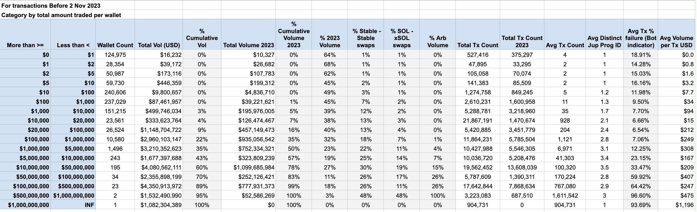

## Grow The Pie Update #1: Community Airdrop 

Here’s the breakdown for the first round of the community airdrop, along with a detailed rationale about how we arrived at it.

We want to be as open as possible about explaining our thought processes, unique circumstances and data points we have gathered, and make sure that the airdrop is as understandable as possible, even the nuances of the discussion.

We take every part of the airdrop discussion very seriously, and we are immensely grateful for all the time and effort that everyone put in. Even if we cannot give everyone what they deserve or think is correct, I would like everyone who ever interacted with Jupiter to know that their usage/contribution was seriously considered.

An official airdrop allocation site will be up for everyone to check their stats and allocations.
That will conclude the current phase, moving us to the next phase of the JUP token launch. 

**BASICS:**
1. There will be 10B JUP Tokens. 

2. As mentioned in our Breakpoint talk, this airdrop is to engage users who used us in the past, and invite them to be closely involved with the next phase of the Jupiter journey. Which means, the **955K wallets** who interacted with Jupiter directly before **Nov 2nd** are eligible for consideration. There will be future rounds of airdrops for new users, so stay tuned for that. 

3. This is obviously a massive number of wallets, and with 35B of volume, how to slice it up to make it meaningful was always going to be a challenge, but we are gonna try our best.

4. All users who interacted with Jupiter via our many amazing integrations for example Solincinerator, Solendprotocol and all the wallets will be included in the airdrop if the transaction was signed directly by the user and we have that data.

5. Also as mentioned, 40% will be allocated to the community over 4 rounds of airdrops. 10% will be allocated in this round, which will be 1B tokens. We expect to start one more round of growth oriented airdrop before token launch.

6. We have never announced or even hinted at any form of airdrop or even token until a couple of days pre-breakpoint. All growth has been purely organic. There was no massive increase in wallets in those few days, so there’s no reason to think that we were massively spammed. Therefore, de-duplication is not a particular area of concern for us, but will definitely be for future rounds.

7. All previously published dashboards and criteria were from 3rd parties. While certainly a good proxy, we are taking into account a much wider set of data points and nuances into consideration. So do wait for the official site to check both the volume, score and allocation. 

8. First round allocations will be up to check but tokens will not be live yet. There are several phases to the token launch, which we covered in the breakpoint talk and we will share more later on.

### PERSPECTIVES 
There were many extremely different perspectives and proposals being floated over the last week, with 2 major directions, the first being a completely even distribution, and the other being a completely volume based distribution. There were also many great proposals that aimed to strike a balance, and we took inspiration from many of those.

### DATA
Based on these feedback and ideas, we looked into the data in a lot of  detail, which you can see in the attached image.

1. Massive Power Law At Play
The most important data point here is the massive power law in terms of trading volume. 0.1% of wallets account for 60% of volume, while 0.2% account for 80% of volume. Even within the 0.2 tier, there are non-bot users that account for 240M of volume, far more than the average user in this elite tier. Conversely, the lower 70% accounts for much less than 1% of volume. 

A linear (or even quadratic) proportion based on volume will not work for a good distribution, even for relatively power users with >100k or >1M of volume. We did not want to overcomplicate it with fancy maths too much *(base x logs)*, so we opted for a reasonable tier method instead that will ensure that no one will get way too much or too little.

2. Bigger wallets were more active before 2022, while smaller wallets were more active after 2023.
A larger number of the bigger wallets turned out to have used it mostly before 2023, while smaller wallets were more active in 2023. This suggests that a multiplier for 2023 volume will have the effect of bumping up small wallets into higher tiers.

3. Stable/xSOL-SOL/Bot volume were more significant at the highest levels
One interesting observation was that stable/xSOL-SOL/bot volume was far higher at the highest levels. For example, the 2 wallets that did >500M in volume were purely arb traffic. While our share of user volume has greatly increased over time, arb bots consisted of a fairly large volume, especially early on in the cycle. 

To be clear, there are many kinds of bots, and many of them play an important part in the liquidity ecosystem, so this is an observation to open up the conversation about whether to differentiate between these volumes.

There are many other interesting observations not covered above, but feel free to join our discord and chat more!

## AIRDROP BREAKDOWN
With these in mind, we would like to present the airdrop breakdown for the first 10%.

- Even distribution for all wallets *(2%)*
- Tiered score based distribution, with score based on  adjusted volume *(7%)*
- Community members on discord, twitter, developers *(1%)*

We believe this breakdown will reward power users and contributors significantly more, while likely giving everyone else a reason to come back and engage. 

Let me dive into each of these categories:

1. Even distribution between all wallets *(2% / 200M tokens)*
While not using volume as the major criteria was always going to be a non-starter, we also greatly appreciated the point that we should aim to be as inclusive as possible to maximise the community building potential here, and bring as many people back as possible regardless of volume.

As such, we are allocating 200M tokens, which means about 200 tokens for each account, which would be a nice welcome present if Jupiter does well. For those who have not tried out Jupiter or Solana for a long time, do come back and try us out again - lots have changed!

We are not de-duplicating here for reasons mentioned above. We have never announced an airdrop before, and neither did we see a huge influx of wallets at any point in time, so we think it's more important to have everyone included, vs performing opaque methods of deduplicating.

2. Tiers Based On Adjusted Volume Score *(7% / 700M Tokens)*
The vast majority of tokens in this drop will be allocated towards a tier based scoring system, with adjusted volume being the main point of reference. 

Here’s where we leave the simplistic into the much more nuanced landscape of allocating based on how much they engaged with the network, how much they used Jupiter in during the bear market, and the nature of the volume.

Based on the **NON-ADJUSTED** volume, we will be looking at approximately:

- Tier 1: Top 2K users, 100,000 tokens each (est >1M trading vol)
- Tier 2: Next 10K users, 20,000 tokens each (est > 100K trading vol)
- Tier 3: Next 50K users, 3000 tokens each (est > 10K trading vol)
- Tier 4: Next 150K users, 1000 tokens each (est >1K trading vol)

It is important to remember that we are using these volume numbers as a proxy, since the final tiering will be based on the top X users in the given tiers based on adjusted volume.

The adjustments will likely be the following:
- multipliers for 2023 volume (likely counted 2X or 3X)
- zeroing of arb volume (defined as samemint - samemint txns)
- removing of known accounts (for example wormhole exploiter)

So, someone who traded mainly in 2022 but disappeared in 2023 will likely be dropped in tier, while someone active throughout 2023 will likely gain in tier. 

One question that we are going to leave open will be whether to discount stable, xsol-sol and bot traffic.

The obvious flaw with this approach is simple - the tiers are pretty broad, tiering is kinda sorta unfair to those who just missed out on the past tier. For example, even in tier 1, you have a user who traded 240M in volume vs the average of 1M traded in that tier.

We opted for this approach because as mentioned in the earlier section, there are massive power laws at work and we want to design a system where we get meaningful amounts of tokens into large numbers of active users of Jupiter, yet have it be meaningful for everyone if they do well.

This approach ensures that anyone who used Jupiter actively, particularly in 2023, will likely see their activity reflected in the various tiers. 

And since this is a community building activity, not an academic exercise to have the mathematically perfect distribution, and I personally don’t like things that are not understandable by everyone this is what we opted for in the end. 

3. Community Contributors *(1% / 100M Tokens)*
Given that community contribution cannot be placed side by side with users, we have created a completely different allocation for discord contributors, Twitter supporters and developers. 

There will be multiple tiers here to reflect the level of contribution these amazing folks have in helping us become the platform we are today. We will have a preliminary list up next week, and allow people to submit additional requests as well. 

---

## Wrapping Up The Community Airdrop Consultation

Hey all, wanted to share the main changes that we are making to the community airdrop after the last few days of very intense debates. We will also share important clarifications and explain some of the hotly debated decisions.

With this update, we are formally wrapping up the community airdrop consultation and will be focusing on getting the allocation checker website up and running asap.

This has been a long process for everyone, but we are seriously grateful for those who took the time and effort to chim in, and that we managed to talk to so many of you representing all various segments of Jupiter users.

Sorry that this update was a couple of days late - I wanted to make sure that anyone who is interested can understand the decisions and thought processes as much as possible.

1. Changes made from first proposal
After talking to everyone, I agree that we missed out on certain important aspects around OGs n consistency. As such, there will be 3 main changes we are making from the initial proposal:

- Acknowledge OGs who used the protocol in the first few months
- Add a consistency modifier, with preference to those who have used Jupiter sufficiently over the last couple of years vs one off usages.
- 2023 volume multiplier only applies to older users who stayed on

The exact details of these changes, as well as the end decisions on stables and bots will be shared on the interns wrap up the analysis of numbers and get the checker up and running.

2. Important Clarifications

- Tiers are based on adjusted scores, not volumes
The volume we indicated in my last post is to explain the guidelines as to how the tiers are derived.

Therefore, there will NOT be a sharp volume based cutoff, but rather based on top 2000/10000/50000/150000 users based on the volume adjusted score.

- The 1% community allocation is for all contributors
The 1% community allocation is to allow us to have high levels of discretion for various types and levels of contribution that go far beyond volume. This includes developers, Twitter contributors, Discord, etc. We will have an initial list but also allow everyone to provide submissions on their contributions. This is similarly retroactive, so only contributions made before nov 2 will be considered.

Folks with Discord roles will be allocated something simple, but this allocation is mostly focused on contribution, which we will put in serious time and effort into reviewing to do justice to everyone who helped us above and beyond in debugging, promoting, moderating, etc. 

- The coming website is an allocation checker site
The coming website is an allocation checker site. The token will go live later. We have a very clear token launch plan made up of 3 meows that we want to work closely with the community to execute.

3. Explainers on hotly debated decisions
We have to stand by certain hotly debated decisions, including the tiering system based on adjusted score, having an allocation for universal distribution, and the 2023 multipliers.

- Bonuses for 2023 volume
Probably the hottest point of contentment was the 2023 multiplier, since it appeared to prioritize newer users rather than older users. The 2023 multiplier might seem arbitrary, so let me explain. Even though the price of SOL started tanking in 2022, 2023 *(after the ftx fallout)* was when we really saw on-chain activity drop dramatically, and belief in Solana has completely tanked.

It is likely not a false statement to say that those continued to be active in 2023 is a big reason why Solana survived, and we want to acknowledge that. We continue to believe that a multiplier for 2023 volume is appropriate, but we will add in additional conditions to ensure that it applies only to old users who stayed on.

- No de-duplication for the even distribution
The lack of de-duplicating here for the even distribution is a concern for some, but the reason here is that it is extremely hard to de-dup without making use of tedious and opaque machine learning approaches, that is at the end of the day, not foolproof. We will avoid that to make this airdrop as understandable as possible. Having a min number of transactions is not ideal as well, since that rules out a lot of users who used us via integrations and we want to be as inclusive as possible for this part of the allocation. We will likely add more rules for this in future rounds of airdrops, but not in this one.

- Disproportionate allocation for power users
Many people have critiqued that power users will get a disproportionately large amount of the airdrop. However, this difference is actually much smaller compared to the difference in volume, which is closer to 1000x or even as large as 240,000x. So the extremes have actually been very much nerfed, while still making it meaningful per tier. It also encourages usage instead of farming via multiple wallets.

- Disparity in same tier
Conversely, some users within the same tier have also commented why given their volume, they might get the same as someone who traded less. The difference in volume within a tier might seem big until you comprehend the massive power law at work, where a non-bot single whale can trade 240M, and 0.2% accounts for 80% of the volume even with bots excluded.

- Just missing out on tiers
We understand that like airline mileage tiers, it sucks to just miss out on a tier, and we sincerely apologise for that, but this is the best we can do at the moment to prevent an overly top heavy distribution, while making it meaningful for people in each tier, and keeping the overall system relatively simple.

4. Reflections on the community consultation
As mentioned, this post formally ends the consultation period for the airdrop.

Next steps:
- A site will be up soon with official criteria, scores and allocations.
- There will also be a place for users to submit their pre-breakpoint community contributions
- We will share some thoughts on this process of community consultation for airdrops, and how the process will be updated for the next few rounds.

Thanks again to everyone for being part of this process. We know it has been extremely tiring for everyone. For us, this retroactive airdrop is a once in a lifetime chance to work with all the amazing users who have been part of our journey, so we are deeply appreciate the change to engage with everyone.
