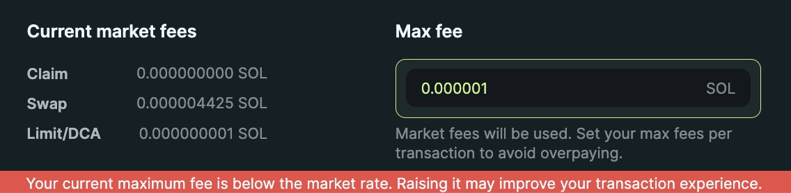

Jupiter LFG Launchpad Beta!

Delighted to share our very beta LFG Launchpad, the first and only system whose goal is to infuse projects with love 💕 from a genuine Jupiter DAO and community, sets them up with long term success and protects their buyers from hype, fomo and rugs.

Unlike other launchpads, this launchpad will not have any complex *(and often fucked)* incentive mechanisms, or isolated price discovery systems - relying on the community, open market and ecosystem to do their things instead.

There will also be 2 tokens launching on LFG in Jupuary, of which we share more details below too. This is **VERY BETA**, so we expect to uncover a lot more issues over these 2 weeks, including the JUP launch.

It is risky, but hey, if we don't dogfood our own launchpad with our own JUP, how am I going to ask others to trust me with theirs right? So let's see if we can make this work😆

## Key Features:
- Largest community rooting for you, maybe even becoming users!
 - Millions of airdrop recipients can claim at once
- Launch pool that's customizable for projects needs, locks team LP for days and mitigate bot advantage powered by the awesome [@MeteoraAG](https://twitter.com/MeteoraAG) DLMM
- Highly intuitive tool to design the liquidity pool exactly the way you want*
- Special network reporting and gas management panel to handle on-chain chaos
- Full trading features but focused on the pre-ordering process 
- Integration with full network of bots so you can choose your fav bot to use it with
- Full enterprise level RPC, Cloudflare and FE support

## Key Goals:
- LFG Price discovery: Everyone starts at once, no complicated isolated pool mechanisms. The open market should be where discovery happens
- Immediate liquidity for paper recipients to dump, while there will be sufficient buy liquidity, preventing very erratic price swings.
- Sufficient backstop buyer-regret liquidity for price to stabilise before liquidity can be withdrawn by team. This prevents a situation where the price dumps shortly but the team has all the stable liquidity.
- Fully transparent on-chain market making, completely zero shennigans. 
- A focused UX for the user to buy/sell wo making a lot of possible mistakes around gas and trades

## DAO Vote, Community Rallying and Technical Support

The DAO will vote for all projects to be launched, ensuring that this is a project the community can get behind.

After the DAO vote, the project will be fully and thoroughly introduced to the community via a few sharing sessions on Discord and Twitter as well as being featured on the Jupiter homepage for a few days.

This will ensure that the most active community members and users will get to know the project very, very well - increasing the chances not just of a one day buying, but a long term, highly synergistic relationship.

Removing all potential worries for projects by providing full operational, scaling, technical support and expertise. Our best in class user support will extend to you too.

## References:
For more details on motivations and technical updates, you can refer to this draft jupresearch post.

https://jupresear.ch/t/jupiter-lfg-launchpad-beta/31

### Custom Price Curve Modeling

Unlike other liquidity curves the point here is NOT price discovery or equilibrium, but rather liquidity bootstrapping and backstopping. Along with every project's extremely different needs and context, a custom price curve tool is needed.

Enter The LFG Price Curve design, maths, paper and website is being developed by intern #2 [@Village_Idiot](https://twitter.com/Village_Idiot), who is mid way through high school. 

https://lfg-design.jup.ag

This tool here to help project teams design the price curves they want, which will then automatically tell them the amount raised at different price points, executes the mathematical translation into DLMM bins etc.

The important here is that there is no need to determine or set an initial price - you can just decide your initial price (which is important for determining bot advantage), your final price (important depending on your liquidity needs) and how steep you want the price to increase.

 *Graph y-axis does not start from 0*

 For example, in this configuration you can see here the starting price is low to incentivize early liquidity, but the curve steeps strongly upwards with only a small number of tokens available for early takers before a more gentle slope occurs. This incentivizes early aggressive price action while leaving most tokens for users.

Alternatively, less hyped project can certainly opt for a more gentle slope with a higher starting price, which will allow everyone to acquire the tokens gradually over time without much price advantage for early buyers.

While the current tooling only supports on single curve, we will be adding a lot more curves over the coming year, including S-shaped and U-shaped ones.  We look forward to experimenting with various configurations over this year, and I am sure best practises will start to show up over time!

The full research paper and post will be up soon. He writes like a 5th grader, so be kind.

## First 2 Projects For LFG Beta:

We are trying out a lot of new things with this launchpad, and many, many things can go wrong. As such, we will host a lower stakes launch first, and then finally eat our own dog food with JUP. 

1. A fun coin managed by our good friends [@OvolsNFT](https://twitter.com/OvolsNFT) will launch this week some help from me.  I will have zero financial stake in it, and Jupiter will have zero involvement in the memecoin. 

With even more airdrop recipients than JUP, it will be a much lower stakes, fun, but similarly extremely technically challenging test for the launch pad.

2. Following week, on 31st of Jupuary, we will of course launch JUP. Yes, we are dogfooding our own launchpad ourselves with JUP. 

## Jupiter DAO

In both cases, both [@OvolsNFT](https://twitter.com/OvolsNFT) and [@Jupiterexchange](https://twitter.com/Jupiterexchange) will provide 1% to LFG launchpad, of which the upcoming JUP DAO will receive 75% and the team 25%. 

So that should be a nice early bonus to the DAO. The team will keep this first, and transfer to the DAO after it forms.

Moving forward, the Jupiter DAO will approve new projects to be on the launchpad. It has to be throughly responsible for making sure the projects are worthy of being promoted to all Jupiter users, and then doing what they can to make the project as successful as possible.

There will be no bullshit like insider arrangements, secret profit sharing and token gating. The above arrangement is a pure, simple and mutually beneficial approach to token launches.

Given that the Jupiter DAO will be the largest, most non-insider voting, most dynamic and open minded DAO in the history of DAOs, we are confident 

The team will provide all required support to projects approved by the DAO, with the likely maximum of one project every 2 weeks to maintain a very high quality pipeline.

## 1st Feb: Ready For Projects
We hope this gives a nice overview of our LFG launchpad, and our road towards launching Jupiter. We look forward to your active participation in these 2 launches. 

If all goes well, we will be able to start offering the launchpad to projects who would like to launch with Jupiter!

Otherwise.... Well, at least we mess up together as a community right? 🩷
