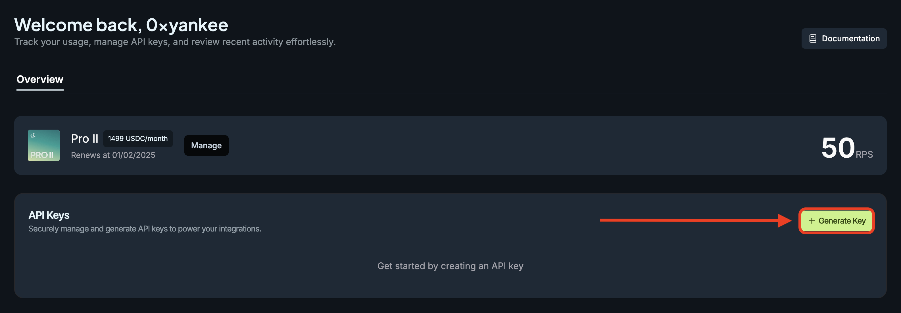

<head>
    <title>API Setup</title>
    <meta name="twitter:card" content="summary" />
</head>

Get started by setting up an account on the dashboard to generate API Keys and managing payments via Sphere.

Then, to use the API Key in our APIs, simply add the key to the header.

```js
headers: {
    'Content-Type': 'application/json',
    'x-api-key': '' // enter api key here
},
```

## 1. Open Portal

Navigate to https://portal.jup.ag

## 2. Connect via email

To enter the portal, simply connect via email account. This allows us to keep track of your account tagged to your API Keys.


## 3. Browse and Select Plan

To decide on a suitable plan by gauging requests required by your project size and user needs.

:::note Change of plans
You can always change your plans later.

Plan changing by yourself is a work in progress. Please reach out to the team in the meantime.
:::


## 4. Payment

Before you set up your keys, you will need to make the payment upfront via Sphere.

1. Redirected to Sphere payment page.
2. Enter the required details.
3. Connect wallet to pay via Solana blockchain
4. Click the **Subscribe** button to proceed.

:::note other payment methods
New payment methods is a work in progress.
:::

:::caution Payment delegation
Do note that the Sphere payment is set up as a [delegation payment method](https://docs.spherepay.co/api/subscription).

This means that you have delegated the total billable to be deducted/withdrawn from your wallet automatically per month.

For example, in the image, 2.4 USDC is total billable which will mean your wallet will be delegated to be billed every month, while 0.2 USDC is to be paid upfront upon signing.
:::

:::caution Out of funds
If your delegated wallet has insufficient funds to pay for the new month, your API Key will be disregarded, and your requests will fallback as a typical call via the free plan.
:::


## 5. Processing Screen

Yes, please wait.


## 6. Setup API Keys

Click on the **"+ Generate Key"** button to generate an API Key.

:::caution Generating multiple keys
The rate limits are imposed on a **PER ACCOUNT** basis, not per API Key.

If you need more requests, you can upgrade the plan, or create a completely new account and subscribe to a plan, (this means you will have 2 separate accounts, each has its own plans).
:::



## 7. Have a Question?

Please reach out to us.
- If you have increasing demand and growth in your app, and need additional support.
- If you have questions or need support.
- Join the [Telegram channel](https://t.me/jup_dev) or [Discord channel](https://discord.com/channels/897540204506775583/1115543693005430854) to subsribe to updates.

## 8. Get Started!

With your API Key, you can gain higher request access to `/quote`, `/swap` and other endpoints to build world class applications.

If you are new to development, do take a look at
- [Get Started](./get-started)
- [Development Basics](./development-basics)

Dive right in!
- [Swap API](./swap-api/get-quote)
- [Price API](./utility/price-api)
- [Token API](./utility/token-api)
- [API Reference](./api)
