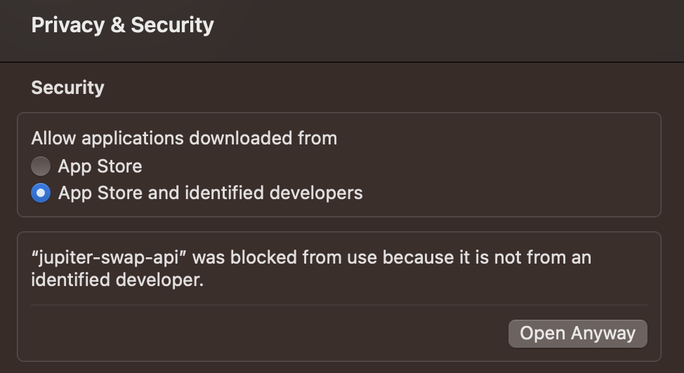

Advanced users can run a self-hosted swap api, the binary of the jupiter-swap-api are distributed for free.

Download the binary for your host

[Jupiter Swap API releases](https://github.com/jup-ag/jupiter-swap-api/releases)

## Prerequisites

- Dedicated Solana RPC node, optional but recommended with the [Yellowstone grpc plugin](https://github.com/rpcpool/yellowstone-grpc) installed

## Typical usage

`RUST_LOG=info ./jupiter-swap-api --rpc-url <RPC-URL> --yellowstone-grpc-endpoint <GRPC-ENDPOINT> --yellowstone-grpc-x-token <X-TOKEN>`

For instance, if you used Triton and your RPC url is https://supersolnode.jup/91842103123091841, the arguments would be `--rpc-url https://supersolnode.jup/91842103123091841 --yellowstone-grpc-endpoint https://supersolnode.jup --yellowstone-grpc-x-token 91842103123091841`

It is also possible to run the API in poll mode (heavy for nodes and not recommended). Periodically polling the Solana RPC node for accounts rather than listening with the yellowstone grpc endpoint

`RUST_LOG=info ./jupiter-swap-api --rpc-url <RPC-URL>`

Other options can be discovered through `--help`

`./jupiter-swap-api --help`

Once the swap api is ready, it will open a http server at 0.0.0.0:8080

The jupiter-swap-api is feature identical to the public Swap API so all the documentation applies [Swap API](/docs/apis/swap-api), replacing the api url `https://quote-api.jup.ag/v6` with `http://127.0.0.0.1:8080`

## Macos

On Macos you will see this error message

`“jupiter-swap-api” can’t be opened because Apple cannot check it for malicious software.`

Go to System Settings and click on "Open Anyway"



## Advanced

If a set of AMMs is never needed for routing they can be removed before starting the api to reduce load.

Create a market-cache excluding the program you want to remove, Openbook for this example

```shell
curl "https://cache.jup.ag/markets?v=3" -o market-cache.json
jq 'map(select(.owner != "srmqPvymJeFKQ4zGQed1GFppgkRHL9kaELCbyksJtPX"))' market-cache.json > market-cache-no-openbook.json
```

then

`RUST_LOG=info ./jupiter-swap-api --market-cache market-cache-no-openbook.json ...`
