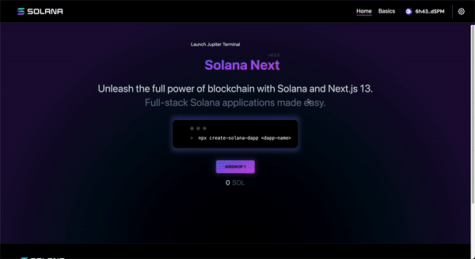
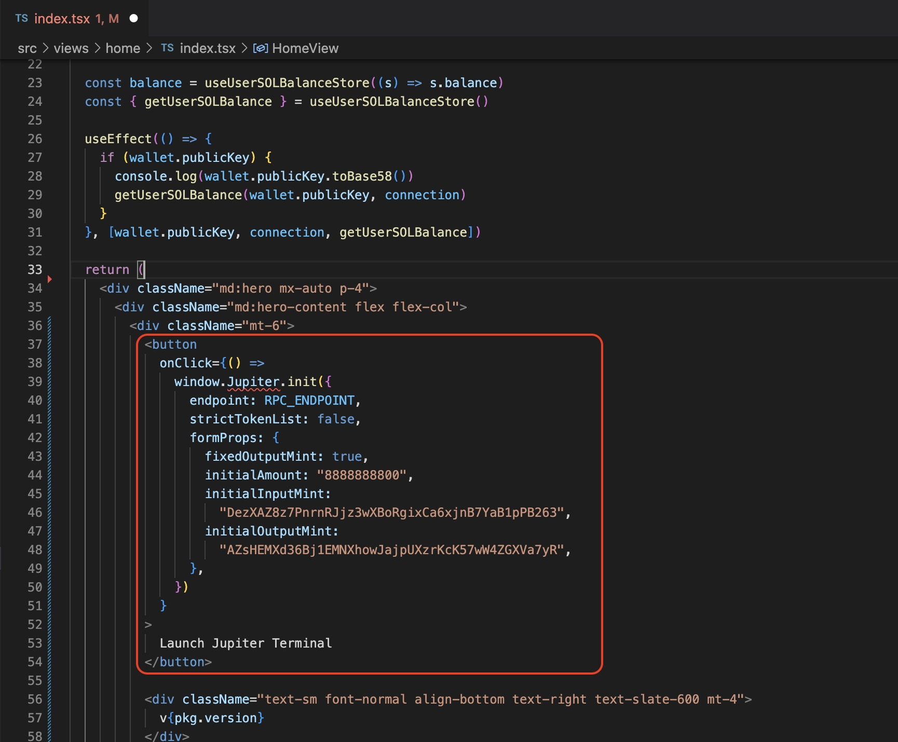

<head>
    <title>Jupiter Terminal Walkthough: Streamlined Integrations</title>
    <meta name="twitter:card" content="summary" />
</head>


Jupiter Terminal is an open-sourced, lite version of Jupiter that provides end-to-end swap flow by linking it in your HTML with just a few lines of code. 

:::tip Jupiter Terminal Links
- [Demo](https://terminal.jup.ag/): See all available modes
- [Developer Docs](/docs/jupiter-terminal/jupiter-terminal): Jupiter Terminal in detail
- [Repo](https://github.com/jup-ag/terminal)
:::

Here's a quick preview of the modes available. To see more, go to [our Demo page](https://terminal.jup.ag/)


## Example: Jupiter Terminal integration on a Solana Dapp scaffold

Integrating Jupiter onto your website should be straight-forward. We provide a step-by-step guide here so anyone can do it.

Here's what you can expect from this tutorial: You'll get Jupiter Terminal launching from Solana Dapp in "Modal" mode.



This walkthrough is also available on Youtube: 

<iframe width="100%" height="315" src="https://www.youtube.com/embed/T-3KN3k1e5Y" title="YouTube video player" frameborder="0" allow="accelerometer; autoplay; clipboard-write; encrypted-media; gyroscope; picture-in-picture; web-share" allowfullscreen></iframe>

[Watch tutorial on YouTube](https://youtu.be/T-3KN3k1e5Y)

## Step-by-step Walkthrough

Solana Labs Dapp scaffold Repo: https://github.com/solana-labs/dapp-scaffold

1. Clone Solana Dapp Scaffold repo into your local machine or working environment.
2. Update dependencies, in this example it will be `pnpm install`
3. Fire up the development environment in your localhost, in this example it will be `pnpm dev`


4. Next, change your network configuration from `devnet` to `mainnet-beta` in `NetworkConfigurationProvider.tsx` file. 


5. Include Jupiter Terminal script into your `src/pages/_document.tsx` file.

``` js
<script src="https://terminal.jup.ag/main-v1.js" data-preload />
```


6. Next, include some of the basic script into `src/views/home/index.tsx` file. 

``` js
import { Connection, PublicKey, Transaction } from '@solana/web3.js';
import { notify } from 'utils/notifications';
```

More info on [`@solana/web3.js`](https://solana-labs.github.io/solana-web3.js/)


7. Next, you will need a working RPC endpoint for the transaction to work properly. In this example, we park our RPC_ENDPOINT in `src/views/home/constant.ts` and import or initialize with `import { RPC_ENDPOINT } from './constant'`.


:::info 
It is recommended that you use your own RPC endpoint.
This RPC_ENDPOINT is only for demonstration purposes so that this example will run.
:::

8. Here comes the *fun part*, this is where you can customize the setting and configuration that best fit your dApp or site in [`Jupiter Terminal Playground`](https://terminal.jup.ag/)


9. Lastly, there's a Code snippet in the Terminal playground with your configuration. Copy the code snippet and plug it directly into your file, in this example it will be `src/views/home/index.tsx` file. 




:::success Please reach out in discord if you need help
Feel free to reach out to us in [discord](https://discord.gg/jup) if you experience difficulties, we can help you there.
:::