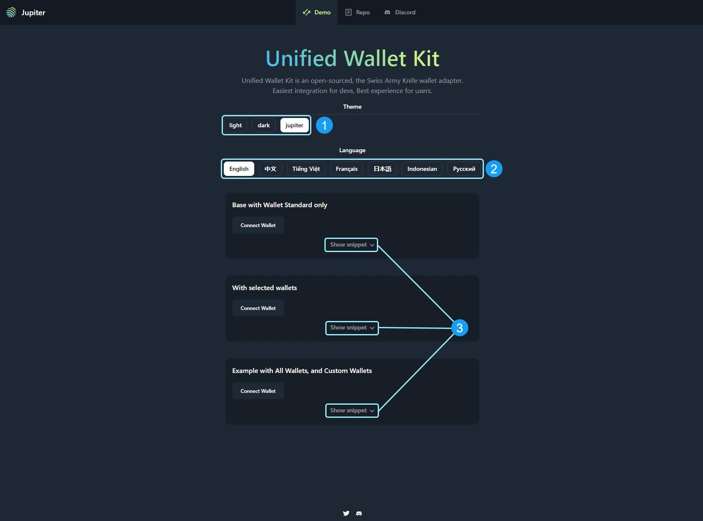
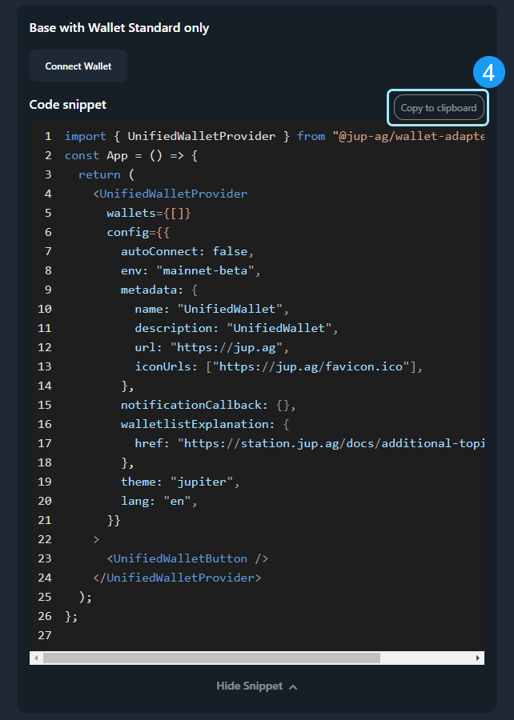

<head>
    <title>Unified Wallet Kit - A Powerful Wallet Integration Tool</title>
    <meta name="twitter:card" content="summary" />
</head>

##  Overview

The Unified Wallet Kit is an open-source, Swiss Army Knife wallet adapter designed to streamline your development on Solana. This wallet kit is purpose built to help ease the burdens of integrating multiple wallets with seamless UI/UX into your custom program. Make your development process faster and more efficient with Jupiter’s Unified Wallet Kit.

The Unified Wallet Kit will help you reduce repetitive tasks within your development process, including:
- Creating a wallet notification system
- Managing wallet states (connected, disconnected, etc.)
- Implementing a mobile-friendly wallet connector 

The Unified Wallet Kit eliminates redundancies by providing these building blocks in a simple, plug-and-play package. This allows developers to focus on what matters most: building innovative features for your dApp.

:::tip Unified Wallet Adapter Links
- Demo: https://unified.jup.ag/
- Repo: https://github.com/TeamRaccoons/Unified-Wallet-Kit
:::

## Core Features
- Compact Bundle: Main ESM bundle is a lightweight 94KB (20KB gzipped).
- Built-in Support: Comes with Wallet Standard and Mobile Wallet Adapter support.
- Abstracted Wallet Adapter: Use the Bring Your Own Wallet (BYOW) approach to select custom and legacy wallets.
- Mobile Responsive: Designed to be mobile-first.
- Smart Notification System: Integrates seamlessly with your existing notification system or can be used independently.
- Internationalization: Supports multiple languages including English, Chinese, Vietnamese, French, Japanese, Bahasa Indonesia, and Russian.
- Theming Options: Choose from light, dark, and Jupiter modes, with more customization options coming soon.
- New User Onboarding: Simplifies the onboarding process for new users.



### Unified Wallet Kit Usage Flow
1. Adjust the Theme Selector to your desired version.
2. Select your appropriate Language
3. Expand the "Show Snippet" box for the wallet configuration you would like in your app and 
4. Select the `Copy to Clipboard` button for easy code insertion into your app. (See Image Below)



## Implementation

Implementing the Unified Wallet Kit is straightforward and efficient. Here's a quick guide to get you started:

1. Install the Unified Wallet Kit to your project dependencies.
```
pnpm i @jup-ag/wallet-adapter
```

2. Wrap your app with `<UnifiedWalletProvider />` and pass in as little to as many wallets you would like to support.

### An Example from the Unified Wallet Kit Repository

```jsx
const ExampleBaseOnly = () => {
  return (
    <UnifiedWalletProvider
      wallets={[]}
      config={{
        autoConnect: false,
        env: 'mainnet-beta',
        metadata: {
          name: 'UnifiedWallet',
          description: 'UnifiedWallet',
          url: 'https://jup.ag',
          iconUrls: ['https://jup.ag/favicon.ico'],
        },
        notificationCallback: WalletNotification,
        walletlistExplanation: {
          href: 'https://station.jup.ag/docs/additional-topics/wallet-list',
        },
      }}
    >
      <UnifiedWalletButton />
    </UnifiedWalletProvider>
  );
};

export default ExampleBaseOnly;
```

:::info
This kit also supports the attachment of custom elements to specific wallets
:::

```jsx
config={{
  walletAttachments: { 
    'Phantom': {
      attachment: <div tw="text-xs rounded-md bg-red-500 px-2 mx-2 text-center">Auto Confirm</div>
    } 
  }
}}
```

## Live Playground


:::info
See all of the available features the Unified Wallet Kit provides in real-time at our [live playground](https://unified.jup.ag). To see more examples of how the code works view the [Unified Github Wallet Kit](https://github.com/TeamRaccoons/Unified-Wallet-Kit).
:::

---
<br/>
<br/>