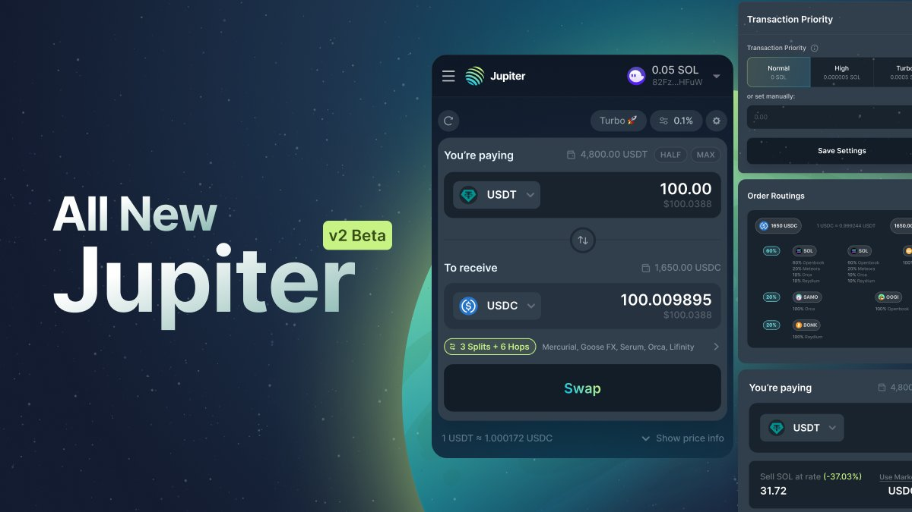

# Overview

## Integration Tips

- **Quote given is not the true price:** The quote given on a route is based on the current liquidity in the pools. Pool liquidity can go up or down at any time and in some cases, pools may close. An example would be oracle-based Lifinity which may stop accepting swaps after a price movement.
- **Set a Slippage amount to protect yourself:** [slippageBps](/docs/apis/swap-api#guide) is your swap protection if the price diverges from the quoted price.
- **Jupiter cannot guess the true spot price or know what is a reasonable price impact for you**. We encourage checking before the swap is made in multiple ways:
  - Get the user to confirm
  - Check the [Price Impact](/guides/price-impact-slippage-price-warning) *(Price impact defers from one AMM to another, when Jupiter routing through different AMMs and DEXs, price impact might occur to one or another)*
  - Check aginst a price feed like [Coingecko](https://www.coingecko.com/), [Birdeye](https://birdeye.so/), or some CEX pricing

## Developer Support

Developing on Solana can be a landmine of potential hiccups. We aim to make developing a good swap interface or program as seamless as possible. We do this by:

- Removing key barriers to providing a good UX, including having clear instructions for issues like ATAs and Open Orders accounts.
- Providing various methods of accessing the swap, so all apps, dapps, and programs can use it seamlessly.
- Providing updated liquidity sources, token lists, and possible UX improvements as soon as possible.

If you have questions or need support, you can ask in the #developer-support channel in our discord:  https://discord.gg/jup.