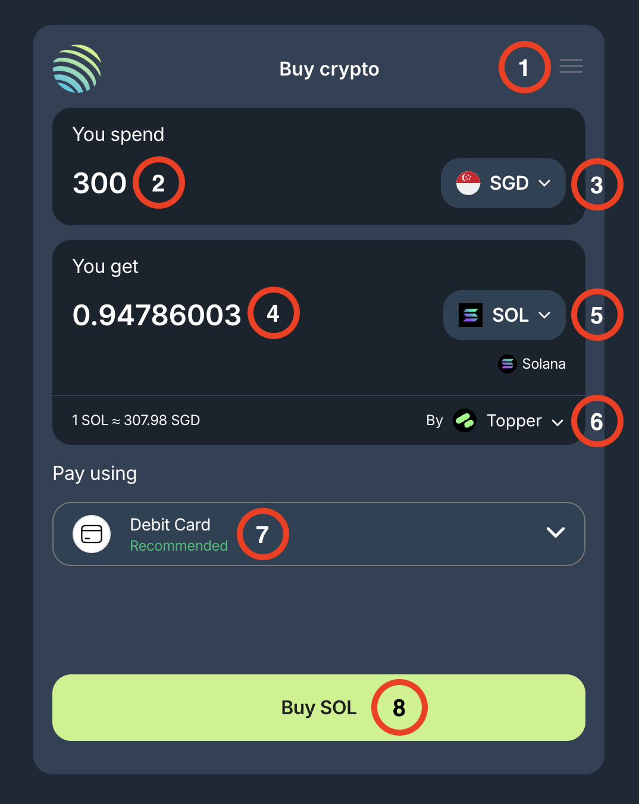

<head>
    <title>Adding Funds</title>
    <meta name="twitter:card" content="summary" />
</head>

Jupiter makes it easier than ever to convert your local currency into crypto assets on Solana through its seamless Onramp integration.

With Onramper, Jupiter’s direct Onramp application lets you purchase Solana assets directly using your local currency. This tool aggregates the best onramp services like Stripe, Banxa, and MoonPay to provide the most competitive rates and options based on your region, amount, and payment method.

---

## How It Works

1. **Access the Onramp App:** Select the Onramp option at https://jup.ag/onboard/.
2. **Set Preferences:**
    - Choose your language, review terms, and find support if needed.
3. **Choose Currency & Asset:**
    - Input the amount you’d like to spend and select the Solana asset you want to purchase.
    - We recommend always buying SOL, so you can use it for transaction fees and easily swap to other assets via Jupiter for the best price.
4. **Select Payment Processor:**
    - Pick your desired processor from the list of available options.
5. **Complete the Transaction:**
    - Click "Buy" and complete the transaction on the payment processor’s secure site. A new tab will open to finalize the purchase.

:::note Fees
Jupiter **does not charge any additional fees** for Onramp transactions.
:::

:::note Support
If you need help, please reach out to us on [Discord](https://discord.gg/jup).

We will do our best to help you, however, please note that we are not the Onramp service nor the payment processor.
:::

## Onramp UI

1. **Options Menu:** Select your language preferences, review the Terms of Usage and Privacy Policy, and find Help & Support here.
2. **You Spend:** Selector to choose the currency and input the amount you would like to spend on your purchase.
3. **Spend Currency:** The currency you are spending.
4. **You Get:** Selector to choose the Solana asset and the output amount of that asset you will get for your input spend amount.
5. **Token:** The Solana asset you are purchasing.
6. **Payment Processor Selector:** Select your preferred payment processor to complete the Onramp purchase.
7. **Pay Using:** A dropdown to choose the payment method to use for the purchase. This includes credit, debit, Apple Pay, Google Pay and ACH options.
8. **Buy Button:** Click this to begin the Onramp purchase transaction.

Once you click `Buy Button`, a new tab will open for you to complete the transaction through the payment processor's site with the inputs specified above.

---

## CEX Transfers to Solana

Transferring assets to Solana has never been easier. If you are looking to transfer assets from a Centralized Exchange (CEX), each CEX may have different requirements for external transfers. Be sure to refer to their respective guides for step-by-step instructions.

:::tip
Always transfer a small amount first to ensure your wallet address is correct.
:::
