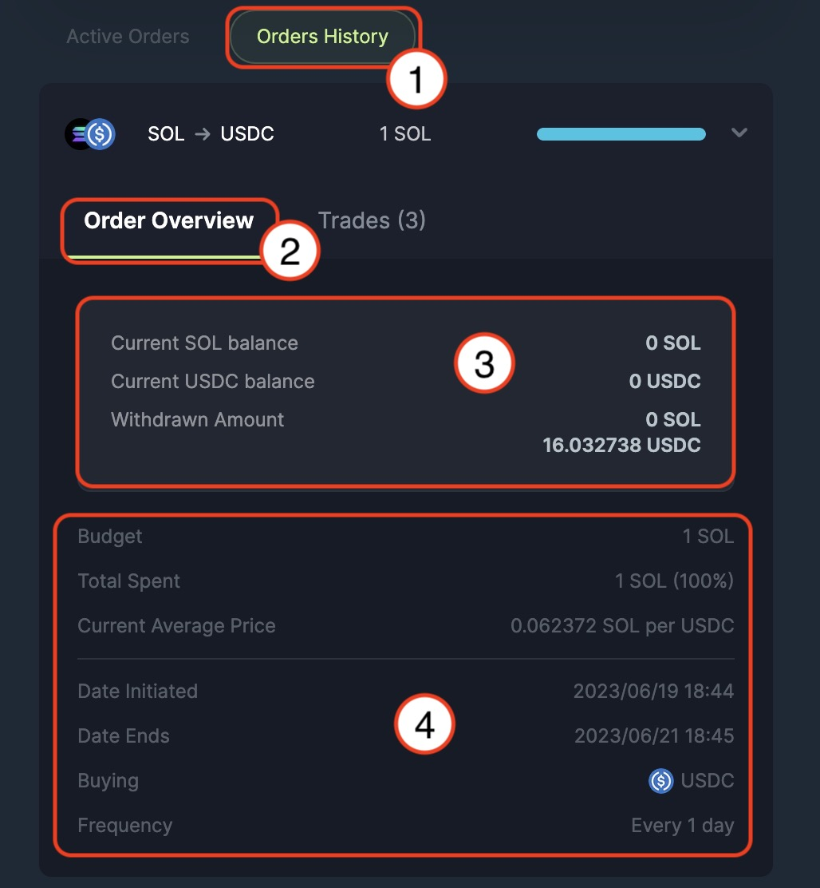
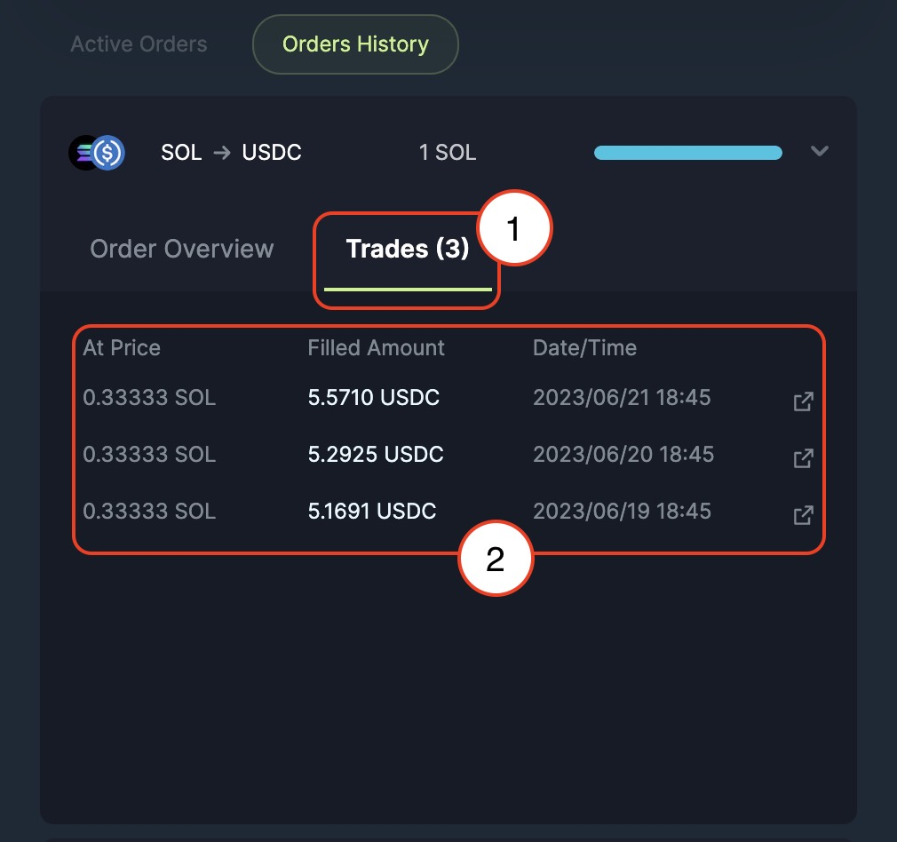

**Jupiter DCA (Beta)** is a dollar cost averaging solution to enable users to automate the purchase or sale of any SPL tokens at a regular intervals over a certain period of time. 

:::info
**For Beta phase**, there is a minimum requirement of USD $1 and a maximum of USD $5,000 in deposit value regardless of what token you use to create a DCA order, we use Jupiter [Price API](/docs/2-apis/4-price-api) to determine the dollar value.
:::

1. **DCA (Beta)** tab along with Jupiter suite of products.
2. **Input Token Selector** for token that you are looking to spend/ sell/ swap from.
3. **Input field** for the amount of input tokens that you are looking to spend/ sell/ swap from.
4. **Ouput Token Selector** for token that you are looking to buy/ swap into. *(In beta phase, we are resctricting to only Top 20 tokens traded on Jupiter)*
5. **Frequency** of purchase/ sale of tokens over a period of duration, selection from hour, day, week, and month.
6. **Duration** for the purchase/ sale of tokens.
7. **Order Summary** for the current DCA order that you are placing/ submitting. From the screenshot example:
    - Sell - 1 SOL (You are selling/ swapping from 1 SOL)
    - Get (or Buying) - USDC (You are buying/ swapping into USDC)
    - Frequency - Days (Frequency for the trade to happen)
    - Amount per cycle - A quick estimation of the amount of token that you will be getting in each cycle/ iteration
    - End Date - The last cycle/ iteration the order will be executing to finish the DCA order
8. Place order to submit the transaction.

1. **Active Orders** tab shows the current on-going DCA orders
2. **Current on-going DCA order**, it shows the token you're swapping from and into (In this screenshot example - SOL -> USDC), with 1 SOL along with the progress bar of the DCA order.
3. **Order Overview** shows the DCA order details when you have expanded one of on-going DCA order.
4. **Balance Summary** shows the current on-going DCA order balance progress, shows the current input token balance that is in the DCA program waiting to be execute, output token that have successfully traded and also the available withdraw amount.
5. **Order Summary** shows the current on-going DCA order, with information like:
    - Budget - The input amount and token that user selling or swapping from.
    - Total Spent - The progress of the DCA, or the amount spent to swap from.
    - Current Average Price - The average price for the DCA from input token to output token for the current DCA duration.
    - Date Initiated - The date and time when the DCA initiated or submitted.
    - Date Ends - The date and time when the DCA will be ending. 
    - Buying - The output token that user is buying or swapping into. 
    - Frequency - The frequency that user selected for the DCA order.
6. **Withdraw Balance** allow user to withdraw the executed or the amount traded directly into user's wallet. 
7. **Close and Withdraw** cancel and close the DCA order, to also retrieve all current input and output balance tokens directly into user's wallet. 

1. **Trades Tab** is where all the transaction/ trade for the current on-going DCA order house in. 
2. **Trade Summary** shows each iteration/ cycle amount and the filled amount with respective date and transaction id. 

1. **Orders History** is the tab where you can find all your past/ completed DCA orders.
2. **Order Overview** is the tab for the summary view for your DCA order when you click expand into one of the your past/ completed DCA order. 
3. **Balance Summary** shows all your input token balance and output token balance along with the amount that you have withdrew back into your wallet.
4. **Order Summary** shows the entirety of the completed order, with information like:
    - Budget - The input amount and token that user selling or swapping from.
    - Total Spent - The progress of the DCA, or the amount spent to swap from.
    - Current Average Price - The average price for the DCA from input token to output token over the full duration of the DCA.
    - Date Initiated - The date and time when the DCA initiated or submitted.
    - Date Ends - The date and time when the DCA ended and finished executing. 
    - Buying - The output token that user is buying or swapping into. 
    - Frequency - The frequency that user selected for the DCA order.

1. **Trades Tab** is where all the transaction/ trade for the DCA order house in.
2. **Trade Summary** shows each iteration/ cycle amount and the filled amount with respective date and transaction id.

---

### DCA Creation Process

- When you create a DCA order, your funds will be transferred from your wallet to a program owned associated token account. 
- As an example, if you choose to use 900 $USDC to DCA into $SOL, daily over 3 days, every executed trade will be transfer directly to your wallet.
- The first iteration will happen immediately after a DCA order has been placed, and the remaining iteration depends on the number of period that you have input when you place the order. 
- As an example, if you choose to use 1,000 $USDC to DCA into $SOL, daily over 10 days, the very first trade will be executed right after the DCA has been successfully placed, hence there will be 9 more iterations to be executed around the time of your order placement. 

:::caution
To minimise the predictability of your DCA strategy, orders are filled within a randomised padding of +/- 5 minutes.
:::

:::success Example (Beta)
- If $SOL is USD20, the minimum amount of SOL you can use is USD 1 / USD 20 = 0.05 SOL
- If $SOL is USD20, the maximum amount of SOL you can use is USD5000 / USD20 = 250 SOL
:::

---

### Order Mechanism

:::info DCA Order / Account
A DCA order or account consists of many orders. The number of orders depends on the options or iterations you choose. For example, if you choose to DCA into SOL with $900 USDC over 3 days, your DCA order/account will have a total of 3 trades/ transactions of $300 USDC each.
:::

- You can choose to split your oder to `hourly`, `daily`, or `weekly`.

Scenario with example:

If you choose to DCA into SOL with $900 USDC over 3 days
- Your first trade/ transaction to swap from $300 USDC for SOL will take place immediately after DCA order has been confirmed. 
- Your second trade/ transaction to swap the next $300 USDC for SOL will take place approximately 24 hours later after the initial trade/ transaction. 
- Your third or last trade/ transaction to swap the remaining $300 USDC for SOL will take place approximately 24 hours after the second order and so on and so forth.

The amount of SOL you receive depends on the price at the point of order. 
Continuing on the previous example:
- During the first order, if the price of SOL is $20 USDC / SOL, you will receive 300 / 20 = 15 SOL.
- During the second order, if the price of SOL is $25 USDC / SOL , you will receive 300 / 25 = 12 SOL.
- During the third order, if the price of SOL is $15 USDC / SOL, you will receive 300 / 15 = 20 SOL.

There is a platform fee of 0.1% for Jupiter DCA. This fee is applied at time of order/ transaction execution. 
With the previous example:
- For the first order, instead of receiving 15 SOL, 15 * (100 - 0.1) % = 14.985 SOL, user will receive 14.985 SOL.
- For the second order, 12 * (100 - 0.1) % = 11.988 SOL, user will receive 11.988 SOL.

---

### Automatic Transfer of Purchased Tokens on every order

You will received purchased tokens in your wallet within the same transaction of each order and a link to the block explorer. 

As an example, say user opt to DCA into SOL with $900 USDC over 3 days, with SOL being the purchase token. 

- On Day 1, you will receive $300 USDC worth of SOL in your wallet automatically. If the price of SOL is $30 USDC / SOL, you will receive 29.97 SOL *(net of fees)* in your wallet.
- On Day 2, you will receive $300 USDC worth of SOL in your wallet. If the price of SOL is $25 USDC / SOL, you will receive 11.988 SOL *(net of fees)* in your wallet. 
- On Day 3, you will receive $300 USDC worth of SOL in your wallet. If the price of SOL stay stagnant and remain as $25 USDC / SOL, you will receive 11.988 SOL *(net of fees)* in your wallet.

:::tip Caveat to auto-withdrawal
In the event your desired purchased token is not SOL, auto withdrawal for each order will only work if user have the correct associated token account (ATA) open and ready.
:::

- By default, Jupiter DCA open the necessary ATA for your wallet when you create a Jupiter DCA account. However, if you close your purchased token's ATA manually via wallet interface or any other 3rd-party tool, tokens will not transferred to you automatically on every order but only at the end of your DCA cycles as a single lumpsum amount. **This only applicable to SPL tokens and not SOL.**

- An example, if you have a DCA order into BONK with $300 USDC over 3 days, but if you choose to close your wallet's BONK token account before the 2nd trade/ transaction, the last trade/ transaction of $100 USDC worth of BONK will remain in the program account. You can choose to withdraw BONK from the program account at anytime through our UI.

- During your last trade/ transaction, auto-withdrawal will happen regardless of whether you have a BONK ATA or not. Based on the example above, even though your BONK tokens does not get transferred to your wallet automatically for your 2nd trade/ transaction, your BONK tokens will be transferred to your wallet on the very last trade - see auto close below for more information.

---

### Auto Close

:::info Auto Close
At the end of your DCA orders, you would not need to perform any actions, any remaining tokens and rent is transferred to your wallet account directly.
:::

By default, if your wallet’s ATA remains open, your purchase tokens are automatically transferred to you on every order (the program only allows your tokens to be sent to your wallet and no one else’s). 

However, in the event, there are remaining purchase tokens yet to be transferred to you (ie. if you close your wallet’s token account for your purchase token halfway through the DCA cycle as described in auto-withdrawal section), the DCA program will close the PDA in-token account and utilize the rent recovered to open the correct ATA for your wallet to store your purchased token. 

This allows the program to transfer the remaining purchased tokens to you. As such, you would only receive 2/3 of the rent incurred to initialise your DCA account. Having said that, this 1/3 rent is not absorbed by any third-party. This rent will remain recoverable by you if you decide to close your ATA that “holds” your purchased token. 

:::warning 
Do not close your ATA without first withdrawing the tokens or swapping them for other tokens. Doing so can result in the lost of tokens. This is not unique to Jupiter or Jupiter’s DCA. This has to do with how Solana wallets and accounts work.
:::