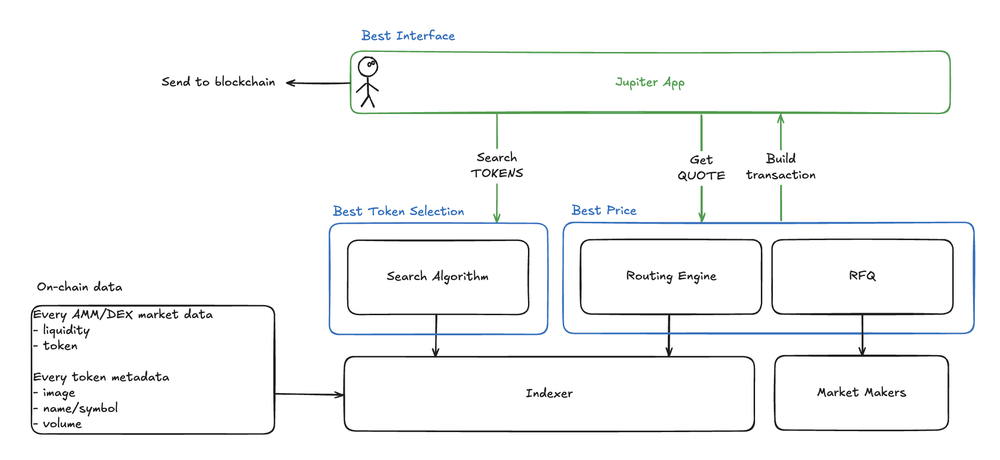

<head>
    <title>How Swap works</title>
    <meta name="twitter:card" content="summary" />
</head>

Jupiter Swap is simple to use but a complex system. In this article, we will breakdown the intricacies of how it works and how it has evolved over time.

---

## Overview

Jupiter Swap is built around various crucial on-chain data and using those data in algorithms or display them as information to aid users make informed swap decisions.

Refering to the simple flowchart below, the sequence of events are as follows:

1. You come to [jup.ag](https://jup.ag) or Jupiter Mobile.
2. You enter the tokens you want to swap.

    - Search Algorithm provides you with the results based on verification, volume, etc.

3. You enter the amount to swap.

    - The Routing Engine will find the best possible swap based on on-chain liquidity data.
    - The RFQ infrastructure will find market makers to fulfil the quote.
    - Based on the results, we compare and provide you with the best amongst the two.

4. You click swap, we build the transaction and send it on-chain to execute.

    - All through the simple interface.

## Best Experience

Financial tools on blockchains can become complicated, actions such as handling slippage, preventing MEV, adjusting priority fees can become cumbersome to seasoned veterans and remain daunting for beginners. Solana trading environment is like nothing we have seen before, demanding a different level of execution. The Jupiter Swap interface is simple yet powerful, allowing you to swap with confidence, using token, price information and settings to ensure your swap works.

### Ultra Mode

Ultra Mode ⚡ is the best DeFi experience.
- It takes care of the entire execution flow and settings.
- 0 transaction fees (we pay all on your behalf even failed transactions).
- 0.1% swap fee applies (to help us help you land transactions effectively).
- Real Time Slippage Estimator (RTSE) uses real time historical data to estimate the slippage of your trade.
- Optimised transaction landing to ensure your transaction is paying sufficient priority fees without overpaying.

### Manual Mode

Switch to Manual Mode ⚙️, if you're a seasoned user and prefers to customise your settings with precision.
- You control your own exact slippage threshold and priority fees.
- You pay your own transaction fees but no additional swap fee applies.
- You get to utilise the full suite of swap settings (offered no where else) which includes AMM exclusions, custom transaction broadcast methods, etc.

## Best Token Selection

Since late 2023 and onwards, we see a gigantic surge in the number of tokens being minted and actively traded on Solana. Through this period, Jupiter has rebuilt and strengthen its infrastructure to scale with the big growing demand of trading new tokens.

### Ecosystem List

The Jupiter Ecosystem List started off as a simple Github CSV (deprecated) file where token creators can create Pull Requests to get themselves "strict listed" or verified. The list grew popular and became widely used in the ecosystem. However, as more tokens appeared, more pull requests were created, which significantly increased our manual load to hand verify each token.

Today, the Ecosystem List is run by a group of contributors from various parts of our community. Additionally, more parameters are automatically reflected in the portal to aid them in verification of the tokens legitimacy/credibility.

:::note Resources!
[Read about the full backstory and thought process](https://www.jupresear.ch/t/ecosystem-master-token-list/19786).

[Read about the community verification process](https://www.jupresear.ch/t/get-your-token-a-community-tag-beta/18963).

To verify your token, [check out this guide](./how-to-get-your-token-on-jupiter) or [head over to the site now](https://catdetlist.jup.ag/).

Do note that this process will continue to improve/evolve and might have changes in the future.
:::

### Search Algorithm

With the Ecosystem List, there are still tens of thousands of tokens out in the wild. In order to prevent malicious or scam tokens from being bought, we apply a smart algorithm to the token search function.

- Simple match algorithm to search token name or symbol.
- Direct token address search.
- Flag potential malicious tokens.

    - Tokens with name or symbol including a potential token address of another token.
    - Tokens with freeze authority, transfer tax, permanent delegate, etc.

### Organic Index

Metrics like holders, volume and TVL can be easily gameable, we've built an organic index by using real time transactions from real user wallets to determine the organic score of tokens.

You can also [watch the workshop on YouTube](https://youtu.be/ieVMQPIVLe0?feature=shared)!

    <iframe 
        width="100%" 
        height="400" 
        src="https://www.youtube.com/embed/ieVMQPIVLe0?si=TntBNlVMySOws0n6" 
        title="YouTube video player" 
        frameborder="0" 
        allow="accelerometer; autoplay; clipboard-write; encrypted-media; gyroscope; picture-in-picture; fullscreen" 
        allowfullscreen
        style={{ display: 'block', margin: 'auto' }}>
    </iframe>

## Best Price

By default, Jupiter ensures you are getting the best price by comparing the Routing Engine results to the RFQ results. The following explains further of how each mechanism works to provide you with the best price.

### Metis Routing Engine

Pre 2023, there were only a handful of DEXes/AMMs built on the Solana blockchain. At that time, it was simpler to aggregate and provide the best possible route (less permutations of markets and tokens). However, as Solana gain traction, more market volume as well as more DEXes being built.

Over time, Jupiter went through a few iterations of its routing engine and have been using the Metis version since. It is a heavily modified variant of the [Bellman-Ford algorithm](https://en.wikipedia.org/wiki/Bellman%E2%80%93Ford_algorithm) catered for the key requirements of offering best price routing at scale in a very dynamic operational space.

- Operate seamlessly with Solana's hyper-fast blocktimes.
- Route can be provided quickly (without compromising on best price).
- Handle load and demand efficiently.

You can also [watch it on YouTube](https://youtu.be/m29UNEFYWUE?si=wTWi-pfg9EwE4Wuz)!

    <iframe 
        width="100%" 
        height="400" 
        src="https://www.youtube.com/embed/m29UNEFYWUE?si=_Rlc-vRuPwKtL97r" 
        title="YouTube video player" 
        frameborder="0" 
        allow="accelerometer; autoplay; clipboard-write; encrypted-media; gyroscope; picture-in-picture; fullscreen" 
        allowfullscreen
        style={{ display: 'block', margin: 'auto' }}>
    </iframe>

### JupiterZ

JupiterZ, also known as Request For Quote (RFQ), is a pricing mechanism where users request a quote for a specific trade from a permissioned set of off-chain market makers, who then fulfil your swap request on-chain if you choose to accept.

On-chain AMMs and DEXes continue to be complicated and volatile, Jupiter aggregates them to achieve the best price derived on-chain, however, with off-chain market makers, we can greatly improve user experience.

1. Market makers offer firm quotes (guaranteed prices) instead of relying on fluctuating on-chain liquidity pools.

    - **0% slippage**
    - **MEV protected**

2. Market makers execute the swap for you.
    - **0 transaction fees**
