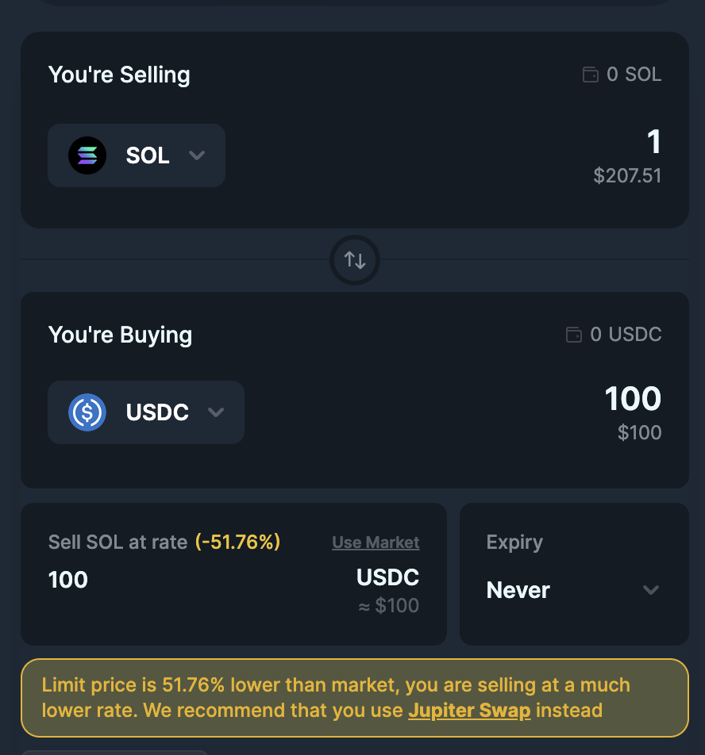

<head>
    <title>How Limit Order works</title>
    <meta name="twitter:card" content="summary" />
</head>

Creating a Limit Order is like setting up a reliable machine that monitors price conditions and execute your orders at the exact price, here’s how it works in a nutshell, let’s break it down into:

- How the orders are created
- How your tokens are bought
- How the order is closed
- How Jupiter Limit Order Differs from CLOB (Central Limit Order Book)

---

Jupiter Limit Order executes your order based on the price you have set by matching it with the available liquidity on-chain across Solana. This is not an order book system. The limit order system utilizes a keeper system to monitor token prices on-chain and trigger the fulfilment of orders if liquidity is available.

In short, Jupiter Limit Order is **an automated Jupiter Swap at 0% slippage**.

## How the orders are created

1. When you place a limit order, the tokens you are selling, say USDC, will be transferred to an account co-owned with the Jupiter Limit Order program. This also includes other information like the desired output mint, amount, expiry, etc.
2. Upon creation, the multiple keepers bots will constantly monitor your limit order and the price condition. Think of keeper bots as the dedicated executors that work tirelessly to fill your order!

:::

## How your tokens are bought

As mentioned, Jupiter Limit Order is an automated Jupiter Swap at 0% slippage. The keeper bots does 2 main actions: monitoring and executing.

1. Upon creation of order, the keeper bots constantly watches if the current market price has reached your specified price condition.
2. Upon meeting of price condition, the keeper bots attempts to fill the order using Jupiter Swap at 0% slippage.

:::note Partial Fulfilment
If your order size is too large, the keeper bots will attempt for partial fulfilment to prevent price impact and maintain the exact market rate.

However, this does not mean the order is complete, while the keeper bots will continue to try to fill the rest of the order.
:::

:::note multiple keeper bots attempts
Jupiter utilizes multiple keeper bots to monitor and execute your orders. Hence, in most order histories, you can actually see the attempts of other keeper bots.
:::

::::caution do not use as stop loss
Jupiter Limit Order does not support using it as a **STOP LOSS**.

If you attempt to set your order as a stop loss, the keeper bots will execute exactly as you quoted.

Let's use this example:

- Market Price: 1 SOL = 200 USDC
- Limit Price: 1 SOL = 100 USDC
- Limit Order: Sell 1 SOL to buy 100 USDC

Refering to the image, you can see the warning of `Limit price is 50% lower than market...`. This indicates that you are attempting to set a Limit Order where the price level is lower than of market rate.

The current Jupiter Limit Order system does not support it as we do not utilize an oracle (a source of truth for price) to determine price checks and validity of the price/liquidity of the pool. If we cannot verify the price and liquidity of a pool, the execution may be invalid and wrongfully filled.

:::note
The interface will attempt to prevent you from creating the order with sufficient warnings and checks, if you still manage to create, we are not liable for any of the loss.
:::

::::

:::caution Price Wicks or Insufficient Liquidity
Jupiter Swap routes various DEXes which are built differently, the price condition being met does not always equate to sufficient liquidity for your order as other bots, users of Solana DeFi could have moved the market.

When the market price reaches your limit, your order becomes **eligible for execution**. Keepers attempt to fill it immediately. However, if the price briefly touches your limit but lacks sufficient liquidity, the order may not execute fully. In such cases, you might notice failed transaction attempts in your wallet as the keepers repeatedly try to fill your order.
:::

## How the Limit Order is closed

After the order is executed, regardless of partial or full fulfilment, the wallet which created the order will immediately and automatically receive the tokens you quoted for (minus platform fees charged by Jupiter).

Upon 100% filled, the Limit Order account will be closed on-chain and you should have received all of the amount.

:::caution Caveat to Auto-Withdrawal: Keep Your ATAs Open
Always keep your Associated Token Accounts (ATAs) open!

When creating the order, we automatically set up the necessary ATA for you to receive the tokens. However if you happen to close it, the Limit Order will fail to fill the order as the transaction will fail.

Hence, keep your ATAs open to ensure the order executes and transfers automatically into your wallet.
:::

## How Jupiter Differs from CLOB (Central Limit Order Book)

Central Limit Order Book (CLOB) is a mechanism used by traditional finance to facilitate trading between buyers and sellers. It acts as a hub where both buyers and sellers can submit their buy/sell orders, which are matched based on specific rules and executed accordingly. This mechanism requires a certain level of market-making for it to operate efficiently. For a particular market or token to be available for trading on the CLOB, it requires a market maker to be present and accessible.

In contrast, Jupiter Limit Order executes orders vaia Jupiter Swaps, an aggregated liquidity and markets based on more than 20 decentralized exchanges (DEXs) and automated market makers (AMMs).

#### Why not CLOB?

If Jupiter Limit Order were to utilize the typical CLOB execution model, we will not be able to support **all tokens** across Solana DeFi seamlessly. There could be some improvements in terms of price or execution, however, we will lose the accessibility to the vast DeFi markets and introduce more user friction.
