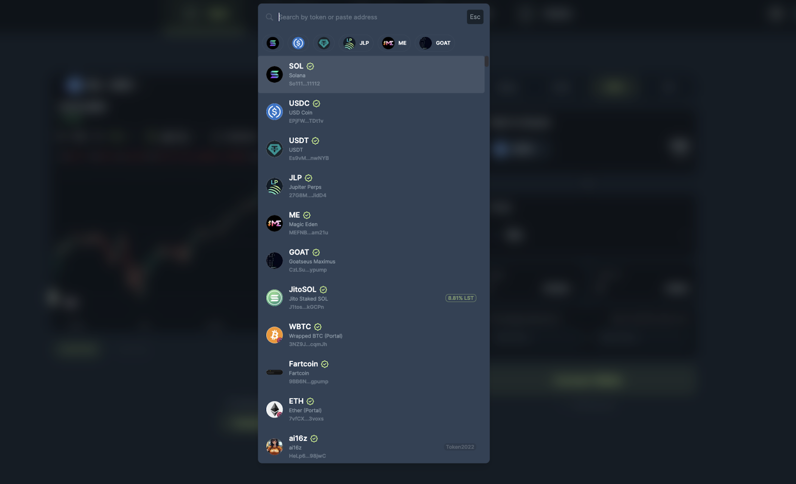
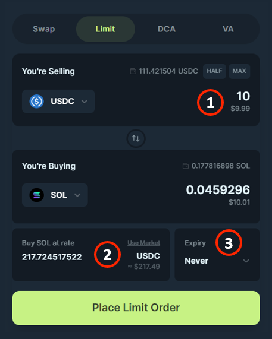
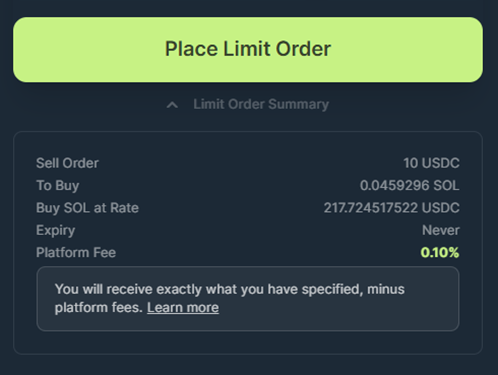

<head>
    <title>Create Trigger Order</title>
    <meta name="twitter:card" content="summary" />
</head>

Setting up a Trigger Order plan on Jupiter is quick, simple, and designed to help you efficiently set up orders for your desired price levels to execute your strategy.

---

## Step 1: Connect Your Wallet

Before anything else, you’ll need to connect your wallet to Jupiter.

1. Visit the [**Jupiter Trigger Order page**](https://jup.ag/limit).
2. Double-check that the URL is correct at https://jup.ag/limit and "Trigger” Tab is selected.
3. Click on the **“Connect Wallet”** button at the top right or use one of the other "Connect Wallet" buttons on the dashboard: Select your preferred wallet from the list (e.g., Phantom, Solflare, or any other supported wallet).
4. Approve the connection request in your wallet.

## Step 2: Choose Your Tokens

Now it’s time to decide which tokens you want to sell and buy.

1. Upon clicking on the token selector to choose what token to sell and buy, the token list will open up.
2. Select the token you want to sell in the top selector, **“I Want To Allocate”**.
3. Select the token you want to buy in the bottom selector, **"To Buy”**.

:::caution tokens not supported
Tokens with transfer fee extension enabled are not supported.
:::

## Step 3: Set Your Trigger Order

1. **Enter the amount** of the token you are selling.
2. Enter the **rate** at which you want to buy/sell. This is the price at which the order will get executed at.
    :::tip
    Jupiter will calculate how many tokens you will get based on the input token amount and rate entered, shown in the **"You're Buying"** field.
    :::
3. Optional: **Choose the Expiry** of your order. This option lets you select the maximum period for which your order remains active.
    :::tip
    It can be 10 minutes or by default it is set to never expire. The expiry option ensures that if the order is not executed in your specific time then it will cancel.
    :::

## Step 4: Review and Place Trigger Order

Before placing the order, double-check the details:

1. The amount to sell.
2. The rate at which you buy/sell, **important to always check**.
3. The expiry, if necessary.

Have a look at the Trigger Order Summary thoroughly. If everything looks good, click on the **“Place Trigger Order”** button.

## Step 5: Approve the Transaction in Your Wallet

Your wallet will prompt you to approve the transaction to create the Trigger Order

1. Check the transaction details in your wallet.
    - The selling amount
    - The rent for accounts
2. Approve the transaction.

Once approved, your Trigger Order will be created on-chain and keeper bots will begin monitoring it.

A notification toast will appear that will notify you once the transaction has been sent and has completed.

## Step 6: Track Your Orders

Congratulations! Your first Trigger Order is now active.

1. Navigate to the Active Orders section to monitor them.
2. See details like:
    - Order details.
    - Tokens purchased.
    - To learn more about what each detail means, [read here](./interface).
3. You can also [cancel your order](./how-to-manage-trigger-orders) at any time.