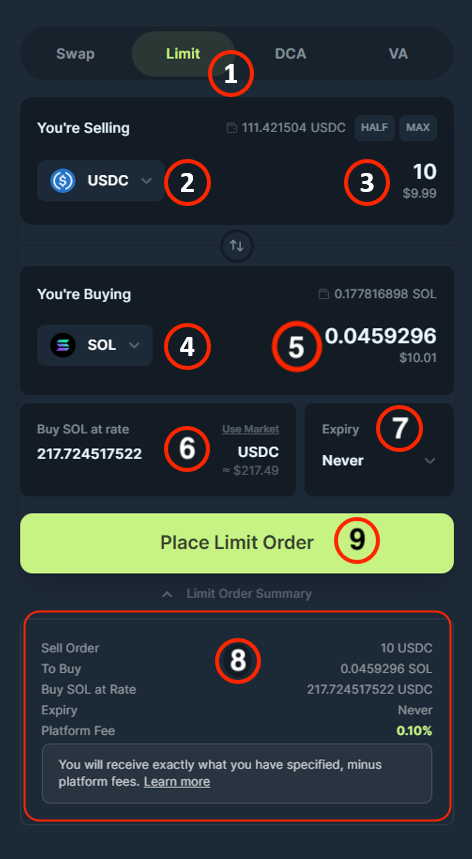
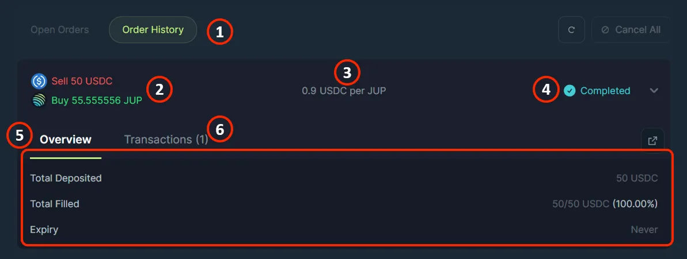
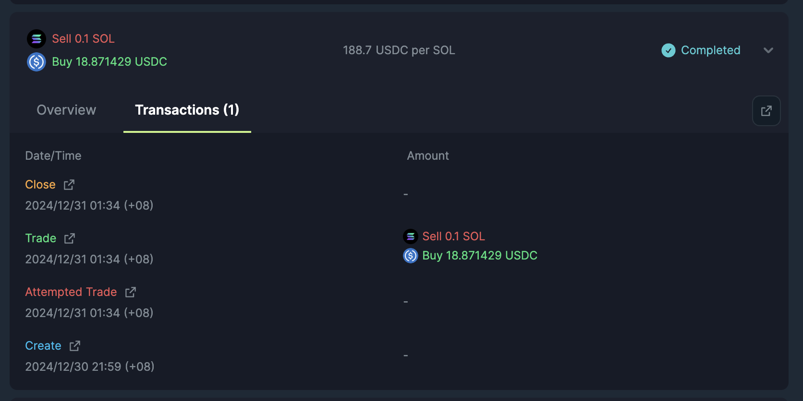

<head>
    <title>Trigger Order Interface</title>
    <meta name="twitter:card" content="summary" />
</head>

In this section we go through what each setting on the Trigger Order dashboard means.

- Trigger Order Form
- Open/Historical Trigger Order

---

## Trigger Order Form

| Field | Description |
|---|---|
| **(1) Trigger** | Select the Trigger tab in the Spot navigation menu to arrive at the Trigger Order form. |
| **(2) Input Token Selector** | Select the token you want to sell. |
| **(3) Input Token Amount** | Enter the amount of the input tokens that you are looking to sell. |
| **(4) Output Token Selector** | Select the token that you want to buy/receive. |
| **(5) Output Token Amount** | Shows the amount of output tokens you will receive based on your **input amount** and **rate**. |
| **(6) Rate** | Enter the target price for the order to execute.  *Do always double check your rate, we always fill at exactly your quote.* |
| **(7) Expiry** | Select the time period where your Trigger Order will be active. |
| **(8) Order Summary** | Shows your selections and input for the Trigger Order. |
| **(9) Place Trigger Order** | Click to submit the transaction to create the Trigger Order. |

## Open Orders

| Field | Description |
|---|---|
| **(1) Open Orders** | This tab shows the active Trigger Orders. |
| **(2) Token Deposited Details** | Shows the amount of tokens you are selling and buying. |
| **(3) Target Price per Token** | Shows the target price of your selected token for the order to execute. Once the token reaches this price your order will execute.  *This refers to the "Rate" in the Trigger Order Form.* |
| **(4) Fill Percentage** | Shows how much of the order is filled. If 100%, it will marker order as completed in Order History tab, else other percentages represent partial fulfilment. |
| **(5) Expanded View** | Click to expand the specific active Trigger Order. |
| **(6) Overview** | Shows more details like expiry and filled amount. |
| **(7) View Transaction** | Click to open the transaction of the Trigger Order in a blockchain explorer. |
| **(8) Cancel Order** | It closes the specific Trigger Order. |
| **(9) Cancel All** | It closes all open Trigger Orders. |

## Historical Orders

| Field | Description |
|---|---|
| **(1) Order History** | This tab shows the historical Trigger Orders. |
| **(2) Token Deposited Details** | Shows the amount of tokens you are selling and buying. |
| **(3) Target Price per Token** | Shows the target price of your selected token for the order to execute. Once the token reaches this price your order will execute.  *This refers to the "Rate" in the Trigger Order Form.* |
| **(4) Status** | Shows the final status of the order, if 100% filled, it is marked as completed, else it will be marked as cancelled. |
| **(5) Overview** | Shows more details like expiry and filled amount. |
| **(6) View Transactions** | Tab showing a list of transactions made by the specific Trigger Order such as creation, fills, etc. |

## Transactions

| Fields | Description |
|--------|-------------|
| **Date/Time** | The date and time when this transaction was executed. |
| **Status** | The type of transaction: Create, Trade, Attempted Trade or Withdrawn. |
| **Amount** | The amount of tokens sold and bought. |

:::tip Explore Further With Blockchain Explorers
For advanced users, you can dive further into the details of each order. Simply click on the redirect link to view the transaction using a blockchain explorer.
:::