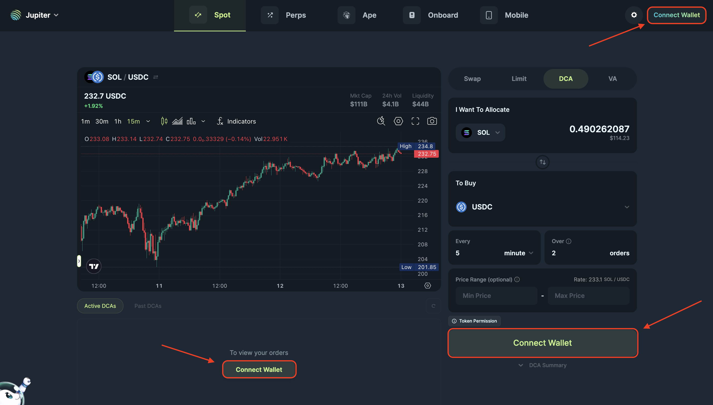
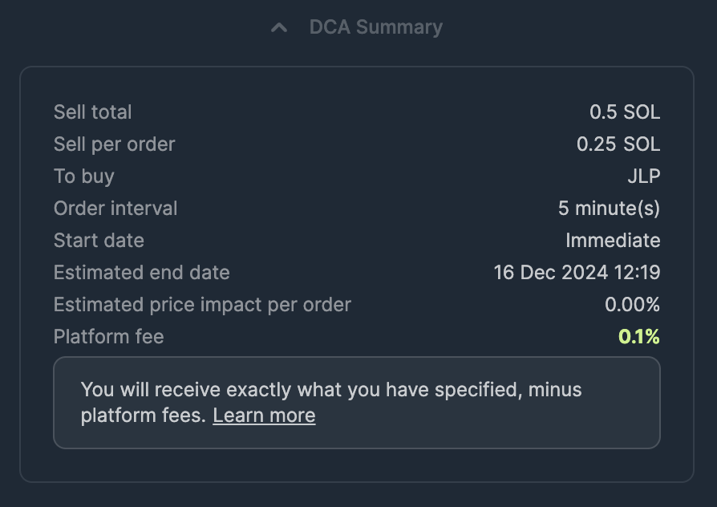
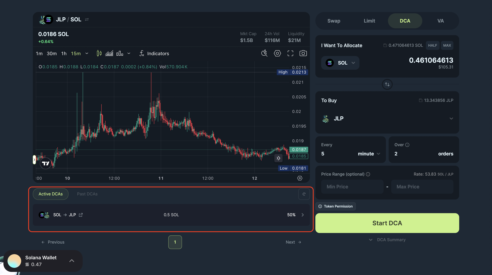
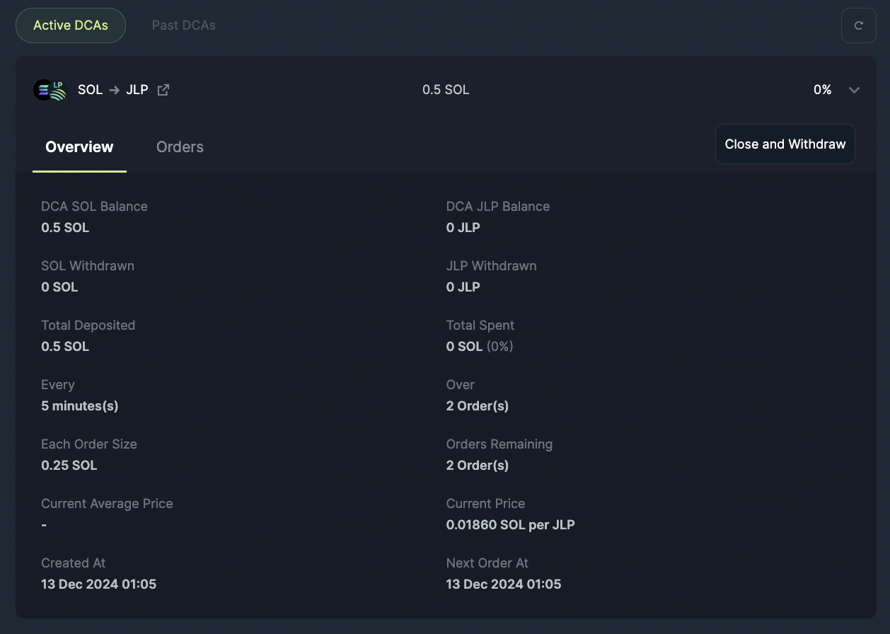

<head>
    <title>Create Recurring Orders</title>
    <meta name="twitter:card" content="summary" />
</head>

Setting up a Recurring Order on Jupiter is quick, simple, and designed to help you build your portfolio without the anxiety of timing the market. Let’s dive into the steps to get started.

---

## Step 1: Connect Your Wallet

Before anything else, you’ll need to connect your wallet to Jupiter.

1. Visit the [**Jupiter Recurring Order page**](https://jup.ag/dca/).
2. Double-check that the URL is correct at https://jup.ag/dca and **"Recurring Tab"** is selected.
3. Click on the **“Connect Wallet”** button at the top right or using one of the other "Connect Wallet" buttons on the dashboard: Select your preferred wallet from the list (e.g., Phantom, Solflare, or any other supported wallet).
4. Approve the connection request in your wallet.

## Step 2: Choose Your Tokens

Now it’s time to decide which tokens you want to allocate and buy.

1. Upon clicking on the token selector to choose what token to allocate and buy, the token list will open up.
2. Select the token you want to sell/allocate in the top selector, **“You’re Selling”**.
3. Select the token you want to buy in the bottom selector, **“You’re Buying”**.

:::tip **Pro Tip:**
Choose tokens that align with your investment goals. If you’re unsure, start with popular ones like SOL or LSTs (Liquid Staking Tokens) like JupSOL.
:::

## Step 3: Set Your Recurring Order

This is where the magic happens!

1. **Enter the amount** you want to allocate to the entire Recurring Order (e.g., $100 worth of JupSOL).
2. Choose the **frequency** of your purchases: in minutes, hours, days, weeks or months.
3. Enter the number of orders you want your Recurring Order to be processed in.

:::tip **Pro Tip:** Price Strategy
4. This is an optional setting, you can provide a minimum or maximum price range for your order.

[Read this guide for more information!](./how-to-use-recurring-order-price-range)
:::

## Step 4: Review and Start Recurring Order

Before confirming, double-check the details:

- The allocated token and token to buy.
- The frequency, total amount being used, amount per order.
- The price range, if necessary.

Have a look at the Recurring Order Summary for a thorough overview. If everything looks good, click on **"Start Recurring Order"** button.

## Step 5: Approve the Transaction in Your Wallet

Your wallet will prompt you to approve the transaction to set up the Recurring Order.

1. Check the transaction details in your wallet.
    - The allocation amount
    - The rent for accounts
2. Approve the transaction.

Once approved, Jupiter will handle all future transactions for you automatically.

A notification toast will appear that will notify you once the transaction has been sent and has completed.

## Step 6: Track Your Recurring Order

Congratulations! Your first Recurring Order is now active.

1. Navigate to the Active Recurring Orders section to monitor your active Recurring Orders.
2. See details like:
    - Tokens purchased.
    - Average purchase price.
    - Next scheduled transaction, and more.
    - To learn more about what each detail means, [read here](./interface).
3. You can also [close/cancel your plan](./how-to-manage-recurring-order) at any time.

