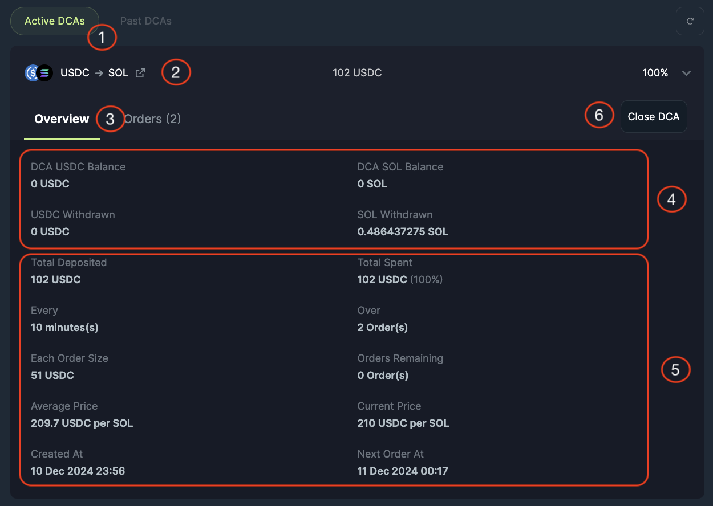
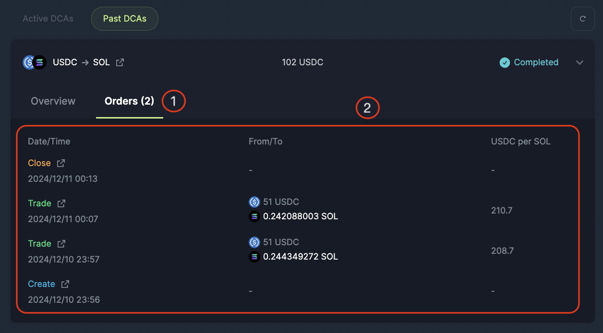

<head>
    <title>Recurring Order Interface</title>
    <meta name="twitter:card" content="summary" />
</head>

In this section we go through what each setting on the Recurring Order dashboard means.

- Recurring Order Form
- Active/Historical Recurring Order

---

## Recurring Order Form

| Field | Description |
|---|---|
| **(1) Recurring Order** | Select the Recurring Order tab in the Spot navigation menu to arrive at the Recurring Order form. |
| **(2) Input Token Selector** | Select the token you want to spend/allocate with your Recurring Orders. |
| **(3) Input Token Amount** | Enter the amount of the input tokens that you are looking to spend/allocate **in total** with your Recurring Orders. |
| **(4) Output Token Selector** | Select the token that you are looking to Buy. |
| **(5) Interval** | Specify the time in between each purchase with a numerical input and the dropdown selector for time unit. |
| **(6) Total Orders** | The number of orders you want the Recurring Order to be spread out over. |
| **(7) Price Range** | Set a minimum and maximum price range under which only your Recurring Order would be executed (optional parameter). |
| **(8) Order Summary** | Specify the details for the current Recurring Order you are creating:  **Sell Total:** 50 USDC (You are selling USDC).  **Sell Per Order:** The Sell Total divided by the Total Orders (50 USDC / 12).  **Receive:** JUP (You are buying JUP).  **Order Interval:** 5 minutes (A trade will take place every 5 minutes).  **Start Date:** The Recurring Order will begin immediately upon submission.  **Estimated End Date:** The final Recurring Order will finish by this date.  **Estimated Price Impact Per Order:** Estimated impact on the market price per Recurring Order trade.  **Platform Fee:** 0.1% platform fee for Recurring Orders. |
| **(9) Start Recurring Order** | Click to submit the Recurring Order and start the Recurring Order. |

## Active/Historical Recurring Order

| Field | Description |
|---|---|
| **(1) Active/ Historical Recurring Orders** | Select either the Active or Historical tab to view respectively. |
| **(2) Individual Recurring Orders** | Active: Ongoing Recurring Orders percentage to indicate how much of the orders has been executed.  History: Status of order, either Completed, Cancelled or Withdrawn. |
| **(3) Information Tabs** | Select either Overview or Orders to view respectively. |
| **(4) Balance Summary** | This shows the Recurring Order balance progress where you can track the balances for the tokens you allocated, you are buying and you have withdrawn. |
| **(5) Order Summary** | **Total Deposited:** The input amount and token that you are selling or swapping from.  **Total Spent:** The progress of the Recurring Order, or the amount spent to swap from.  **Every:** The time interval specified in the Frequency fields.  **Over:** The total number of purchases.  **Each Order Size:** Total deposited divide by Total number of purchases  **Orders Remaining:** The number of purchases left to complete the Recurring Order.  **Current Average Price:** Sum of the price of each transaction divide by Total current completed purchases  **Current Price:** The price of the token your are buying now.  **# of Orders Left:** The number of orders remaining with this Recurring Order request.  **Created At:** The date and time when the Recurring Order was submitted.  **Next Order At** The date and time of the next order to be executed. |
| **(6) Close and Withdraw** | Click to submit and start the Recurring Order. |

## Recurring Orders

| Fields | Description |
|--------|-------------|
| **Date/Time** | The date and time when this transaction was executed. |
| **Status** | The type of transaction: Create, Trade, Close or Withdrawn. |
| **From/To** | The amount of tokens sold and bought. |
| **Rate** | The rate of the purchase for the transaction. |

:::tip Explore Further With Blockchain Explorers
For advanced users, you can dive further into the details of each order. Simply click on the redirect link to view the transaction using a blockchain explorer.
:::