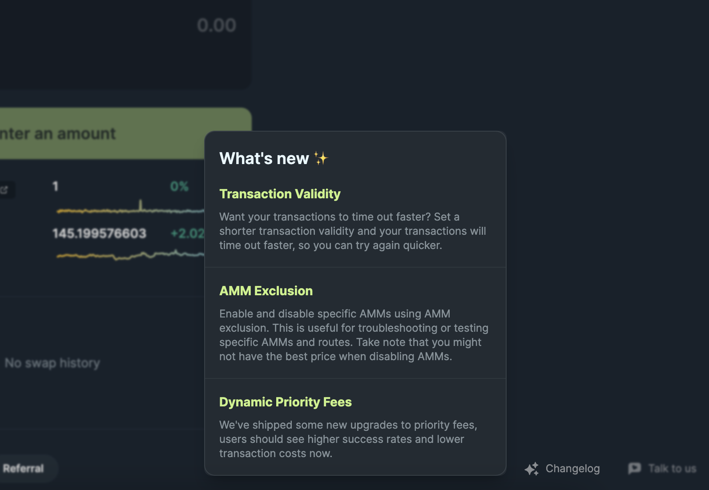

<head>
    <title>Edge: Explore Jupiter's latest cutting-edge features</title>
    <meta name="twitter:card" content="summary" />
</head>

## What is Edge?

Edge, or [edge.jup.ag](https://edge.jup.ag/), is Jupiter's innovation testing ground, designed for power users who want to experiment with cutting-edge tech before they are released on jup.ag.

On Edge, we ship our newest features for Spot and Perpetuals, let users try it out and give us feedback,    then we re-iterate and improve on the features before it lands into the production site.

## How to Access Edge

Anyone can access [edge.jup.ag](https://edge.jup.ag/) and help us out with testing. However, please note that the latest features are still in Beta and may not function perfectly as intended.

## How to Find New Features on Edge

Edge includes a changelog that highlight the latest features and additions, making it easy for you to see what’s new and available for testing.

## How to Provide Feedback

If you want to report a bug or suggest something new, you can join our Discord server and create a ticket/post a message in the **‘💭 · edge-jup-ag’** channel.

The goal of Edge is to create a **continuous feedback loop**:

1. We add new features into the changelog
2. You try them out and tell us what you like/dislike
3. We reiterate and improve on the features

Your feedback is crucial in helping us improve Jupiter!

## Try It Out

1. Visit [edge.jup.ag](http://edge.jup.ag) and start exploring the latest features on Jupiter
2. Join the Jupiter Discord server ([discord.gg/jup](http://discord.gg/jup)) and give us your feedback!