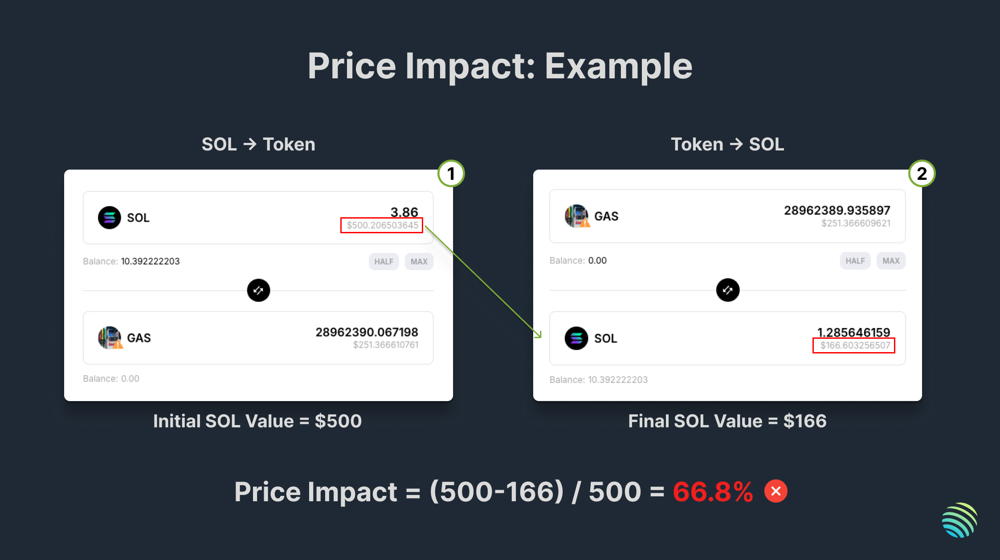

<head>
    <title>How to Get Your Market Fully Routed on Jupiter</title>
    <meta name="twitter:card" content="summary" />
</head>


To provide users access to new tokens, all new markets on supported AMMs are instantly routed for **14 days**.

After 14 days, markets that fit the criteria will continue to be routed on Jupiter.

To ensure your market gets routed on Jupiter after 14 days, your market must fit **one of the following criteria**:

1. **Price Impact on $500**

Using a benchmark position size of **$500**, a user should encounter less than **30%** price impact after swapping in AND out of the token from the same pool. 

```
Price Impact = ($500 - Final USD value) / $500
```

For example, a user swaps **$500** worth of SOL into the token, then swaps the same output amount back into SOL. We then use the formula to calculate the price impact percentage.

If the price impact is more than **30%**, it means that there is insufficient liquidity in the pool for the benchmark position size of **$500**.




2. **(For additional markets) Price Difference**

For additional markets on already supported tokens, there should be a variance of less than **20%** between the new pool and the pool existing in routing. 