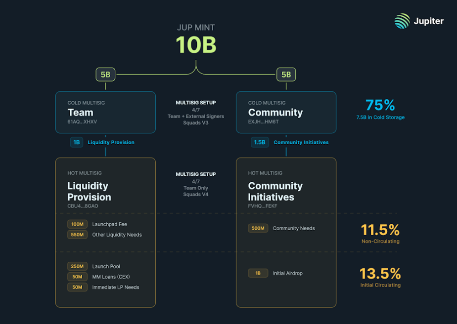

<head>
    <title>$JUP Tokenomics</title>
    <meta name="twitter:card" content="summary" />
</head>

#  Overview

$JUP is the governance token of the Jupiter DAO. It represents the interests of the Jupiter DAO. LFG and Governance Votes both utilize the $JUP Token in the ASR voting process.

**1 $JUP = 1 vote**

**Total Supply:** 10 Billion
- **$Jupuary Airdrops:** 40% - 4 Billion
- **Jupiter Team:** 20% - 2 Billion
- **Strategic Reserve:** 20% - 2 Billion 
- **Contributors and Grants:** 10% - 1 Billion
- **Liquidity Provision:** 10% - 1 Billion

---  

# Token Circulation

## Team-Managed Allocation (50% of Total Supply)

### Current Team Members (20%)
- Vesting: One year cliff, two years vesting.

### Strategic Reserve (20%)
- Purpose: strategic reserve, used for future team members, future strategic investors, and for past Mercurial stakeholders (now Meteora).
- Conditions for usage.

### Liquidity Provision (10%)
- Explanation of liquidity provision strategy.
- Details of implementation.
- Used in the first year.

## Community Distribution (50% of Total Supply)

### Airdrops (40%)
- 4 Rounds of Airdrops. First dropped 1 billion tokens on January 31st of 2024, due for 3 more each January until 2027 (if my math is right lol).
- Criteria for eligibility and distribution process - always uncertain to prevent farming but using the Jupiter swap in an organic manner is a very good bet.

### Contributors and Grants (10%)
- Purpose: supporting community members contributing to Jupiter’s ecosystem.
- Administration via JUP DAO.

---

# Governance and Community Engagement
- Governance in regards to DAO actions takes place utilizing the $JUP token as the vote count mechanism. 1 $JUP = 1 Vote
- The LFG Launchpads' voting process also hinges on $JUP holder votes to select projects to launch. 75% of the fees generated from the launchpad are returned to the users who vote, in the form of ASR or Active Staking Rewards. 100mm $JUP has been injected into the ASR pool as an additional reward for Voters in the first two quarters of voting. 
- ASR, or Active Staking Rewards takes into account the activity of $JUP holders as they participate in the governance and launchpad processes to allocate rewards to active community members that have staked and vote on DAO actions.

