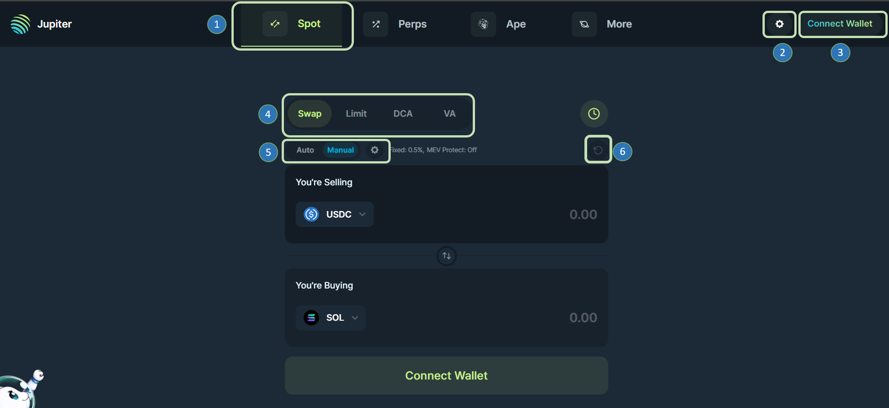
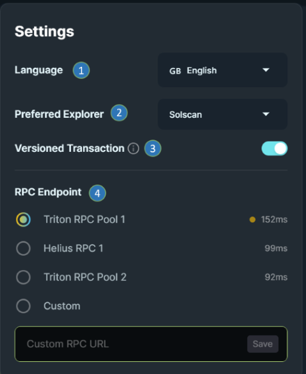
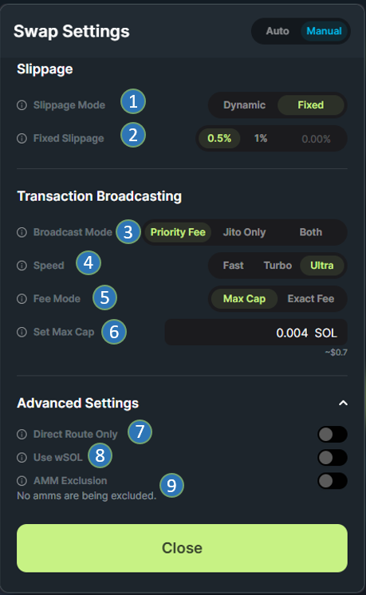
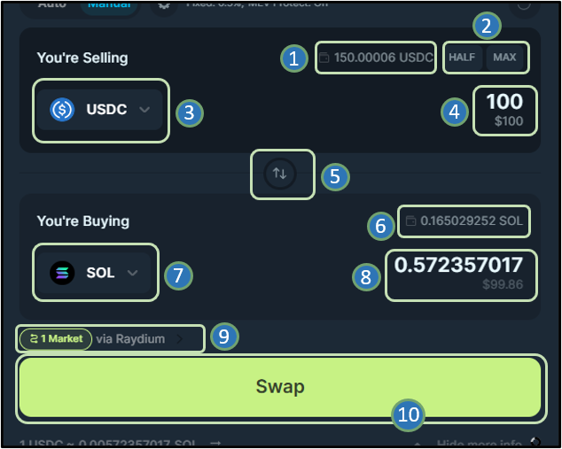
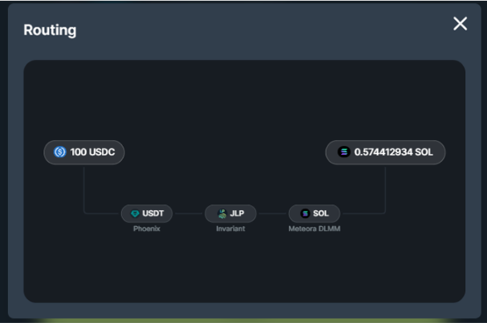

<head>
    <title>How to Swap Tokens on Jupiter: Step By Step</title>
    <meta name="twitter:card" content="summary" />
</head>

:::tip Jupiter charges no fees
There are no protocol fees on Jupiter. The only fees are transaction fees and DEX/AMM fees which are factored in to the swap calculations. If you see more SOL deducted than what you expect, it is probably due to deposits for creating [Associated Token Accounts](https://https://spl.solana.com/associated-token-account).
:::

## Basic Swap User Flow

1. Visit the Jupiter website [Jupiter Website](https://jup.ag/). **Double check** that the URL in your browser address bar is correct: https://jup.ag/
2. Connect your wallet by clicking the `Connect Wallet` button at the top right corner of the site.
3. Select the tokens that you want to swap from and into with the token selectors.
4. Enter the amount of the selected token that you want to swap from in the top selector.
5. Review output token amounts and the swap route. Checkout the full list of supported DEXes for routing [here](https://station.jup.ag/partners?category=DEXes).
6. Configure additional parameters to optimize your trade, including: Priority Fees, Slippage Settings, and Swap Settings.
7. After you have confirmed all the parameters and inputs, click on the 'Swap' button. You will be prompted with a confirmation from your wallet. If you 'Confirm', your swap will be sent to the blockchain, to be finalized.
8. A notification toast will appear in the lower left corner that will show the current status of your transaction.
9. You can view your swap history at the bottom of the page or click on the wallet at the top right corner.

**Let's go through Jupiter Settings in greater detail below.**

---

## Jupiter Settings

1. **Jupiter Spot:** In [Jupiter Spot](https://jup.ag/) tab _(the current tab you are in)_, the Jupiter Swap is available.
2. **Jupiter Global Settings:** Select your default settings like language, Solana explorer and RPC endpoint.
3. **Connect Wallet:** Connect your preferred wallet to interact with Jupiter.
4. **Jupiter Swap:** [Jupiter Swap](https://jup.ag/) tab _(the first tab)_ where you can instantly spot swap for any supported SPL token.
5. **Jupiter Swap Settings:** These settings impact the routing and pricing of the swaps. For beginners it is usually easier to go with Auto settings. We will see all the settings in detail in the below sections.
6. **Refresh Quote:** Refresh quote button to update the latest quote for the configured asset swap in the terminal.

### Global Settings

:::tip The RPC Endpoint Selector now displays active end-point latency
Due to network traffic loads RPC endpoints can get overloaded, which can lead to latency issues that will directly impact your trade executions. Reviewing the RPC latency and selecting the lowest latency option is a best practice to ensure the fastest trade execution.
:::

1.  **Language:**  Pick your preferred language from English, Chinese, Vietnamese, Japanese, Indonesian, Korean, Spanish, French, ,Italian, Dutch, Portuguese and Turkish.
2.  **Preferred Explorer:** Pick your preferred explorer from Solscan, SolanaFM, Solana Beach, Solana Explorer, XRAY, and OKLink.
3. **Versioned Transaction:** This allows for more advanced routing and better prices. Enabling [Versioned Transaction](https://station.jup.ag/docs/additional-topics/composing-with-versioned-transaction) improves composability so Jupiter will be able to fit in more routes.
4.  **RPC Endpoint:** Pick your preferred public RPC endpoint from Triton RPC, Helius RPC, or use your own custom RPC endpoint.

### Swap Settings

#### Slippage Settings

::::info Slippage Settings

Utilizing the Slippage Setting to ensure your transactions are executed is a common practice. The slippage setting is important to prevent users from getting poor swap rates on transactions if the asset price falls below the specified slippage rate.

:::danger

This is an advanced setting and should be used with caution.

:::

::::

1.  **Slippage Mode:** Select the slippage mode you want to utilize. Dynamic mode optimises slippage between success rate, and sandwich protection through a series of simulations. Auto slippage will utilize Jupiters internal slippage calculations for the best setting. Fixed will adhere to your specificed slippage amount.
2.  **Fixed Slippage:** Enter the maximum acceptable slippage rate for your swaps.

#### Transaction Priority Fees

:::info Transaction Priority Fees
Trades submitted to the blockchain are assigned a priority based on the fee bidding process. The higher the priority fee, the higher your transactions will be in the execution queue. During times of congestion, increasing your priority fee can help. Use with caution and remember to re-adjust the fee selection afterwards.
:::

3. **Broadcast Mode:** Select your transaction broadcasting option. Choose from submitting to RPCs with priority fee, sending your transaction directly to Jito Validators via a bundle, or a Mixed, which fires both and see which lands first.
4. **Speed:** Specify the Priority Level, in increasing priority: Fast, Turbo, Ultra for the transactions you are executing. Controlling how fast the transaction will land, Turbo and ultra cost more SOL but they are faster.
5. **Fee Mode:** Pick your preferred Fee Mode. Either specify a Max Cap for your fee or an Exact Fee for your transactions. 
6. **Set Max Cap:** When a max fee is set then the fee is adjusted based on market conditions up to the max value.

#### Advanced Settings

7. **Direct Route Only:** Using Direct Route Only ensures that the transaction will only be submitted to a single pool. This will limit a lot of intermediate tokens and filter out a lot of other viable routes that use intermediary tokens.
8. **Use wSOL:** Using [Wrapped SOL (wSOL)](../../12-general/5-wrapped-sol.md) makes using Jupiter faster and more convenient for traders who trade frequently with SOL, since it avoids having to wrap/unwrap SOL.
9. **AMM Exclusion:** This excludes certain AMMs when swapping.

---

## Jupiter Swap

1. **Input Token Wallet Balance:** Jupiter detects the input token balance in your wallet.
2. **Half/ Max Amount:** Shortcut buttons to quickly input `Half` or `Max` of the balance amount.
3. **Input Token / Token to Sell:** Token selector to select token to sell or swap from.
4. **Input Token / Token to Sell Amount:** Specify the amount of input token to sell or to swap from.
5. **Input token & Output Token Switch:** This button switches the input and output token.
6. **Output Token Wallet Balance:** Jupiter detects the output token balance in your wallet.
7. **Output Token / Token to Buy:** Token selector to select token to buy or swap to.
8. **Output Token / Token to Buy Amount:** Jupiter computes this quoted output amount from the swap configuration and current on-chain price rates of the assets involved in the route. _(This includes swap fees from all DEXs and AMMs along the route.)_
9. **Order Routing:** Order routing shows the markets being routed through and each hop along the path. This can sometimes involve Multi-hop and Split trades to achieve the best results.
10. **Action - Swap:** Once you have confirmed all the parameters, LFG!

### Order Routings

:::info Order Routing
Clicking on the area marked number 9 from the Swap terminal above will show you the exact order routing path for the quoted transaction. You can also see the split trades and all market hops along the route (if any).
:::

---

## Swap Details / Price Info

1. **Exchange Rate for the Selected Tokens:** This is the current exchange rate, based on the on-chain prices for the selected input and output tokens.
2. **Minimum Received:** Minimum received takes into account the slippage setting and market liquidity to compute the minimum amount that the user will receive even with maximum price fluctuations during a successful swap.
3. **Max Transaction Fee:** This is the maximum fee you will pay to execute the quoted transaction. This takes into account your selected fee settings.
4. **Deposit:** If you are transacting assets you have not owned before, Solana may require a small deposit amount to create the ATA account in your wallet to hold that asset. This will only occur with assets you have not owned previously.
5. **Price Impact:** Price Impact is influenced by the available liquidity to settle the trade. The larger the trade the larger the price impact on the selected assets.
6. **Price Difference:** This is a comparison against the token prices on Coingecko.