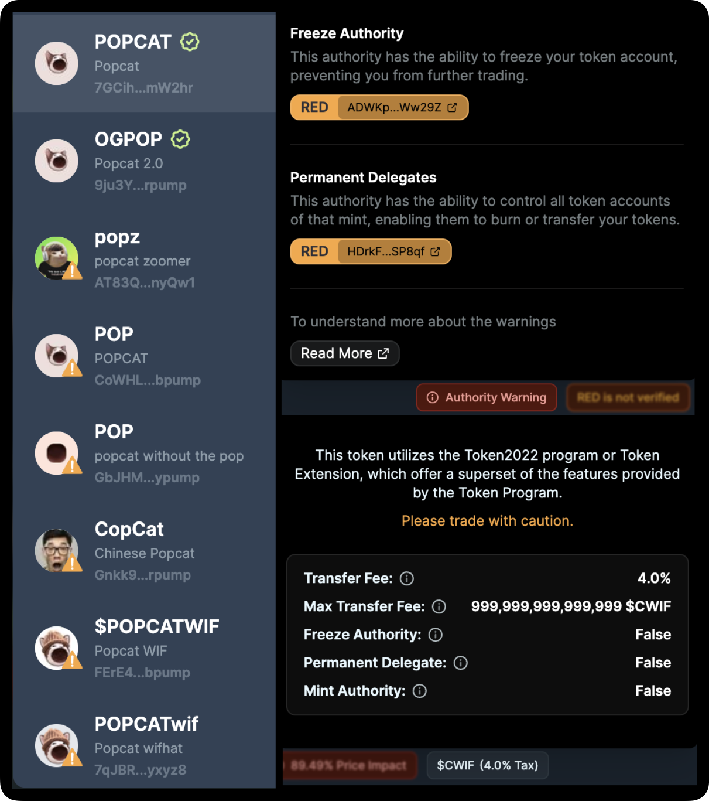

*Last Updated: 5 November 2024*

Trading in DeFi can get complex with tokens of various risk profiles and functionalities, leading to an overload of information. Jupiter is committed to balance convenience and protection for you. 

We highlight safety notifications, non-intrusive warnings, key token info, and swap summary to reduce info asymmetry yet not overload you.

### Warnings

Price impact alert is influenced by the available liquidity and your trade size. A large trade size in an illiquid pool often results in huge price impact, hence you can break up your trade size with [DCA](https://jup.ag/dca/USDC-SOL). 

We also show the quoted rate (from Jupiter) against the market rate. The price difference can be due to various external factors such as price impact, token tax, etc. 

If your trade shows a large price impact and difference, please trade with caution and feel free to seek clarity in our [Discord](https://discord.gg/jup).

### Token Information

Jupiter shows relevant token information to reduce information asymmetry you may face when trading. Token Verification shows as "Verified ✅" or "Not Verified ⚠️" and Token2022 extensions appears as information pills. 

More on Token Verification criteria [here](https://station.jup.ag/guides/general/get-your-token-on-jupiter#how-to-get-your-token-verified). 

More on Token2022 extensions below:

|  | Permanent Delegate | Transfer Tax | Freeze Authority |
| --- | --- | --- | --- |
| Definition | Permanent Delegate allows creators to grant unlimited delegation privileges over any account for that mint. They can burn or transfer any amount of tokens, from any token account.  | Transfer Tax allows fees to be withheld on every transfer. These fees are held on the recipient's account, and can only be redeemed by those with withdraw authority. | Freeze Authority allows token issuers to temporarily or permanently halt the transfer or trading of a token.  |
| Valid Use | This enables automatic payments, recovering drained wallets, and processing refunds. | This enables small service charge to generate revenue for projects, or enable royalties & taxes being collected for particular transfers.  | Common for regulated tokens e.g. stablecoins or RWAs to comply with legal requirements. Issuers can freeze tokens in cases of fraud, money laundering, terrorism financing and law enforcement request compliance.  |
| Misuse  | Scam projects can decide to drain tokens from legitimate holders’ wallets, leading to loss of funds.  | Scam projects can decide to arbitrarily increase the tax rate per transaction without informing the users and withdraw the funds with all authority.  | Commonly used by scam projects to lock users out of trading or transferring the scam token, leading to significant losses. A red flag for users as it shows a potential for market manipulation or outright fraud.  |

### MEV Protect

Jupiter introduces [MEV Protect](https://www.jupresear.ch/t/continuing-to-deliver-on-jupiters-best-ux-promise/22230) mode, which will only send your transactions directly to Jito block engines, minimising the risk of sandwiches for you. 

In a sandwich attack, a bot spots your transaction, places a buy order before yours to push the price up, and places a sell order right after, pocketing the difference and leaving you with a higher cost per token. Turning on MEV Protect will hide your swaps and thus reducing the chances of MEV or sandwich attacks.

### Swap Summary

The summary shows you the information relating to the trade, such as the minimum received, the transaction fees, and price difference when compared to the market rate. 

### ExactOut

ExactOut gets the exact amount of tokens that you need. We share this alert because liquidity venues and routes are lesser than ExactIn. Transparently, you should know that you might get a worse price. Best practice is to compare the rates between ExactOut and ExactIn before you trade. 
