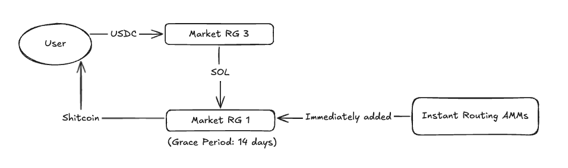

The key to Jupiter Swap, is Jupiter Routing.

### Jupiter Routing

- Offers the best price swapping between any token to any token on Solana
- With wide token selection, supporting new tokens and markets immediately when launched,
- Functions as the universal liquidity layer of Solana, such as Phantom, Birdeye, etc.

Our promise of Best Price & Best Token Selection meant that we needed to ensure that we only used liquid tokens for complex routing for better and reliable prices, while also adding new tokens and new markets super quickly.

:::tip **Note:** Our infrastructure is “markets” focused, primarily used in routing.
:::

### Routing Groups

Routing Groups (0-4) is a way to label markets and treat them differently in routing.

- RG 0: Markets dropped from Jupiter Routing but still exist on-chain.
- RG 1: Also known as Simple Routing, Routing without ALTs.
- RG 2: Full liquidity, ALT created, price impact, price difference (either).
- RG 3: Full liquid, intermediate list.

Note: We create [Address Lookup Tables (ALTs)](https://solana.com/docs/advanced/lookup-tables) for markets to add them to full routing. ALT creation requires time + SOL, which is why we only promote tokens to full routing after 14 days and a set criteria.

### Market Indexer & Crawler

We have 2 ways of a market being added to routing:

1. Market Indexer — Using Triton Yellowstone Geyser RPC plugin, we query all the transactions related to the programs supported by instant routing, with a custom parser to look for the market ID, and immediately add to RG 1.
2. Market Crawler (Cron Job) — that runs every 30mins to check every markets to check the liquidity and classify the pool as RG 0, 2 and 3.

### Instant Routing

With Instant Routing, we wanted to support new tokens with routing immediately. Swap for any shitcoin that launched on any AMM, immediately using any input token.

We did this by creating a middle ground (Routing Group 1), which offers simplified routing without ALTs.

When new markets are launched, we immediately add the market to Routing Group 1, without ALTs. Tokens launched with Routing Group 1 enjoy multi-hop/splits as per normal.

Example: USDC → Market A (RG 3) → SOL → Market B (RG 1) → New Token

When a token launches, it is immediately supported with Routing Group 1, if it is launched on one of the AMMs supported with Instant Routing.

:::tip
Note: We currently support Fluxbeam, Meteora DLMM, 1Intro, Pump.Fun, Raydium CLMM, Raydium CP, Raydium V4, Whirlpools for Instant Routing.
:::

**Criteria:**After 14 days, we apply a criteria to determine if a pool is graduated to full routing / RG 2.

- Price Impact on $500: Less than 30% price impact after buy → sell or sell → buy in the same pool, ensuring there is sufficient liquidity, using $500 size
- Price Difference: Variance of less than 20% between new pool and pool existing in Routing (important for additional markets on already supported tokens)

If it passes, it will be added to Routing Group 2 and ALTs will be created.
