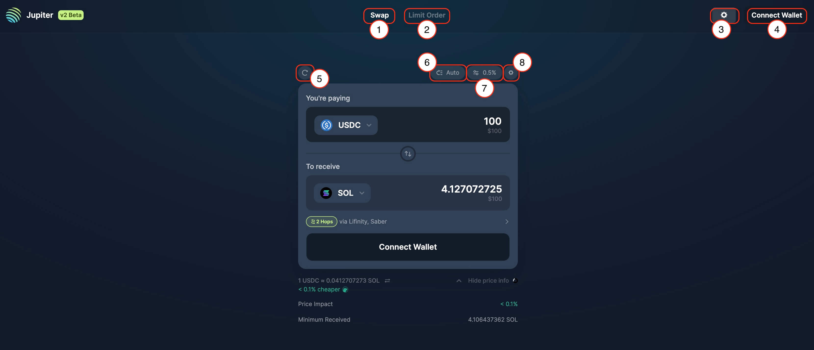
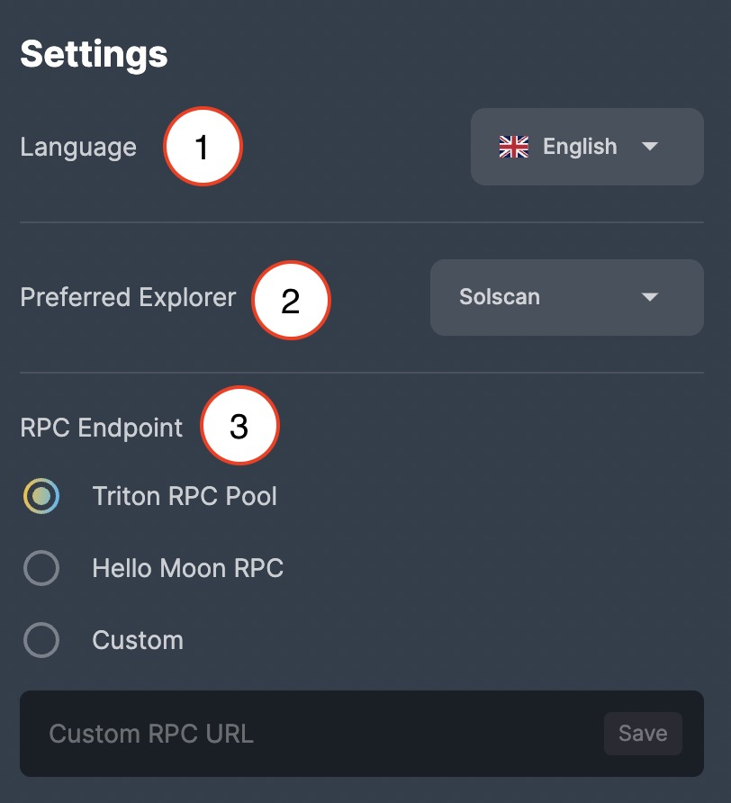
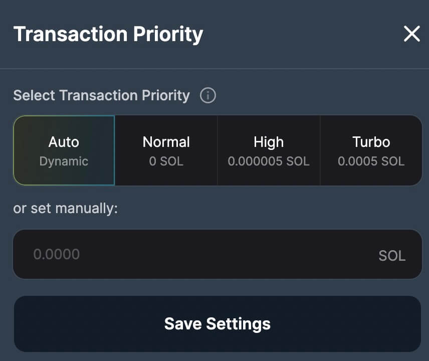
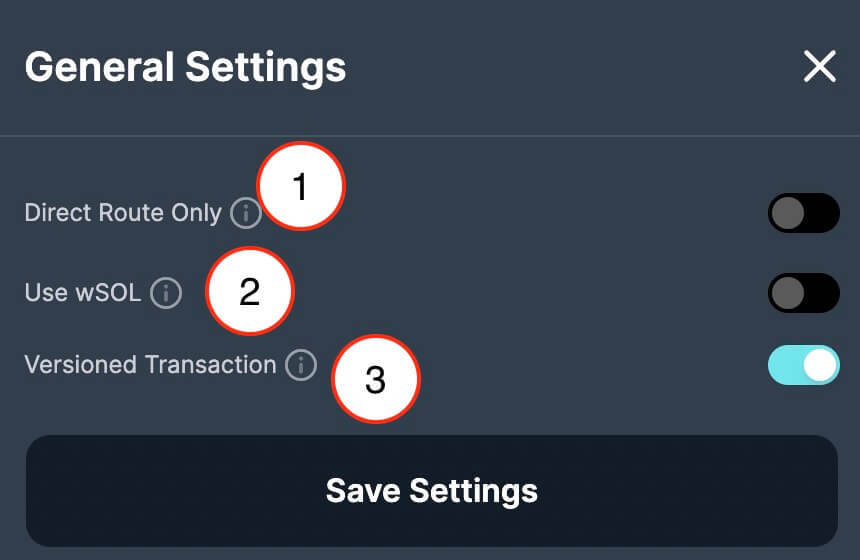
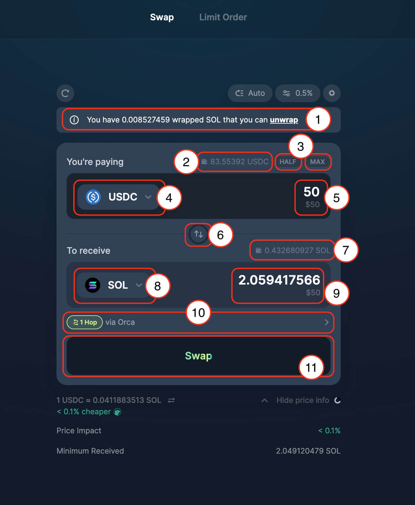
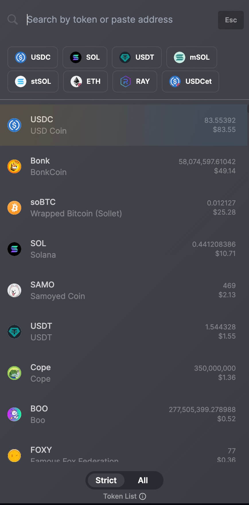
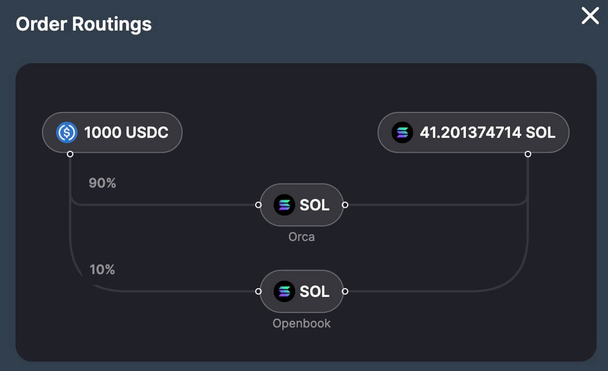
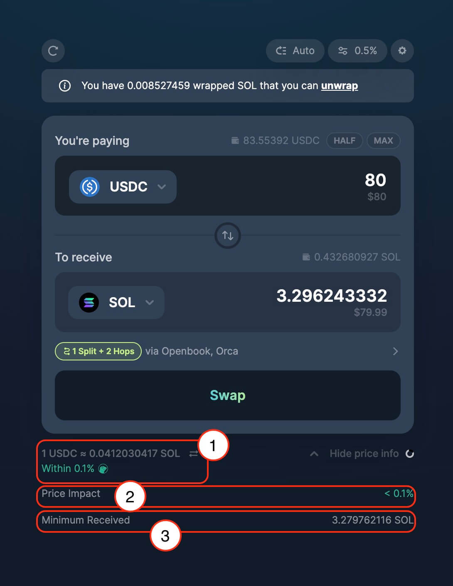

# How to Swap

*A community guide to swapping on Jupiter's dApp.*

This guide was created through contributions from the following community members:  [@Cryptolasp](https://twitter.com/cryptolasp) [@DucPhuBui1](https://twitter.com/DucPhuBui1) [@Val_chi44](https://twitter.com/Val_chi44)

:::info [Why do I need Jupiter?](https://oneel.notion.site/Jupiter-Aggregation-0ef3149cd3bb485b8e118432e6cf8472)
Click the link to read why you need Jupiter written by community member @oneel_d
:::

1. First make sure your URL is correct: **https://jup.ag/**

2. Next, connect your wallet by clicking the `Connect Wallet` button in the upper right corner of the site.

<!--  -->

*Jupiter supports majority of the wallets in Solana and some multi-chain wallets, checkout the site for the full wallet list*

3. After connecting your wallet to Jupiter, you can then select the token pairs that you want to swap from the token selector and enter the amount of tokens that you want to swap.

4. Jupiter will find the best price routes for you amongst all the majority DEXs and AMMs in Solana, checkout the full supported list [here](/partners).

:::tip Jupiter charges no fees.
There are no protocol fees on Jupiter.  The only fees are transaction fees and exchange fees. If you see more SOL deducted than what you expect, then, it is probably due to deposits for creating Associated Token Accounts or Serum Open Orders account.

Fees are already factored into the # of tokens you will receive when choosing a route.
:::

5. Before swapping, you can configure a few parameters before proceeding to help with your trade.
- Transaction Priority Fees
- Slippage Settings
- Swap Settings
    - Direct Route Only
    - Use wSOL
    - Versioned Transaction

:::info What is Slippage?
This is because between the time you get a quote and the time you execute the trade the price may change. If the price falls below your slippage rate, then the transaction will fail in order to prevent you from getting less tokens than you want.
:::

6. After you have confirmed all the parameters and inputs, you can click on the swap button, and the wallet that you have connected to Jupiter will ask you to approve the transaction to submit the order to the chain. If approve, your swap will be executed.

7. A notification toast will appear in the lower left corner that will notify user once the transaction has been sent and has completed.

8. You can view your transaction history by clicking the wallet section on the upper right of the site.

## Jupiter Settings

1. **Jupiter Swap:** [Jupiter Swap](https://jup.ag/) tab *(the current tab you are in)* where user can instant spot token swap / buy any SPL token.
2. **Jupiter Limit Order:** [Jupiter Limit Order](https://jup.ag/limit) tab where user can place limit orders with a specific price / rate and receive tokens directly in your wallet when order is filled.
3. **Global Settings:** Jupiter Global Settings, for default settings like language, explorer and RPC endpoint.

   1. **Language:** Pick your preferred language from English, Chinese, Vietnamese, French, Japanese, Indonesian, and Russian.
   2. **Preferred Explorer:** Pick your preferred explorer from Solscan, SolanaFM, Solana Beach, Solana Explorer, and XRAY.
   3. **RPC Endpoint:** Pick your preferred public RPC endpoint from Triton RPC Pool and Hello Moon RPC or use your own custom RPC endpoint.
4. **Connect Wallet:** Connect to your preferred wallet to interact with Jupiter.
5. **Refresh quote:** Refresh quote button to quickly update the latest quote.
6. **Transaction Priority Fees:** [Transaction Priority Fees](https://docs.solana.com/proposals/fee_transaction_priority) is part of Solana features to bid for priority for their transactions in the leader's queue.

7. **Slippage Settings:** [Slippage settings](/guides/price-impact-slippage-price-warning) is to prevent users from receiving fewer tokens than expected.

8. **Swap Settings:**
   1. **Direct Route Only:** Using Direct Route Only, ensure that it will be a single transaction submitted to a single pool, which will limit a lot of intermediate tokens which filtered out a lot of other viable routes.
   2. **Use wSOL:** Using [Wrapped SOL (wSOL)](/guides/wrapped-sol) enable using Jupiter faster and more convenient for traders who trade frequently with SOL, since it avoids having to wrap/unwrap SOL.
   3. **Versioned Transaction:** Enabling [Versioned Transaction](/docs/additional-topics/composing-with-versioned-transaction) improves composability so Jupiter will be able to fit in more routes and get better even better pricing all in a single transaction.

## Jupiter Swap

1. **Wrapped SOL detected in wallet:** Jupiter detects wrapped SOL (wSOL) in within your wallet which trigger an option for user to unwrap back to SOL.
2. **Input Token Wallet balance:** Jupiter detects the input token balance in your wallet.
3. **Half/ Max amount:** Shortcut buttons to quickly input `Half` or `Max` of the balance amount.
4. **Input Token / Token to sell:** Token selector to select token to sell or swap from.

:::tip [Token List](/docs/apis/token-list-api)
By default, `Strict` token list will be enabled, without unknown or banned tokens, users can choose to toggle on the `All` list to include the full list of all SPL tokens in Solana that is available to trade.
:::

5. **Input Token / Token to sell amount:** Specify the amount of input token to sell or to swap from.
6. **Input token & Output token switch:** This button switches the input and output token.
7. **Output Token Wallet balance:** Jupiter detects the output token balance in your wallet.
8. **Output Token / Token to buy:** Token selector to select token to buy or swap to.
9. **Output Token / Token to buy amount:** Jupiter will computes from the input amount with the current on-chain price rate show user the quoted amount *(Including swap fees from various DEXs and AMMs)* of tokens that user will be receiving or buying.
10. **Order Routing:** Order routing shows the order being routed through which AMM, which sometimes involve [Multi-hop](/docs/legacy/how-does-jupiter-work#multi-hop-routes) and [Split trade](/docs/legacy/how-does-jupiter-work#trade-splitting).

11. **Action - Swap:** Once you have confirmed all the parameters, LFG!

## Swap Details / Price Info

1. **Rate for the input and output token selected:** This is the current on-chain price rate for the selected input and output tokens, along with a comparison against Coingecko Price API.
2. **Price Impact:** [Price Impact](/guides/price-impact-slippage-price-warning#price-impact) is influenced by the available liquidity to settle the trade, and the size of the trade can impact the price impact.
3. **Minimum Received:** Minimum received takes into account of slippage that have set and computes the minimum that user will receive even with price fluctuates.

