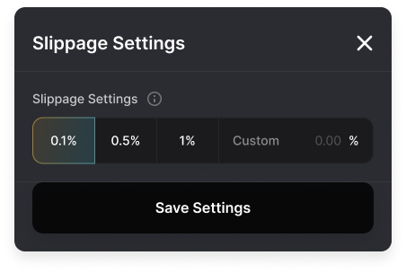

<head>
    <title>How Swap Works</title>
    <meta name="twitter:card" content="summary" />
</head>

The Jupiter Swap is a decentralized exchange aggregator designed to provide the best rates for swapping SPL tokens on the Solana blockchain. It routes trades through multiple liquidity sources to ensure optimal prices, low slippage, and efficient transaction execution. Users benefit from its seamless interface, deep liquidity, and the ability to perform complex token swaps in a single transaction.

## Swap Tips

- **Always double check the token mint address:** Token metadata such as name, symbol, and icon can be faked. The true identity of a token is its mint address. 
  - [Tweet: A gentle reminder to check the mint address of the token you're trading](https://twitter.com/JupiterExchange/status/1580217415593443329?s=20&t=xmsYmPnUZfuS6tQpvEQ7Pg)
  - [We provide a "strict" list mode, with a smaller set of validated tokens](/docs/get-your-token-onto-jup)
- **The quote given is not the final price:** The quote given on a route is based on the current liquidity in the pools. Pool liquidity can go up or down at any time and in some cases, pools may close. An example would be oracle-based Lifinity which may stop accepting swaps after a price movement.
- **Set a slippage amount to protect yourself:** Slippage is your swap protection if the price diverges too much from the quoted price.
- **Jupiter cannot guess the final spot price or know what is a reasonable price impact for you**. We encourage checking these before the swap:
  - Check the Price Impact. *Price impact varies across the AMM and DEXes that Jupiter uses in each route.*
  - Check against a price feed like [Coingecko](https://www.coingecko.com/), [Birdeye](https://birdeye.so/), or CEX pricing.

---

## Safety Notifications

:::info UI Notifications 
Jupiter offers several information signals to help users make informed trading decisions and protect themselves from potential losses. We will explain the difference between price impact, slippage, and price warnings below.
:::

### Price Impact

Price impact refers to the change in an asset's price due to the execution of a trade. This is especially relevant in decentralized exchanges (DEXs) or automated market makers (AMMs) due to their liquidity model.

Price Impact is influenced by the available liquidity to settle the trade and the size of the trade. For example, if you want to swap a large amount of one token for another in a liquidity pool, the larger your trade compared to the pool's size, the more significant the price impact will be. This is because the execution of your trade will shift the balance between the tokens in the pool which will directly affect the price according to the AMM's formula. 

Price impact numbers vary across AMMs and the figure shown on Jupiter is an aggregate based on your particular route. 

To reduce price impact, users can split trades into several smaller trades over time. Jupiter's smart routing system checks all available liquidity pools to find the optimal route that maximizes output tokens.

Be sure to check the minimum amount of destination tokens quoted on the Jupiter interface, and set a Slippage amount to protect yourself.

### Slippage

Slippage occurs when market conditions change between transaction submission and verification. The slippage rate is an important setting to prevent users from receiving fewer tokens than expected. If the price falls below the slippage rate, the transaction fails.

### Price Warning

Price Warning is an additional layer of protection implemented by Jupiter to alert users when the quoted price deviates from the reference price (in this case, CoinGecko's pricing). Price warnings can be caused by various external factors, and Jupiter adds an extra confirmation layer to prevent misclicks or human errors.

#### Additional Safety Confirmation

When price impact or price deviation is too high, we have an additional modal asking you to confirm the trade.

