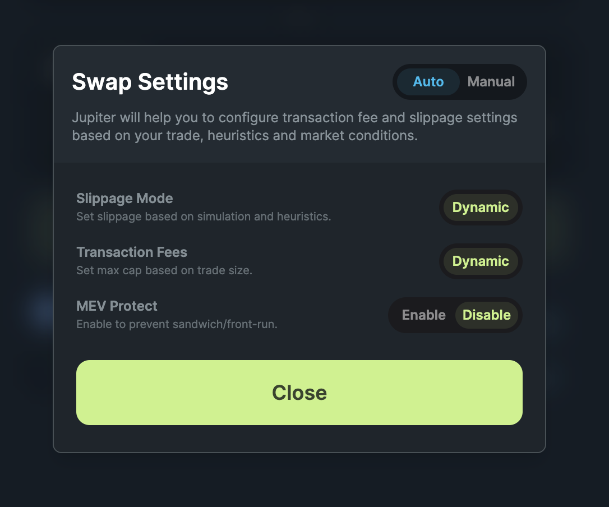

Trading in DeFi can get complex with tokens of various risk profiles and functionalities, leading to an overload of information. Jupiter is committed to balance convenience and protection for you. 

We highlight safety notifications, non-intrusive warnings, key token info, and swap summary to reduce info asymmetry yet not overload you.

### Warnings

Price impact alert is influenced by the available liquidity and your trade size. A large trade size in an illiquid pool often results in huge price impact, hence you can break up your trade size with [DCA](https://jup.ag/dca/USDC-SOL). 

We also show the quoted rate (from Jupiter) against the market rate. The price difference can be due to various external factors such as price impact, token tax, stale market price (usually derived using last traded price), etc. 

If your trade shows a large price impact and difference, please trade with caution and feel free to seek clarity in our [Discord](https://discord.gg/jup).

### Token Information

Jupiter shows relevant token information to reduce information asymmetry you may face when trading. Token Verification shows as "Verified ✅" or "Not Verified ⚠️" and Token2022 extensions appears as information pills. 

More on Token Verification criteria [here](/guides/12-general/4-get-your-token-on-jupiter.md#how-to-get-your-token-verified). 

More on Token2022 extensions below:

|                    | **Definition**                                                                                                                                        | **Valid Use**                                                                                                                                                                       | **Misuse**                                                                                                                                                   |
|--------------------|-------------------------------------------------------------------------------------------------------------------------------------------------------|--------------------------------------------------------------------------------------------------------------------------------------------------------------------------------------|--------------------------------------------------------------------------------------------------------------------------------------------------------------|
| **Permanent Delegate** | Allows creators to grant unlimited delegation privileges over any account for that mint, including burning or transferring any tokens from any account. | Enables automatic payments, wallet recovery, and processing refunds.                                                                                                               | Scam projects could drain tokens from users' wallets.                                                                                                        |
| **Transfer Tax**       | Enables fees to be withheld on each transfer, redeemable by those with withdraw authority.                                                         | Allows projects to generate revenue through service charges, or to collect royalties or taxes on transfers.                                                                        | Scam projects might arbitrarily increase transaction taxes and withdraw funds with full authority.                                                           |
| **Freeze Authority**   | Allows issuers to halt token transfers or trading, temporarily or permanently.                                                                     | Commonly used for regulated tokens (e.g., stablecoins) to meet legal standards; issuers can freeze tokens for compliance with legal or regulatory concerns.                          | Scammers may use this to prevent trading or transferring scam tokens, a red flag for market manipulation or potential fraud.                                 |

### MEV Protect

Jupiter introduces [MEV Protect](https://www.jupresear.ch/t/continuing-to-deliver-on-jupiters-best-ux-promise/22230) mode, which will only send your transactions directly to Jito block engines, minimising the risk of sandwiches for you. 

In a sandwich attack, a bot spots your transaction, places a buy order before yours to push the price up, and places a sell order right after, pocketing the difference and leaving you with a higher cost per token. Turning on MEV Protect will hide your swaps and thus reducing the chances of MEV or sandwich attacks.

:::tip If you are using MEV Protect or Jito only modes
Do note that your transactions may at times fail or be slow to process as not all validators are using Jito block engine.
:::

### Swap Summary

The summary shows you the information relating to the trade, such as the minimum received, the transaction fees, and price difference when compared to the market rate. 

### ExactOut

ExactOut gets the exact amount of tokens that you need. We share this alert because liquidity venues and routes are lesser than ExactIn. Transparently, you should know that you might get a worse price. Best practice is to compare the rates between ExactOut and ExactIn before you trade. 

*Last Updated: 5 November 2024*
