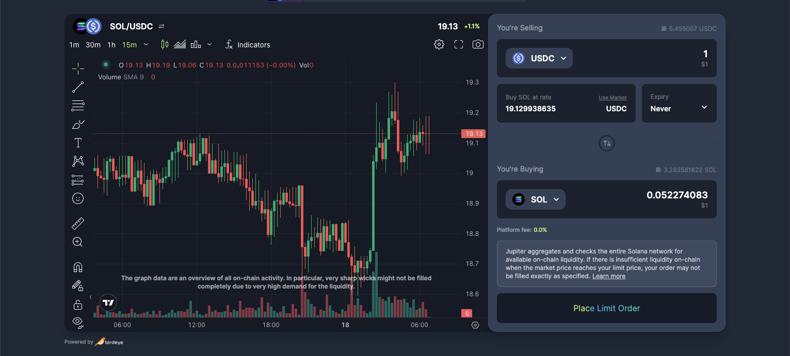
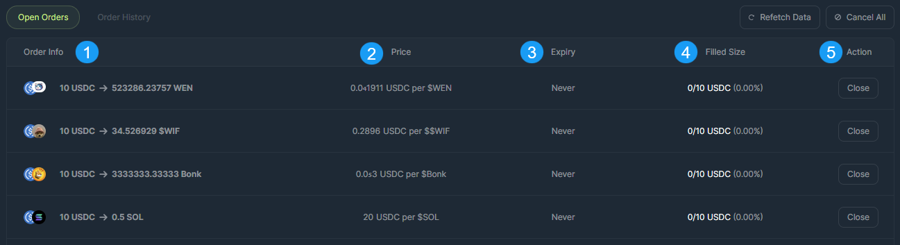
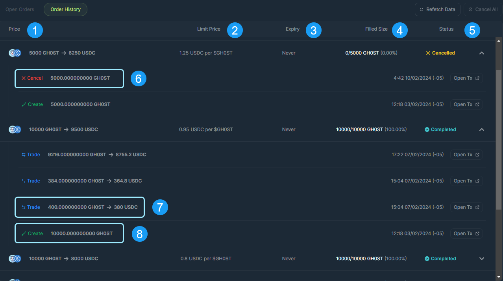

<head>
    <title>How To Place a Limit Order Using Jupiter</title>
    <meta name="twitter:card" content="summary" />
</head>

Jupiter Limit Order provides the easiest way to place limit orders on Solana, offering the widest selection of token pairs and leveraging all the available liquidity across the entire Solana ecosystem. With Jupiter Limit Order, you have the flexibility to buy or sell any token pair according to your specified price limit.

:::tip Order Minimum & Fees
The Jupiter Limit Order feature has a minimum order size requirement of $5 (underlying assets must be greater than $5 per order) and there is a 0.1% platform fee.
:::

## Basic Limit Order User Flow

1. First, navigate to the [Jupiter Website](https://jup.ag/) and then click on the `Limit Order` icon below the top navigation bar. **Double check** that the URL in your search bar is correct: https://jup.ag/limit
2. Next, connect your wallet by clicking the `Connect Wallet` button in the upper right corner of the site.
3. Select the token you are selling and the token you are buying on the terminal.
4. Enter the amount of the token you are selling in the amount field, set the execution price for the order, and the expiry option in the selector. 
5. Double check the limit order inputs and if things look good, click the `Place Limit Order` button.
6. Confirm the wallet notification and the Limit Order will be submitted to the system. 
7. A notification toast will appear in the lower left corner that will notify the user once the transaction has been sent and has completed.
8. Your new Limit Order will populate the Open Orders Section below the Terminal once it is confirmed and the UI updates.

**Let's go through the Limit Order Settings in more detail below.**

:::info
Global Settings still apply to the Limit Order Functionality, please reference [global settings](https://station.jup.ag/guides/jupiter-swap/swap#global-settings) for more information.
:::

## Jupiter Limit Order Settings

1. **Input:** Pick a token from the selector drop-down and specify the amount of tokens that you want to limit sell.
2. **Rate/ Price:** Here you specify the limit order rate / price that you're buying the output token (Or `Use Market` for the current market price).
3. **Expiry:** Set an expiry period for your order, from 10 minutes to custom, or even never.
4. **Output:** Jupiter Limit Order will be able to compute your parameters and come up with the rate that you'll be getting.
5. **Place Order:** Once you've reviewed the order details, you will be able to place the limit order and submit the transaction to the system.

### Open Order

The Open Orders section is where users will see their open submitted order that are in the system and have yet to be filled.

1. **Order Info:** This identifies the order token details from TokenA _(Selling)_ to TokenB _(Buying)_ and the amounts for the order.
2. **Price:** Price is the specified user submitted rate for the limit order - When the on-chain price of the purchase token hits, order will be executed, if there is liquidity available.
3. **Expiry:** This is the time dimension set by user when submitting the order, which can be helpful to auto-cancel orders after a specific time period. In this example it's `Never`, therefore the order will remain active on-chain until the price hits the specified amount, at which point the order will be executed.
4. **Filled Size:** The fulfillment indicator to monitor the size of the order which has been filled. If it is a large order, and there is insufficient liquidity on-chain, Jupiter's keeper will try to execute partially, and continue monitoring on-chain price to fulfill the rest of the order. If the order is fully executed, Jupiter will send the tokens directly to user's wallet. There is no claiming process required once a Limit Order is entirely filled.
5. **Action:** Action is where users are able to cancel and close their order/positions.

### Order History

Order History section is where users keep track of orders that have been completed or cancelled.

1. **Price:** Price is the specified user submitted rate for the limit order - When the on-chain price of the purchase token hits, order will be executed, if there is liquidity available.
2. **Limit Price:** Limit Price is the single unit price for the order - X amount of TokenA per TokenB.
3. **Expiry:** This is the time dimension set by user when submitting the order, which can be helpful to auto-cancel orders after a specific time period. 
4. **Filled Size:** Filled size shows how much of total order size has been fulfilled.
5. **Status:** Status indicates the order state - Completed / Cancelled.
6. **Action - Cancel:** This order was cancelled. Upon cancelling an order the users funds are refunded back to their wallet.
7. **Action - Trade:** This is the actual trade transaction being executed when the on-chain price hits the specified price submitted by user. These trade actions can occur several times for each created order, depending on the available liquidity in the market.
8. **Action - Create:** This is the creation of the order, where the user specified the limit order details and deposited the funds for the order to be created.