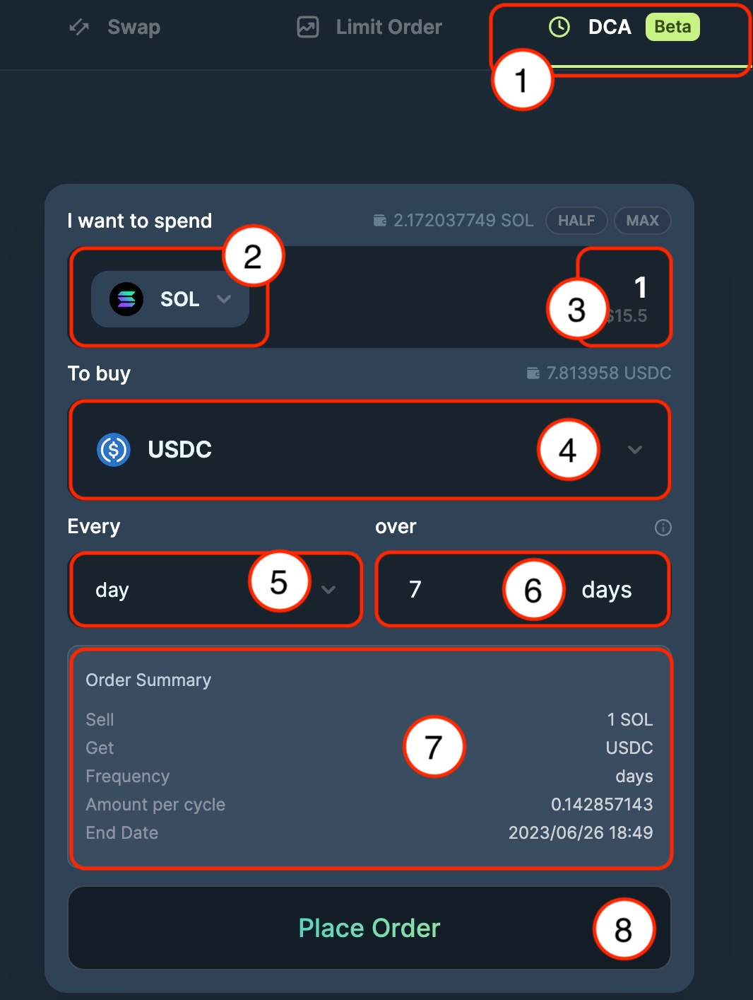
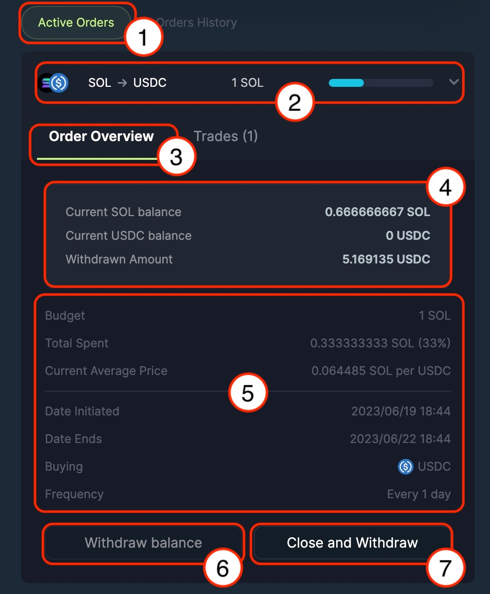
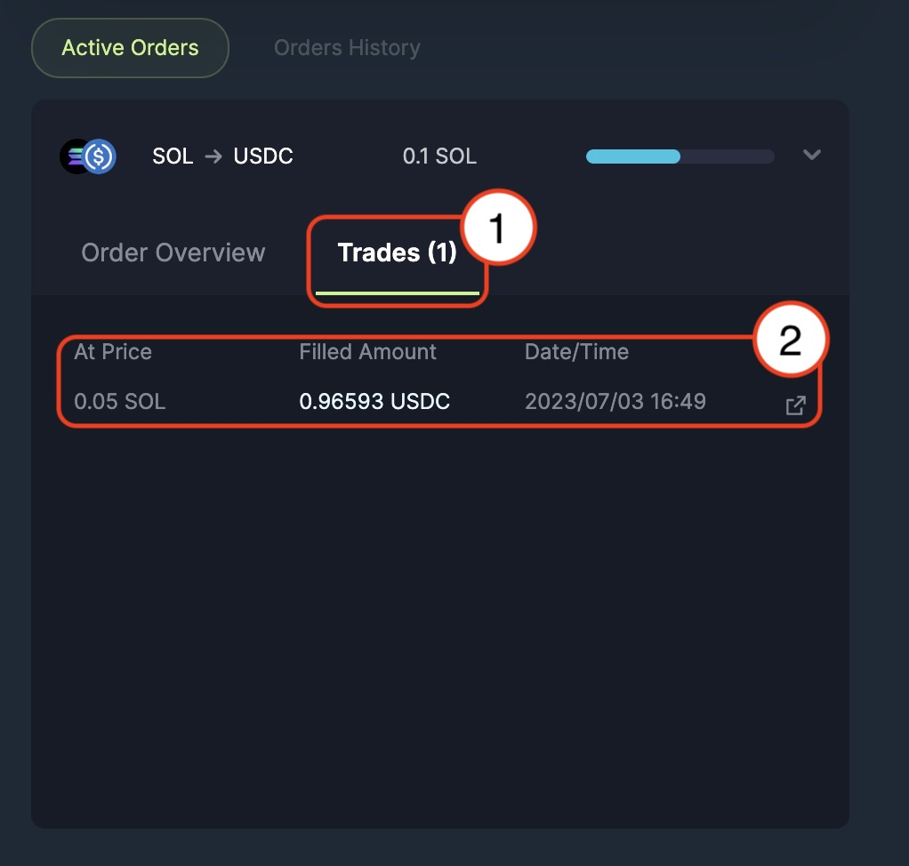
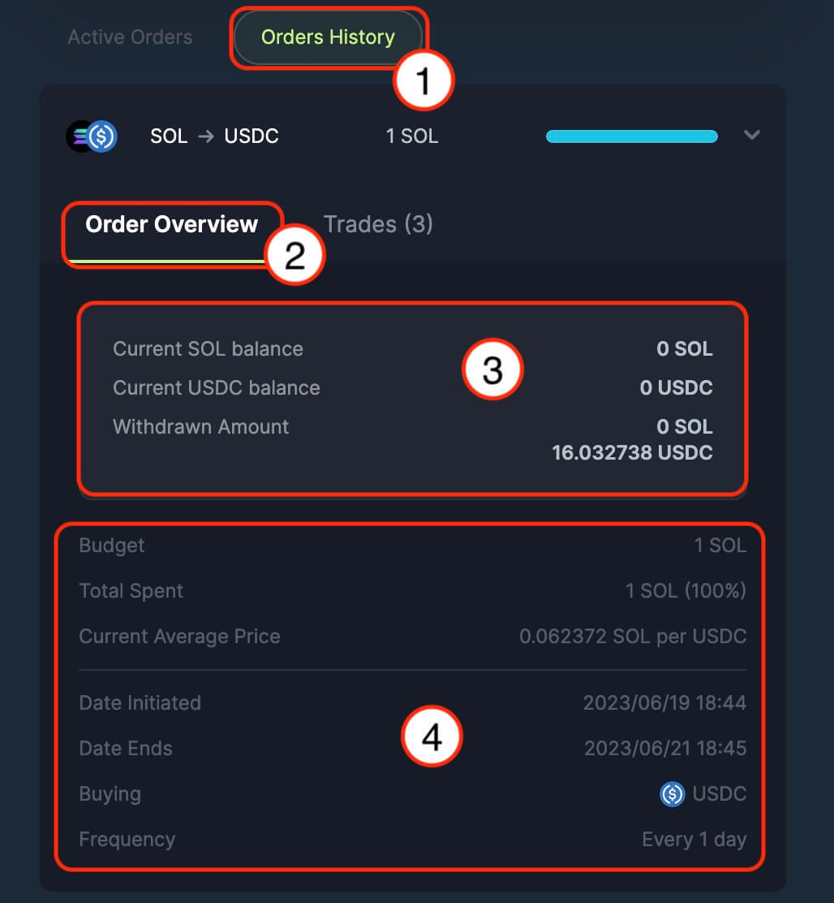
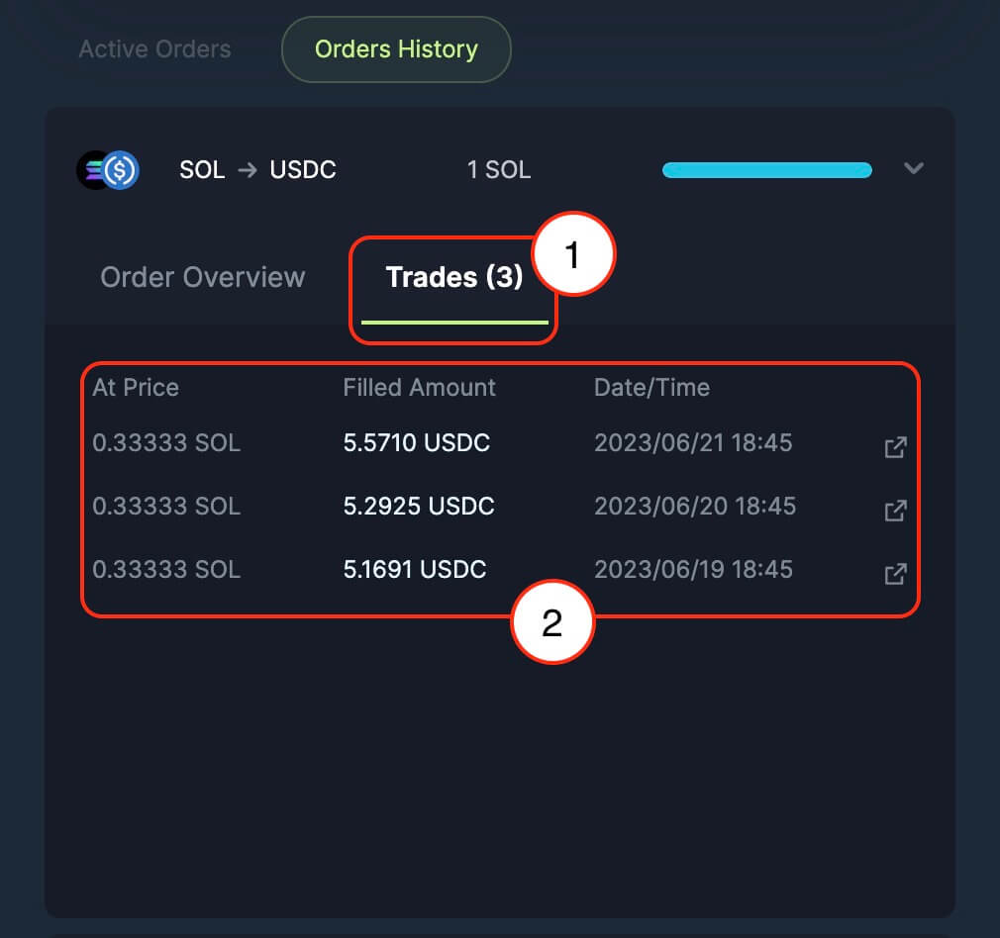

**Jupiter DCA (Beta)** is a dollar cost averaging solution to enable users to automate the purchase or sale of any SPL tokens at a regular intervals over a certain period of time.

:::info
**For Beta phase**, there is a minimum requirement of USD $1 and a maximum of USD $5,000 in deposit value regardless of what token you use to create a DCA order, we use Jupiter [Price API](/docs/apis/price-api) to determine the dollar value.
:::

1. **DCA (Beta)** tab along with Jupiter suite of products.
2. **Input Token Selector** for token that you are looking to spend/ sell/ swap from.
3. **Input field** for the amount of input tokens that you are looking to spend/ sell/ swap from.
4. **Ouput Token Selector** for token that you are looking to buy/ swap into. *(In beta phase, we are resctricting to only Top 20 tokens traded on Jupiter)*
5. **Frequency** of purchase/ sale of tokens over a period of duration, selection from hour, day, week, and month.
6. **Duration** for the purchase/ sale of tokens.
7. **Order Summary** for the current DCA order that you are placing/ submitting. From the screenshot example:
    - Sell - 1 SOL (You are selling/ swapping from 1 SOL)
    - Get (or Buying) - USDC (You are buying/ swapping into USDC)
    - Frequency - Days (Frequency for the trade to happen)
    - Amount per cycle - A quick estimation of the amount of token that you will be getting in each cycle/ iteration
    - End Date - The last cycle/ iteration the order will be executing to finish the DCA order
8. Place order to submit the transaction.

1. **Active Orders** tab shows the current on-going DCA orders
2. **Current on-going DCA order**, it shows the token you're swapping from and into (In this screenshot example - SOL -> USDC), with 1 SOL along with the progress bar of the DCA order.
3. **Order Overview** shows the DCA order details when you have expanded one of on-going DCA order.
4. **Balance Summary** shows the current on-going DCA order balance progress, shows the current input token balance that is in the DCA program waiting to be execute, output token that have successfully traded and also the available withdraw amount.
5. **Order Summary** shows the current on-going DCA order, with information like:
    - Budget - The input amount and token that user selling or swapping from.
    - Total Spent - The progress of the DCA, or the amount spent to swap from.
    - Current Average Price - The average price for the DCA from input token to output token for the current DCA duration.
    - Date Initiated - The date and time when the DCA initiated or submitted.
    - Date Ends - The date and time when the DCA will be ending.
    - Buying - The output token that user is buying or swapping into.
    - Frequency - The frequency that user selected for the DCA order.
6. **Withdraw Balance** allow user to withdraw the executed or the amount traded directly into user's wallet.
7. **Close and Withdraw** cancel and close the DCA order, to also retrieve all current input and output balance tokens directly into user's wallet.

1. **Trades Tab** is where all the transaction/ trade for the current on-going DCA order house in.
2. **Trade Summary** shows each iteration/ cycle amount and the filled amount with respective date and transaction id.

1. **Orders History** is the tab where you can find all your past/ completed DCA orders.
2. **Order Overview** is the tab for the summary view for your DCA order when you click expand into one of the your past/ completed DCA order.
3. **Balance Summary** shows all your input token balance and output token balance along with the amount that you have withdrew back into your wallet.
4. **Order Summary** shows the entirety of the completed order, with information like:
    - Budget - The input amount and token that user selling or swapping from.
    - Total Spent - The progress of the DCA, or the amount spent to swap from.
    - Current Average Price - The average price for the DCA from input token to output token over the full duration of the DCA.
    - Date Initiated - The date and time when the DCA initiated or submitted.
    - Date Ends - The date and time when the DCA ended and finished executing.
    - Buying - The output token that user is buying or swapping into.
    - Frequency - The frequency that user selected for the DCA order.

1. **Trades Tab** is where all the transaction/ trade for the DCA order house in.
2. **Trade Summary** shows each iteration/ cycle amount and the filled amount with respective date and transaction id.
