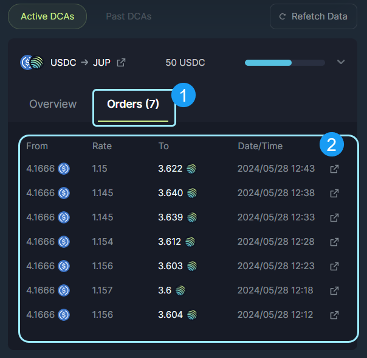

<head>
    <title>How to use Dollar Cost Averaging (DCA) on Jupiter</title>
    <meta name="twitter:card" content="summary" />
</head>

Jupiter DCA is a dollar cost averaging solution designed to enable users to automate the purchase or sale of any SPL tokens at regular intervals over a specified period of time.

The DCA feature has some very powerful use cases, such as interacting with low liquitity markets, long term accumulation, or consistent profit taking without distrupting the market price too much. Check out this [Explainer Page](https://station.jup.ag/guides/dca/explainer) to learn more about DCA other use cases.

## Basic DCA User Flow

1. First, navigate to the [Jupiter Website](https://jup.ag/) and then click on the `DCA` icon below the top navigation bar. **Double check** that the URL in your search bar is correct: https://jup.ag/dca/
2. Next, connect your wallet by clicking the `Connect Wallet` button in the upper right corner of the site.
3. Select the token you are allocating and the token you are going to be buying on the DCA terminal.
4. Enter the amount of the token you want to allocate to the DCA orders in the amount field. 
5. Set the Frequency(Every) and the Duration(Over) for the DCA orders. 
6. Double check the Order Summary details and if things look good, click the `Start DCA` button.
7. Confirm the wallet notification and the DCA Order will be submitted to the system. 
8. A notification toast will appear in the lower left corner that will notify the user once the transaction has been sent and has completed.
9. Your new DCA will populate the Active DCAs section below the Terminal once it is confirmed and the UI updates.
10. You can expand the Active DCAs and inspect the progress of the DCA in the Overview tab, or inspect the individual orders on the Order tab.

**Let's go through the DCA Settings in more detail below.**

---

## Jupiter DCA Settings

1. **DCA:** Select the DCA tab in the product navigation menu to arrive at the DCA terminal.
2. **Input Token Selector:** Select the token you want to spend/ allocate with your DCA orders.
3. **Input Field:** Enter the amount of the input tokens that you are looking to spend/ allocate with your DCA orders.
4. **Output Token Selector:** Select the token that you are looking to DCA into or Buy.
5. **Frequency:** Specify the time freqency for the DCA orders with a numerical input and the dropdown selector.
6. **Duration:** The number of orders you want the DCA to be spread out over. 
7. **Order Summary:** Specify the details for the current DCA order that you are creating. 
    In this example:
    - Sell Total - 50 USDC (You are selling USDC)
    - Sell Per Order - The Sell Total divided by the numerical duration entry. ( 50 USDC / 12 )
    - Receive - JUP (You are buying JUP)
    - Order Interval - 5 minutes (A trade will take place every 5 minutes)
    - Start Date - The DCA will begin immediately upon submission.
    - Estimated End Date - The final DCA order will finish by this date.
    - Estimated Price Impact Per Order - Estimated impact on the market price of the assets being swapped per DCA trade.
    - Platform Fee - 0.1% platform fee for DCA orders.
8. **Start DCA:** Click to submit the DCA instructions and start the DCA.

### Active DCAs

1. **Active DCAs:** This tab lists out all of your active DCA orders.
2. **Individual DCA Orders:** On-going DCAs with a progress bar to indicate how much of the DCA has been executed.
3. **Order Overview:** To see the DCA order details, expand one of your on-going DCA orders and review the Overview Details.
4. **Balance Summary:** This shows the DCA order balance progress. First is the remaining balance of the token you are spending/ allocating. Second is the amount of tokens that have been successfully purchased. Third is the amount of tokens purchased that have been withdrawn.
5. **Order Summary:** This will show the current on-going DCA order, with information like:
    - Total Deposited - The input amount and token that you are selling or swapping from.
    - Total Spent - The progress of the DCA, or the amount spent to swap from.
    - Each Order Size - The average order size for the DCA.
    - Current Average Price - The average price for the transactions being completed over the DCA.
    - Buying - The output token you are purchasing with the DCA order.
    - Interval - The time interval specified in the Frequency fields.
    - '#' of Orders Left - The number of orders remaining with this DCA request.
    - Next Order - The date and time of the next order to be executed.
    - Created - The date and time when the DCA was submitted.
6. **Close and Withdraw:** Use this to cancel and close the DCA. This will halt the progress on the DCA order and withdrawal all funds in the order to your wallet. 

### Active DCA Orders

1. **Orders:** Where all DCA transactions will display for active orders.
2. **Trade Summary:** Shows each DCA transaction, along with the filled amount with respective date and transaction id.

---

### Past DCAs

1. **Past DCAs:** Here you will find all your DCA order history, whether they completed or were cancelled.
2. **Overview:** The Overview tab opens up to show the order details and balance summary.
3. **Balance Summary:** You can see the balance details of past order here.
4. **Order Summary:** This shows all of the details of the past order including all of the details outlined above.

### Past DCA Orders

1. **Orders:** All the transactions for your DCA order are shown here.
2. **Trade Summary:** This shows each individual order amount respective to the date and transaction id.
