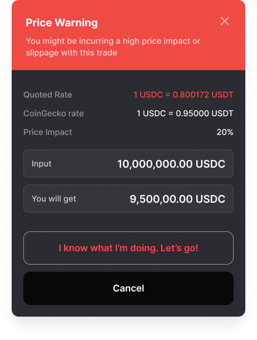

# Understand Price Impact, Slippage and Price Warnings

Jupiter offers several information signals to help users make informed trading decisions and protect themselves from potential losses. On this page, we will explain the difference between price impact, slippage, and price warning

## Price Impact

Price Impact refers to the difference between the total value of the entry tokens swapped and the destination tokens obtained. It is influenced by the available liquidity to settle the trade, and the size of the trade can impact the price impact. Users can check the price impact and the minimum amount of destination tokens received on the Jupiter interface.

To reduce price impact, users can split trades into several smaller trades over time. Jupiter's smart routing system checks all available liquidity pools to find the optimal route that maximizes output tokens.

It's important to note that decentralized exchanges allow users to retain full custody of their tokens, and prices offered by different DEXs can vary. The spread, which is the price difference for a token at which it can be traded in one direction or the other of a given pair, is another factor to consider, especially in illiquid pairs where the spread can be significant.

## Price Warning

Price Warning is an additional layer of protection implemented by Jupiter to alert users when the quoted price deviates from the reference price (in this case, CoinGecko's pricing). Price warnings can be caused by various external factors, and Jupiter adds an extra confirmation layer to prevent misclicks or human errors.

## Slippage

Slippage occurs when market conditions change between transaction submission and verification. The slippage rate is an important setting to prevent users from receiving fewer tokens than expected. If the price falls below the slippage rate, the transaction fails.

## Addition Safety Confirmation

When price impact or price deviation is too high, we have an additional modal asking you to confirm the trade.

