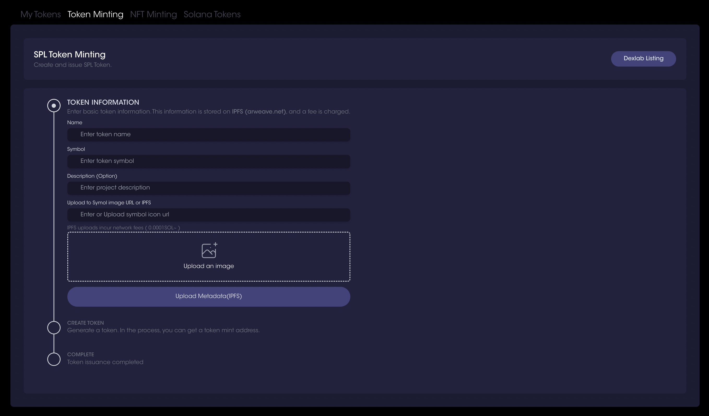
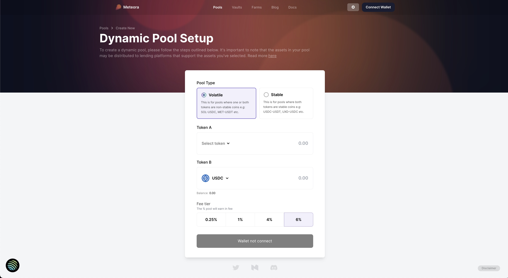
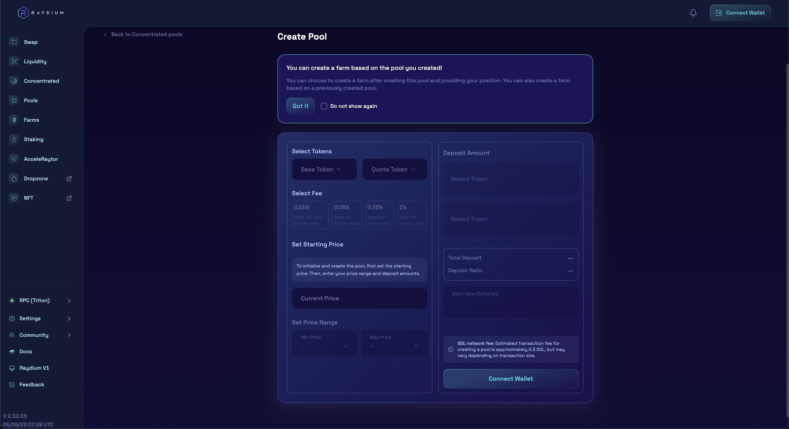
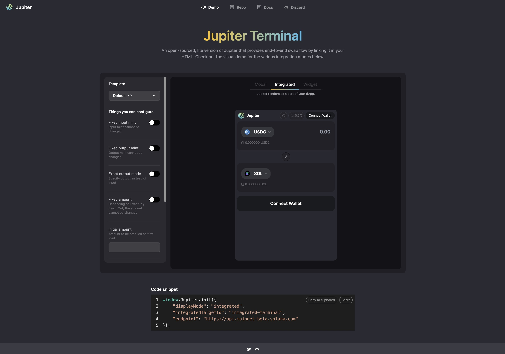
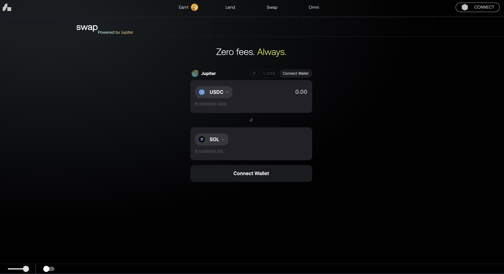
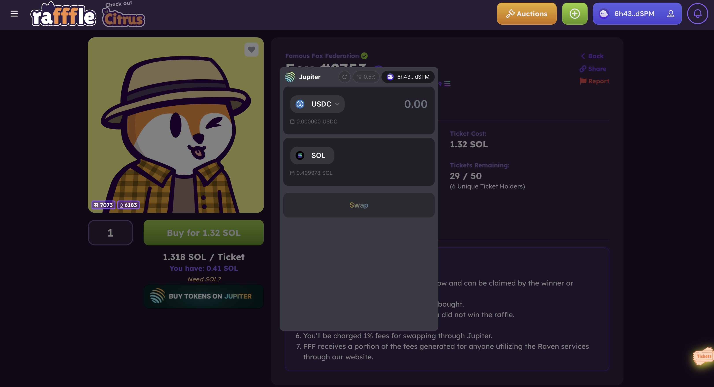

# New Token Guide

## Minting a new token

There are multiple ways of creating/ minting a new set of fungible tokens. 
Here are some of the available tools to minting new tokens.

**Tools:**

- Solana Token Program (CLI): https://spl.solana.com/token 
- Solana Tools: https://solanatools.vercel.app/spltoken 
- Dexlab: https://www.dexlab.space/mintinglab/spl-token 

<!--  -->

## Setting up pools/ market

There are multiple platforms with permissionless pools that allow projects/ protocols to quickly set up pools and markets.
After which, Jupiter will be able to pick up your market automatically.

**Permissionless Pools**

#### [Meteora](https://app.meteora.ag/pools/create)

#### [Orca](https://www.orca.so/liquidity/create) 

#### [Raydium](https://raydium.io/clmm/create-pool/)

:::info 
Jupiter has a minimum liquidity requirement to be able to pick up your market, to enable trading on Jupiter.
Read more [Getting Your Token on Jupiter](/docs/get-your-token-onto-jup)
:::

## Getting on Strict List / Verified

Jupiter validated token list is built up together with partners and our community, feed Jupiter's "Strict" API, and is in use by ecosystem partners. Read More [Getting on Strict List / Verified](/docs/get-your-token-onto-jup#getting-on-the-strict-list)

## Integrating Jupiter Terminal

Another good way of integrating Jupiter is through Jupiter Terminal. Where you can have all the functionalities and features of Jupiter with just a few lines of code. 

Here's a more detailed developers docs for more information [Jupiter Terminal: Easiest way to add Jupiter to your DApp](/docs/web-integration/jupiter-terminal)

Try it out in our [Jupiter Terminal playground](https://terminal.jup.ag/)

<!-- (Jupiter Terminal Integration Guide run-through) -->

*Some examples of integrations by some of our ecosystem partners.*

#### [MarginFi](https://app.marginfi.com/swap)

#### [Famous Fox Federation Raffles](https://rafffle.famousfoxes.com/)

