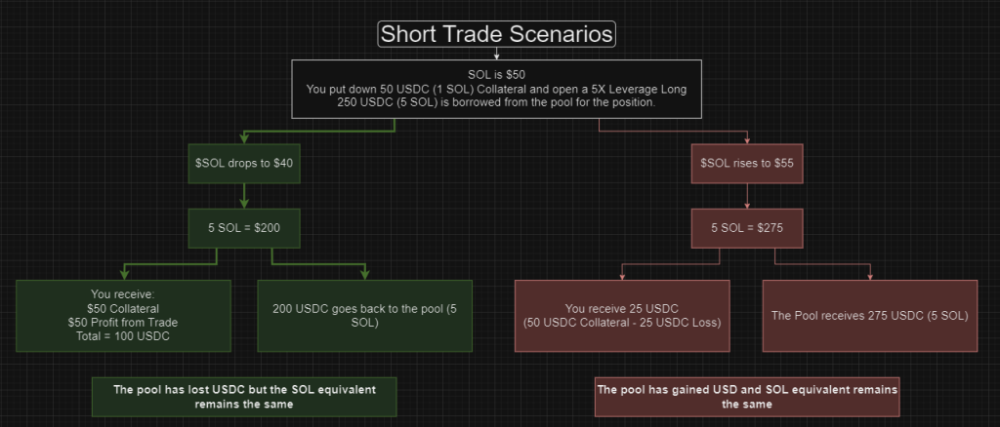

### JLP, Liquidity Provider Token

Liquidity providers serve a crucial role as they act as a counterparty to traders. When traders seek to open leverage positions, they borrow tokens from the pool. Liquidity providers, in return, earn fees from these leverage trading activities, along with borrowing fees and earnings from swaps. As a JLP holder, you receive 75% of the fees generated by the perpetual trading exchange. This amount is directly reinvested into the JLP, increasing the price of JLP, and facilitating continuous compounding of yield and earnings.

The JLP represents a meticulously constructed index of assets designed for swaps and leverage trading. 

### Adding/Removing Liquidity

When an LP adds liquidity to the JLP pool, they increase the amount of TVL (Total Value Locked) which increases the liquidity available on the trading side. The pool is currently a collection of the following tokens:

| Tokens In the Pool |
| ------------------ |
| USDC       |
| USDT       |
| SOL        | 
| wBTC       | 
| wETH       | 

**Adding Liquidity:** Any Liquidity providers (LPs) can acquire JLP by swapping for it on Jupiter Swap. Jupiter Swap will find the best price to acquire JLP for you, automatically. This can either be purchasing it off the open market, or swapping it for a desired asset and depositing that into JLP directly. Use Jupiter Swap for a frictionless experience of getting JLP. While JLP is still being minted, your assets may be deposited into the relevant token pool increasing the current weightage. At the point of depositing assets into the JLP pool, the protocol will re-price the TVL in the USD value.

**Removing Liquidity:** JLP can also be sold via Jupiter Swaps. Simply swap JLP for your desired asset. The JLP token could either be transferred to another trader or may be redeemed by the JLP pool, burning the JLP token, and releasing some of the currency contained in the pool.

#### The best way to purchase or exit JLP is always via [Jupiter Swap](https://jup.ag/swap/USDC-JLP).

**Note:** JLP usually trades at a slight premium over the Virtual Price rate. This is due to the demand for JLP outweighing the TVL caps set for JLP. When TVL caps are raised, this premium closes. The team periodically increases the TVL caps to keep the premium in check. Swap for JLP when the caps are raised to minimize the premium paid.

### Risks Associated with Holding JLP

**Bull Markets:** During a bull market JLP may not outperform SOL, ETH, or BTC. This is because the pool is made of a mix of stable and non-stable tokens. While this factor is less of a risk, it is worth noting that during a bull market, the JLP token will move slower than some of the coins it contains. It is suggested to consider swapping stable tokens (USDC/USDT) into JLP to potentially benefit from yield generated by perpetual trading activities. Please note that this is not financial advice.

Now, let's explore some of the risks associated with holding JLP:

**Profit and Loss (PNL) Dynamics:** Traders' PNL from perpetual trading impacts the JLP pool. If a trader incurs a net positive PNL, the losses are sourced from the JLP pool to compensate the trader. Conversely, if a trader's PNL is a net negative, the gains are deposited into the JLP pool for LP holders.

**Longs:** If the trader profits on the long, the JLP pool will lose in token quantity but not in USD value because the underlying token value in the pool appreciates in value as well.


**Shorts:** If the trader profits on the short, the JLP pool will lose some of the stablecoins but the shorted token will remain the same. This causes a net USD loss on the Pool.



Read more research from a community member on how this works. https://skribr.io/app/article/exploring-jupiters-perpetual-futures-a-comprehensive-research-analysis/

**Token Price Fluctuations:** The JLP pool consists of both stable and non-stable tokens. Fluctuations in token prices can affect the value of JLP. As a result, users may find that their withdrawn tokens are worth less compared to their initial deposit. Additionally, deposit and withdrawal fees for the JLP Pool may further reduce the number of tokens withdrawn, particularly for shorter holding periods.

**Can JLP go down?** Yes. As shown in the trader profiting on a short trade, JLP in USD value will go down when the fees generated are lower than depreciation of assets and payout from traders' profit.

### Yield Generation

The exchange generates fees and yields in three ways:

- Opening and Closing Fees of Positions (consisting of the flat and variable price impact fee).
- Borrowing Fees of Positions
- Trading Fees of the Pool, for spot assets

**75% of the fees generated by JLP go into the pool.** The fees are compounded into the pool hourly. 

:::info Overall Yield Calculation
It is essential to note that pool earnings and losses (index token appreciation/depreciation) are not factored in the overall yield calculation.
:::

### Fee Calculations

| Action             | Fee                                                                        |
| ------------------ | -------------------------------------------------------------------------- |
| Opening a Position | 7 BPS                                                                     |
| Closing a Position | 7 BPS                                                                     |
| Price Impact Fee   | Variable (see [reference](../perpetual-exchange/trading#price-impact-fee)) |
| Swap Fee           | Between 0 BPS to 150 BPS depending on pool weightage                       |
| Borrow Rate        | 1 BPS/hour x token utilization percentage                                  |

Fee calculation for opening and closing positions involves the volume of these transactions, multiplied by the fee percentage of 0.07%.

The price impact fee from larger trades are then added. More analytics on this to follow.

The borrowing fee, often termed the hourly borrow fee, is computed as follows:

```
hourly borrow fee = (tokens borrowed / tokens in the pool) x 0.01% x position size
```

The swap fee for the pool typically ranges between 0% and 2%.

### Target Ratio and Fees

In the JLP pool, every token has a specific target ratio or weightage.

The transactions involving the addition or removal of liquidity have the primary purpose of adjusting a token's ratio in the pool to align it more closely with the predefined target. These transactions can be JLP deposits, JLP withdrawals, or token swaps from the JLP pool.

Transactions that move the token's ratio away from the target incur additional fees while instructions that move it closer to the target get a fee discount. The fee is based on the swap fee.

### Example Yield

To provide an estimated perspective, you can calculate potential revenue by taking the Jupiter Perpetual Exchange's daily or weekly total volume and multiplying it by a fee percentage. For instance:

- Total Daily Volume: 50 million
- Fee Percentage: 0.07%
- Price Impact Fees: 0.01% average
- Revenue Share Percentage: 75%

Using these values, the calculation would be as follows:

Total revenue to be deposited into JLP pool:

```
$50M x 0.08% x 75% = $30,000
```

To determine your specific share or weight in the total JLP pool, use the following formula:

```
your_pool_contributed_amount / total_pool_amount x 100 = your_pool_percentage
```

For example:

- Your contribution: $1,000
- Total pool amount: $4,000,000
- Your share percentage: 1,000 / 4,000,000 x 100 = 0.025%

Finally, you can calculate your generated revenue share by multiplying the results of the first and second calculations:

```
revenue share you generate = $30,000 x 0.025% = $7.50
```


### Virtual Price, Market Price and AUM Limit

- Virtual Price = Sum of all JLP Assets (in USD) / Total Quantity of JLP in circulation
- Market Price = Virtual Price + Market-assigned Premium (when AUM Limit is hit)

Usually, users can mint new JLP or redeem (burn) them at the Virtual Price. However, when AUM Limits are hit, new minting of JLP is disabled to cap the amount of TVL in the pool.

When this happens, the demand for JLP on the market usually leads to a premium for JLP compared to the virtual price.

You may sell your JLP for the Market Price at any time. If the Market Price is below the Virtual Price, your JLP tokens are redeemed (burned) at the virtual price instead of sold at the market price.


You can view the current TVL and AUM Limit on the main UI.

Every Monday, at ~ UTC 18:00, the Estimated APY figure is updated with the above calculation, by using the previous week's fees and estimating an APR and APY for users.
