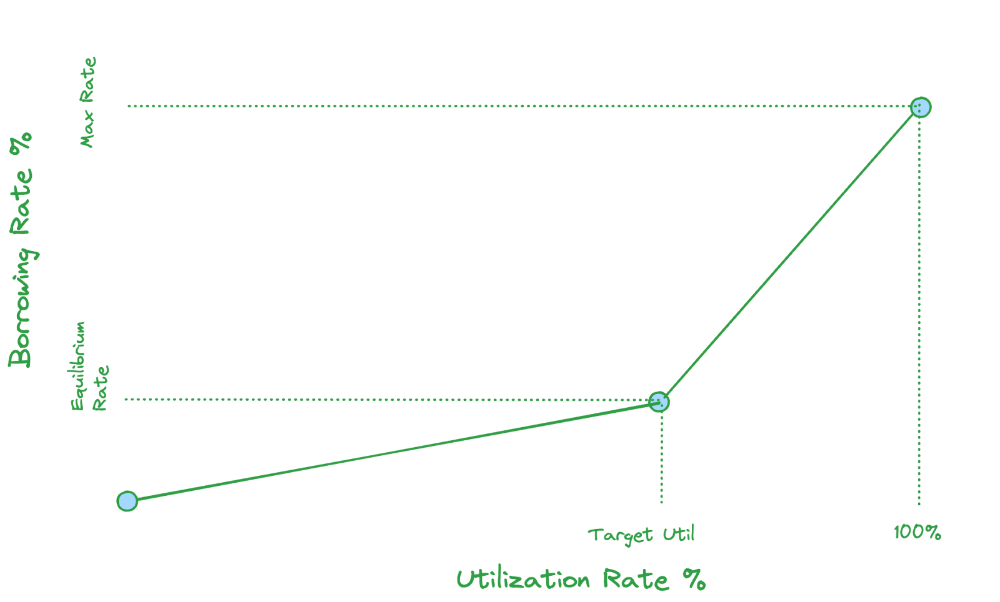

<head>
    <title>Perps: Fees</title>
    <meta name="twitter:card" content="summary" />
</head>

There are 4 types of fees on Jupiter Perps:

1. A flat 0.06% (6bps) base fee, applied on notional position size.
2. A price impact fee, simulating the orderbook impact given notional size.
3. Borrow fee, paid hourly on open positions, based on notional size.
4. Transaction & Priority fee to create trade requests.

---

## Base Fees

A flat rate of **0.06%** of the position amount is charged when opening or closing a position. This base fee is also charged when a position is closed partially.

### Calculating Base Fees

Position size * 0.06% = Base Fee

<details>
    <summary>
        <div>
            <div>
                <b>Price Impact Fee Example</b>
            </div>
        </div>
    </summary>

```
BPS_POWER = 10^4      // 10_000

// 1. Get the base fee (BPS) from the JLP pool account's `fees.increasePositionBps` for open position requests
// or `fees.decreasePositionBps` for close position requests
// https://station.jup.ag/guides/perpetual-exchange/onchain-accounts#pool-account
baseFeeBps = pool.fees.increasePositionBps

// 2. Convert `baseFeeBps` to decimals
baseFeeBpsDecimals = baseFeeBps / BPS_POWER

// 3. Calculate the final open / close fee in USD by multiplying `baseFeeBpsDecimals` against the trade size
openCloseFeeUsd = tradeSizeUsd * baseFeeBpsDecimals
```

</details>

---

## Price Impact Fees

Large trades on the Jupiter Perpetuals exchange inherently incur no price impact since token prices are sourced from price oracles. While this is favourable for traders, it poses risks to the Jupiter Liquidity Pool (JLP).

1. Large, profitable trades can put stress on the liquidity pool’s reserves.
2. The platform becomes more vulnerable to potential order manipulation.

To address these risks, Jupiter Perpetuals implements a **price impact fee**. This fee is designed to simulate trading conditions in traditional exchanges, where larger orders typically experience more price slippage due to limited liquidity at each price level.


### Benefits of Price Impact Fees

1. **Trader Incentives:**
    
    The fee encourages traders to consider the size of their trades, where larger trades will incur higher price impact fees. Also, splitting large orders to smaller sizes can expose traders to price changes between updates from the oracle.
    
2. **Fair Compensation to JLP Holders:**
    
    JLP Pool receives trading fees, whether traders open large trades or split them up. This keeps the liquidity pool balanced and protects it from excessive depletion.
    
3. **Market Integrity:**
    
    The fee structure mimics traditional order book dynamics, where the fee is proportional to the impact a trade might have on the market, making the environment fairer for both traders and liquidity providers.

### Calculating Price Impact Fees


<details>
    <summary>
        <div>
            <div>
                <b>Price Impact Fee Example</b>
            </div>
        </div>
    </summary>

```
USDC_DECIMALS = 10^6  // 1_000_000
BPS_POWER = 10^4      // 10_000

Calculate Price Impact Fee:

// 1. Get the trade impact fee scalar from the custody account's `pricing.tradeImpactFeeScalar` constant
// https://station.jup.ag/guides/perpetual-exchange/onchain-accounts#custody-account
tradeImpactFeeScalar = custody.pricing.tradeImpactFeeScalar

// 2. Convert trade size to USDC decimal format
tradeSizeUsd = tradeSizeUsd * USDC_DECIMALS

// 3. Scale to BPS format for fee calculation
tradeSizeUsdBps = tradeSizeUsd * BPS_POWER

// 4. Calculate price impact fee percentage in BPS
priceImpactFeeBps = tradeSizeUsdBps / tradeImpactFeeScalar

// 5. Calculate final price impact fee in USD
priceImpactFeeUsd = (tradeSizeUsd * priceImpactFeeBps / BPS_POWER) / USDC_DECIMALS
```

</details>

---

## Borrow Fees

On the Jupiter Perpetuals exchange, traders can open leveraged positions by borrowing assets from the liquidity pool. Unlike other exchanges that charge funding rates, Jupiter Perps uses a borrow fee system. The borrow fees compound hourly based on the amount borrowed for the leveraged position.

:::caution Deducted from Collateral
Borrow fees are continuously accrued and deducted from your collateral. This ongoing deduction has two important consequences:

1. Your effective leverage increases over time as your collateral decreases.
2. Your liquidation price moves closer to the current market price.

It's crucial to regularly monitor your borrow fees and liquidation price. Failure to do so may result in unexpected liquidation, especially during periods of high market volatility or extended position duration.
:::

:::tip
The hourly borrow rates for JLP assets can be retrieved from the Borrow rate field of the Jupiter Perpetuals trade form or fetched onchain via the [custody account's `funding_rate_state.hourly_funding_dbps` field](../../docs/perp-api/custody-account#fundingratestate). Note that these rates represent the maximum charged at 100% utilization.
:::

#### Dual Slope Model

Jupiter's hourly borrow fee is calculated using a **dual slope model** that adjusts based on the custody's utilization rates. For each custody, the model defines a target utilization level.

When utilization is below the target level, the borrow rate is lower which incentivizes traders to borrow from the pool, thus increasing utilization and yield for the JLP. Once utilization exceeds the target level, the borrow rate increases aggressively.



### Benefits of Dual Slope Model

1. **Incentivizing Trading Opportunities**

    Low utilization results in a lower borrow rate, incentivizing traders to borrow from the pool which increases utilization and yield for the JLP.

2. **Risk Mitigation**

    High utilization results in a higher borrow rate, incentivizing traders to reduce their position size as the higher borrowing costs outweigh potential returns, preventing excessive leverage and overutilization of the JLP's assets; while also incentivizing additional liquidity providers to enter the market.

3. **Incentivizing Liquidity Provisioning**

    High borrow rates also incentivize additional liquidity providers to enter the market, which benefits the traders with more liquidity in the pool.

### Calculating Borrow Fees

The dual slope model uses four parameters to calculate the borrow rate:

- **Minimum rate**: The lowest borrow rate, applied at 0% utilization
- **Maximum rate**: The highest borrow rate, applied at 100% utilization
- **Target rate**: The borrow rate when utilization reaches its target level
- **Target utilization**: The optimal utilization level for the custody

<details>
    <summary>
        <div>
            <div>
                <b>Calculating Borrow Rate</b>
            </div>
        </div>
    </summary>

The parameters above can be fetched onchain from the min_rate_bps, max_rate_bps, target_rate_bps, and target_utilization_rate fields via the [custody account's jump_rate_state field](../../docs/perp-api/custody-account#jumpratestate).

```
# First, calculate the slopes for both curves
lower_slope = (target_rate - minimum_rate) / target_utilization
upper_slope = (maximum_rate - target_rate) / (1 - target_utilization)

# Calculate the borrow rate based on current utilization
if utilization < target_utilization:
    # Below target utilization: Use gentler slope starting from minimum_rate
    borrow_rate = minimum_rate + (lower_slope * utilization)
else:
    # Above target utilization: Use steeper slope starting from target_rate
    borrow_rate = target_rate + (upper_slope * (utilization - target_utilization))
```

:::info
The borrow rate is calculated above is expressed as the annual rate (APR). To get the hourly borrow rate, divide the APR by 8,760 hours.
:::

</details>

<details>
    <summary>
        <div>
            <div>
                <b>Calculating Utilization Rate</b>
            </div>
        </div>
    </summary>

To determine the current utilization rate, access the asset's [on-chain account](../../docs/perp-api/custody-account) and apply the following calculation:

```
// Calculate utilization percentage
if (custody.assets.owned > 0 AND custody.assets.locked > 0) then
    utilizationPct = custody.assets.locked / custody.assets.owned
else
    utilizationPct = 0
```

</details>

<details>
    <summary>
        <div>
            <div>
                <b>Hourly Borrow Fee Example</b>
            </div>
        </div>
    </summary>

#### Worked Example

Assume the borrow rate parameters are as below:

* `Minimum Rate`: 10%
* `Max Rate`: 230%
* `Target Rate`: 60%
* `Target Utilization`: 80%

Based on the formula above, we can obtain the upper slope and lower slope values for the dual slope borrow rate curve:

* `Lower Slope` = (60% - 10%) / 80% = 62.5%
* `Upper Slope` = (230% - 60%) / 20% = 850%

Assume the trader is opening a position with size **$10,000**.

#### Scenario 1: 40% Utilization (below target level)

* `Borrow Rate` = 10% + (62.5% × 40%) = 10% + 25% = 35%

The hourly borrow rate is calculated by dividing the borrow rate by the number of hours in a year:

* `Hourly Borrow Rate` = 35% / 8760 = ~0.004%

This means the position will accrue a borrow fee of `0.004% * $10,000 = $0.40` every hour.

#### Scenario 2: 90% Utilization (above target level)

Assume the current utilization rate is 85% which is above the target utilization level of 80% from the example above, the calculation is as follows:

* `Borrow Rate` = 60% + (850% × 10%) = 60% + 85% = 145%

The hourly borrow rate is calculated by dividing the borrow rate by the number of hours in a year:

* `Hourly Borrow Rate` = 145% / 8760 = ~0.0166%

This means the position will accrue a borrow fee of `0.0166% * $10,000 = $1.66` every hour.

</details>

<details>
    <summary>
        <div>
            <div>
                <b>How does the Jupiter Perpetuals contract calculate borrow fees?</b>
            </div>
        </div>
    </summary>

Due to Solana's blockchain architecture, calculating funding fees in real-time for each position would be computationally expensive and impractical. Instead, the Jupiter Perpetuals contract uses a counter-based system to calculate borrow fees for open positions.

The [pool](../../docs/perp-api/pool-account) and [position](../../docs/perp-api/position-account) accounts maintain two key fields:

* The pool account maintains a global cumulative counter through its `fundingRateState.cumulativeInterestRate` field, which accumulates interest rates over time
* Each position account tracks its own `cumulativeInterestSnapshot` field, which captures the global counter's value whenever a trade is made: when the position is opened, when its size is increased, when collateral is deposited or withdrawn, or when the position is closed

To calculate a position's borrow fee, the contract takes the difference between the current global interest rate counter and the position's snapshot, then multiplies this by the position size. This approach enables efficient on-chain calculation of borrow fees over a given time period without needing real-time updates for each position.

The example below demonstrates the borrow fee calculation:

```
// Constants:
BPS_DECIMALS = 4             // 10^4, for basis points
DBPS_DECIMALS = 5            // 10^5, decimal basis points for precision
RATE_DECIMALS = 9            // 10^9, for funding rate calculations
USD_DECIMALS = 6             // 10^6, for USD amounts as per the USDC mint's decimals

// Main calculation:
1. Get the cumulative interest rate from the pool account:
   cumulativeInterestRate = pool.cumulative_interest_rate

2. Get the position's borrow rate snapshot:
   borrowRateSnapshot = position.cumulative_interest_snapshot

3. Get the position's borrow rate interval:
   borrowRate = cumulativeInterestRate - borrowRateSnapshot

4. Calculate final borrow fee (USD):
   borrowFeeUsd = (borrowRate * position.size_usd) / (10 ^ RATE_DECIMALS) / (10 ^ USD_DECIMALS)
```

</details>

---

## Funding rate

**There is no funding rate for Jupiter Perps**. The Jupiter Perps platform does not behave like a standard futures platform where longs pay shorts (or vice-versa) based on the funding rate, since traders borrow from the JLP Pool which incurs a [borrow fee](#borrow-fee).

---

## Example Trade

Suppose a trader wants to open a 2x long SOL position at a position size of $1000 USD by depositing $500 USD worth of SOL as a collateral and borrowing $500 USD worth of SOL from the pool. Assume the hourly borrow rate for SOL is **0.012%**.

| Initial Position Value | $1000 |
| --- | ----- |
| Initial Deposit | $500 |
| Borrowed Amount | $500 |
| Leverage | 2x |
| Initial SOL Price | $100 |
| Utilization Rate | 50% |
| Hourly Borrow Rate | 0.012% per hour |
| Position Opening Fee | `0.06% * $1000 = $0.6` |

The trader keeps this position open for 2 days, and the price of SOL appreciates by 10%.

| Final Position Value | $1100 |
| --- | ----- |
| Final SOL Price | $110 |
| Holding Period | 2 days (48 hours) |
| Position Closing Fee | `0.06% * $1100 = $0.66` |

The borrow fee accumulated throughout this period can be calculated as:

- `Hourly Borrow Fee = Tokens Borrowed/Tokens in the Pool * Hourly Borrow Rate * Position Size`
- `Total Borrow Fee = 50% * 0.012% * 1000 * 48 = $2.88 USD`

The trader's final profit can be calculated as:

- `Final Profit = Final Position Value - Initial Position Value - Borrow Fee - Opening Fee - Closing Fee`
- `$1100 - $1000 - $2.88 - $0.6 - $0.66 = $95.86`

The trader gets a final profit of **$95.86 USD** after this trade.

---

## Calculating Programmatically

This [code repository](https://github.com/julianfssen/jupiter-perps-anchor-idl-parsing/blob/main/src/examples/) contains the examples on calculating the different fees programmatically.

## References

Jupiter is working with experts like [Chaos Labs](https://www.chaoslabs.xyz/) and [Gauntlet](https://www.gauntlet.xyz/) to optimize and maintain a fair, safe and competitive environment by analyzing different fee structures and their impact on the exchange. Here are some of the references on the recommendations.

- [Jul 2024:Gauntlet's proposal and analysis on the price impact fee here](https://www.jupresear.ch/t/gauntlet-comprehensive-analysis-jupiter-perpetuals-price-impact-structure-implementation-and-proposed-adjustments/19127)

- [Aug 2024: Gauntlet's proposal and analysis on the borrow fee here](https://www.jupresear.ch/t/gauntlet-jupiter-perpetuals-optimization-borrowing-rate-reduction-and-competitive-analysis-vs-okx-and-bybit/21580)

- [Dec 2024: Dual Slope Model](https://www.jupresear.ch/t/gauntlet-dual-slope-borrowing-rate-model-implementation-and-recommendations-12-19-24/29072)

- [Dec 2024: Borrowing Rate Jump Model](https://www.jupresear.ch/t/chaos-labs-borrowing-rate-jump-rate-model-recommendations/29203)
