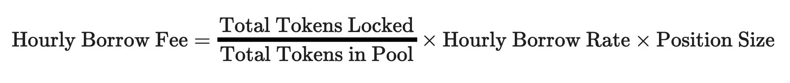

<head>
    <title>Perps: Fees</title>
    <meta name="twitter:card" content="summary" />
</head>

There are 4 types of fees on Jupiter Perps:

1. A flat 0.06% (6bps) base fee, applied on notional position size.
2. A price impact fee, simulating the orderbook impact given notional size.
3. Borrow fee, paid hourly on open positions, based on notional size.
4. Transaction & Priority fee to create trade requests.

---

## Base Fees

A flat rate of **0.06%** of the position amount is charged when opening or closing a position. This base fee is also charged when a position is closed partially.

### Calculating Base Fees

Position size * 0.06% = Base Fee

<details>
    <summary>
        <div>
            <div>
                <b>Price Impact Fee Example</b>
            </div>
        </div>
    </summary>

```
BPS_POWER = 10^4      // 10_000

// 1. Get the base fee (BPS) from the JLP pool account's `fees.increasePositionBps` for open position requests
// or `fees.decreasePositionBps` for close position requests
// https://station.jup.ag/guides/perpetual-exchange/onchain-accounts#pool-account
baseFeeBps = pool.fees.increasePositionBps

// 2. Convert `baseFeeBps` to decimals
baseFeeBpsDecimals = baseFeeBps / BPS_POWER

// 3. Calculate the final open / close fee in USD by multiplying `baseFeeBpsDecimals` against the trade size
openCloseFeeUsd = tradeSizeUsd * baseFeeBpsDecimals
```

</details>

---

## Price Impact Fees

Large trades on the Jupiter Perpetuals exchange inherently incur no price impact since token prices are sourced from price oracles. While this is favourable for traders, it poses risks to the Jupiter Liquidity Pool (JLP).

1. Large, profitable trades can put stress on the liquidity pool’s reserves.
2. The platform becomes more vulnerable to potential order manipulation.

To address these risks, Jupiter Perpetuals implements a **price impact fee**. This fee is designed to simulate trading conditions in traditional exchanges, where larger orders typically experience more price slippage due to limited liquidity at each price level.


### Benefits of Price Impact Fees

1. **Trader Incentives:**
    
    The fee encourages traders to consider the size of their trades, where larger trades will incur higher price impact fees. Also, splitting large orders to smaller sizes can expose traders to price changes between updates from the oracle.
    
2. **Fair Compensation to JLP Holders:**
    
    JLP Pool receives trading fees, whether traders open large trades or split them up. This keeps the liquidity pool balanced and protects it from excessive depletion.
    
3. **Market Integrity:**
    
    The fee structure mimics traditional order book dynamics, where the fee is proportional to the impact a trade might have on the market, making the environment fairer for both traders and liquidity providers.

### Calculating Price Impact Fees


<details>
    <summary>
        <div>
            <div>
                <b>Price Impact Fee Example</b>
            </div>
        </div>
    </summary>

```
USDC_DECIMALS = 10^6  // 1_000_000
BPS_POWER = 10^4      // 10_000

Calculate Price Impact Fee:

// 1. Get the trade impact fee scalar from the custody account's `pricing.tradeImpactFeeScalar` constant
// https://station.jup.ag/guides/perpetual-exchange/onchain-accounts#custody-account
tradeImpactFeeScalar = custody.pricing.tradeImpactFeeScalar

// 2. Convert trade size to USDC decimal format
tradeSizeUsd = tradeSizeUsd * USDC_DECIMALS

// 3. Scale to BPS format for fee calculation
tradeSizeUsdBps = tradeSizeUsd * BPS_POWER

// 4. Calculate price impact fee percentage in BPS
priceImpactFeeBps = tradeSizeUsdBps / tradeImpactFeeScalar

// 5. Calculate final price impact fee in USD
priceImpactFeeUsd = (tradeSizeUsd * priceImpactFeeBps / BPS_POWER) / USDC_DECIMALS
```

</details>

---

## Borrow Fees

On the Jupiter Perpetuals exchange, traders can open leveraged positions by borrowing assets from the liquidity pool. Unlike other exchanges that charge funding rates, Jupiter Perps uses a borrow fee system. The borrow fees compound hourly based on the amount borrowed for the leveraged position.

:::caution Deducted from Collateral
Borrow fees are continuously accrued and deducted from your collateral. This ongoing deduction has two important consequences:

1. Your effective leverage increases over time as your collateral decreases.
2. Your liquidation price moves closer to the current market price.

It's crucial to regularly monitor your borrow fees and liquidation price. Failure to do so may result in unexpected liquidation, especially during periods of high market volatility or extended position duration.
:::

:::tip
The hourly borrow rates for JLP assets can be retrieved from the Borrow rate field of the Jupiter Perpetuals trade form or fetched onchain via the [custody account's `funding_rate_state.hourly_funding_dbps` field](../../docs/perp-api/custody-account#fundingratestate). Note that these rates represent the maximum charged at 100% utilization.
:::

### Benefits of Borrow Fees

1. **Compensation for Liquidity Pool:**

    Borrow fees compensate the JLP Pool for providing assets to traders. This ensures the pool remains healthy and can continue to support trading activity.

2. **Risk Mitigation:**

    Borrow fees act as a deterrent against excessive borrowing. By charging a fee for borrowing, the platform discourages traders from taking on excessive leverage, which could lead to significant losses.


The borrow fees are reinvested back into the JLP Pool, boosting its yield and liquidity. This also helps align the token mark price with its spot market price.

### Calculating Borrow Fees

The hourly borrow fee is calculated using the following formula:



| Term | Description |
|------|-------------|
| `Total Tokens Locked` | Tokens locked in all open positions |
| `Total Tokens in Pool` | Tokens deposited into the liquidity pool for the position's underlying token |
| `Utilization` | The proportion of tokens in the pool that are currently locked in open positions |
| `Hourly Borrow Rate` | The base rate charged for borrowing, which varies by asset |
| `Position Size` | The USD value of the leveraged position |

<details>
    <summary>
        <div>
            <div>
                <b>Calculating Utilization Rate</b>
            </div>
        </div>
    </summary>

To determine the current utilization rate, access the asset's [on-chain account](../../docs/perp-api/custody-account) and apply the following calculation:

```
// Calculate utilization percentage
if (custody.assets.owned > 0 AND custody.assets.locked > 0) then
    utilizationPct = custody.assets.locked / custody.assets.owned
else
    utilizationPct = 0

// Get hourly funding rate in basis points
hourlyFundingDbps = custody.fundingRateState.hourlyFundingDbps

// Convert basis points to percentage and apply utilization
hourlyBorrowRate = (hourlyFundingDbps / 1000) * utilizationPct
```

</details>

<details>
    <summary>
        <div>
            <div>
                <b>Hourly Borrow Fee Example</b>
            </div>
        </div>
    </summary>

For example, assume the price of SOL is **$100**. The SOL liquidity pool has **1,000 SOL** under custody and has lent out **100 SOL** (i.e, utilization is 10%). A trader opens a **100 SOL** position with an initial margin of **10 SOL**. The remaining **90 SOL** is borrowed from the pool to open the leveraged position. Assume that the hourly borrow rate for SOL is **0.012%**:

* `Position Size in SOL`: 100 SOL
* `Total Tokens Locked`: 100 SOL (position size) + 100 SOL (utilized SOL in pool) = 200 SOL
* `Total Tokens in Pool`: 1,000 SOL (existing custody) + 10 SOL (user collateral) = 1,010 SOL
* `Utilization`: 200 SOL / 1,010 SOL = 19.8%
* `Hourly Borrow Rate`:  0.012% (0.00012 in decimal format or 1.2 BPS)

Calculation:

```
Hourly Borrow Fee = (200 / 1010) * 0.00012 * 10000 = 0.238
```

This means your position will accrue a borrow fee of $0.238 every hour it remains open.

</details>

<details>
    <summary>
        <div>
            <div>
                <b>How does the Jupiter Perpetuals contract calculate borrow fees?</b>
            </div>
        </div>
    </summary>

Due to Solana's blockchain architecture, calculating funding fees in real-time for each position would be computationally expensive and impractical. Instead, the Jupiter Perpetuals contract uses a counter-based system to calculate borrow fees for open positions.

The pool and position accounts maintain two key fields:

* The pool account maintains a global cumulative counter through its `fundingRateState.cumulativeInterestRate` field, which accumulates funding rates over time
* Each position account tracks its own `cumulativeInterestSnapshot` field, which captures the global counter's value whenever a trade is made: when the position is opened, when its size is increased, when collateral is deposited or withdrawn, or when the position is closed

To calculate a position's borrow fee, the contract takes the difference between the current global funding rate counter and the position's snapshot, then multiplies this by the position size. This approach enables efficient on-chain calculation of borrow fees over a given time period without needing real-time updates for each position.

The example below demonstrates the borrow fee calculation:

```
// Constants:
BPS_DECIMALS = 4             // 10^4, for basis points
DBPS_DECIMALS = 5            // 10^5, decimal basis points for precision
RATE_DECIMALS = 9            // 10^9, for funding rate calculations
USD_DECIMALS = 6             // 10^6, for USD amounts as per the USDC mint's decimals

// Main calculation:
1. Get the cumulative funding rate from the pool account:
   cumulativeFundingRate = pool.cumulative_interest_rate

2. Get the position's funding rate snapshot:
   fundingRateSnapshot = position.cumulative_interest_snapshot

3. Get the position's funding rate interval:
   fundingRate = cumulativeFundingRate - fundingRateSnapshot

4. Calculate final borrow fee (USD):
   borrowFeeUsd = (fundingRate * position.size_usd) / (10^RATE_DECIMALS) / (10^USD_DECIMALS)
```

</details>

---

## Calculating Programmatically

This [code repository](https://github.com/julianfssen/jupiter-perps-anchor-idl-parsing/blob/main/src/examples/) contains the examples on calculating the different fees programmatically.

## References

Jupiter is working with experts like [Chaos Labs](https://www.chaoslabs.xyz/) and [Gauntlet](https://www.gauntlet.xyz/) to optimize and maintain a fair, safe and competitive environment by analyzing different fee structures and their impact on the exchange. Here are some of the references on the recommendations.

- [Jul 2024:Gauntlet's proposal and analysis on the price impact fee here](https://www.jupresear.ch/t/gauntlet-comprehensive-analysis-jupiter-perpetuals-price-impact-structure-implementation-and-proposed-adjustments/19127)

- [Aug 2024: Gauntlet's proposal and analysis on the borrow fee here](https://www.jupresear.ch/t/gauntlet-jupiter-perpetuals-optimization-borrowing-rate-reduction-and-competitive-analysis-vs-okx-and-bybit/21580)