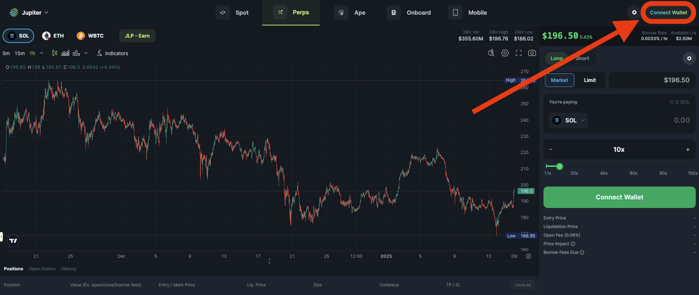
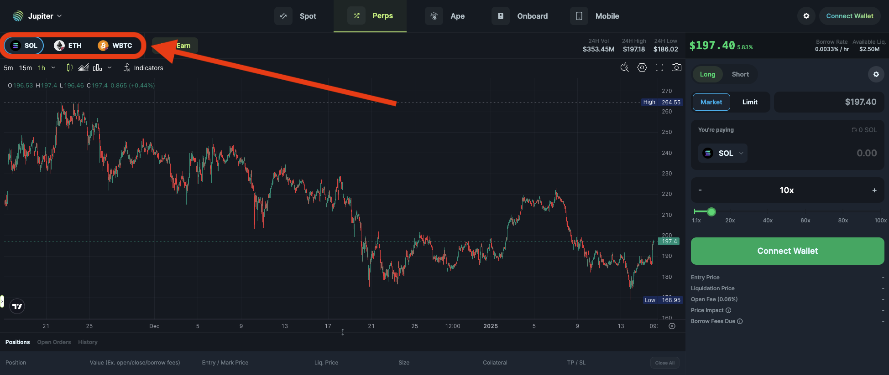
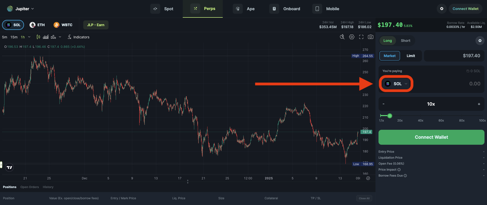
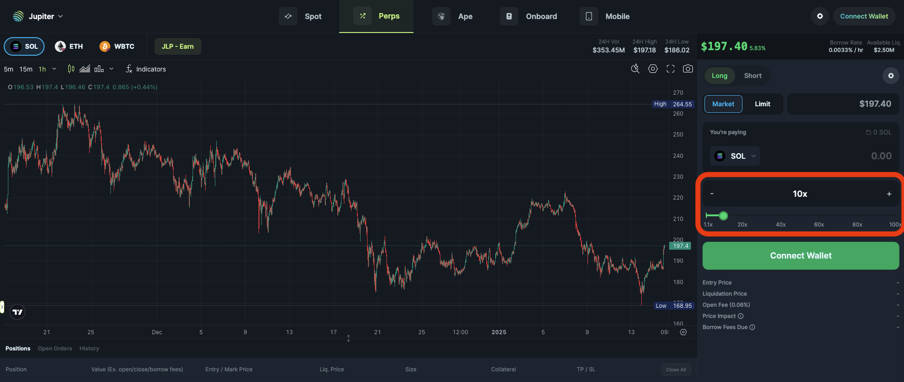
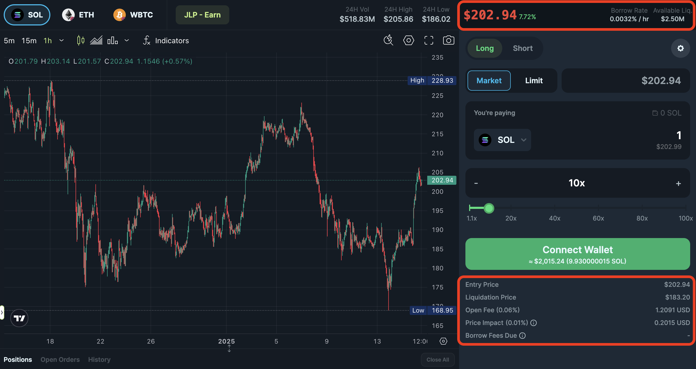
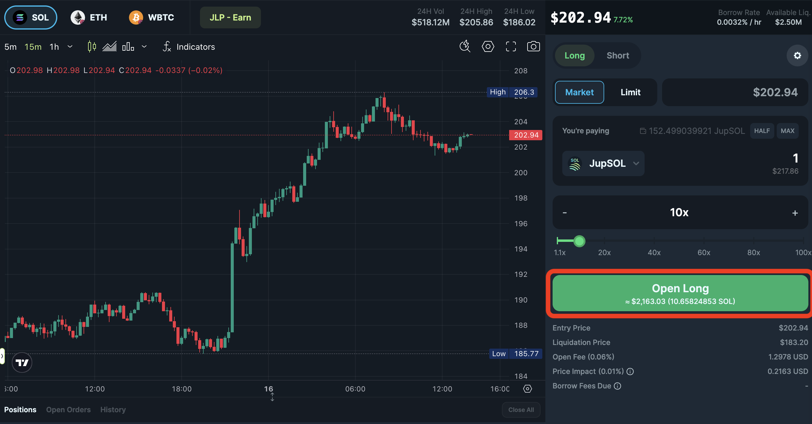

<head>
    <title>How to open position</title>
    <meta name="twitter:card" content="summary" />
</head>

Welcome to the world of Jupiter Perps, where trading gets fast, exciting, and packed with potentials! Whether you're looking to go long or short on top tokens like SOL, ETH, or wBTC, this guide will walk you through every step to master the platform.

---

:::tip Jupiter Perps V2
Check out the Jupiter Perps V2 at https://jup.ag/perps-v2 to trade with new features like Limit Orders, Gasless Orders and more!
:::

### Step 1: Connect Your Wallet

To begin trading on Jupiter Perps, head to the Jupiter Perps platform at https://jup.ag/perps and click on the **“Connect Wallet”** button in the top-right corner. From there, select your preferred Solana wallet, such as Phantom or Solflare, and approve the connection. Once connected, you’re ready to dive into the trading interface!

---

### Step 2: Select the Market

The next step is choosing the market you want to trade in. Using the **Perp Token Selector**, pick from the supported tokens: **SOL**, **ETH**, or **wBTC**. This defines the token for which you will open a leveraged long or short position on.

---

### Step 3: Choose Long or Short

Now it’s decision time! Use the **Long/Short Selector** to choose your position. Selecting **Long** means you believe the token’s price will rise, while **Short** indicates you expect the price to fall.

---

### Step 4: Set Your Collateral

After deciding your position, it’s time to set your collateral. In the **Input Token Selector**, choose the token you want to use as collateral for your trade and specify the amount you wish to use.

:::tip Any Solana Token
You can use any Solana token as collateral for your trade.

For example, you are opening a long position on SOL, you can use JUP as collateral for your trade.

Jupiter Swap will automatically convert JUP to SOL and use it as collateral for your trade.
:::

---

### Step 5: Adjust Leverage

With your collateral in place, use the **Leverage Slider** to set your desired leverage. You can choose anywhere from a modest **1.1x** to a maximum of **100x** leverage. Remember, higher leverage increases both potential rewards and risks, so adjust thoughtfully!

---

### Step 6: Review Position

Before opening your position, you can make use of details such as the borrow rate, available liquidity above the order form, or confirm your entry price, liquidation price and fees information. This will help you make an informed trading decision.

---

### Step 7: Submit Your Order

Whenever you are ready, click the **"Open Long"** or **"Open Short"** button to agree to the position details and create a transaction for your request. You’ll need to approve the transaction in your connected wallet. Once approved, your request is submitted and when it has landed and **confirmed** on the blockchain, only then your position is opened.

:::caution Always check your transactions
You can utilise blockchain explorers like [Solscan](https://solscan.io/) to check the status of your transaction.

If your position is not confirmed, but you have attempted to submit, it does not mean your position is opened.
:::

---

### Step 8: Monitor and Manage Your Position

After your trade is live, head to the **Positions Tab** to monitor it. Here, you can track real-time profit and loss (PnL), add or withdraw collateral, or add Take Profit or Stop Loss to your position. This tab ensures you stay updated and in control of your trades.

Refer to [How to manage your position](./how-to-manage-position) for more information.

---

### Step 9: Closing Your Position

When you’re ready to close your trade, go to the **Positions Tab** and select the position you wish to exit. You can choose to close it partially or fully based on your strategy. Confirm the closure and approve the transaction in your wallet to finalize the trade.

:::caution Always check your transactions
You can utilise blockchain explorers like [Solscan](https://solscan.io/) to check the status of your transaction.

If your request to close your position is not confirmed, but you have attempted to submit, it does not mean your position is closed.
:::

Refer to [How to close your position](./how-to-close-position) for more information.