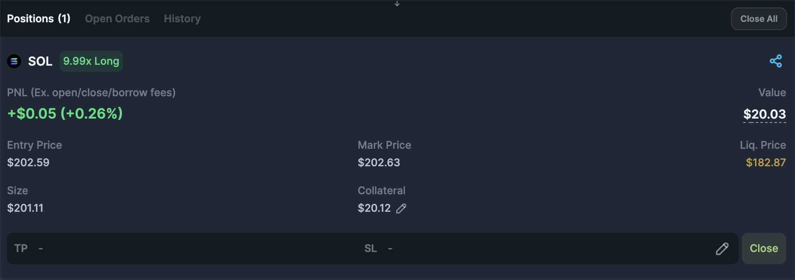
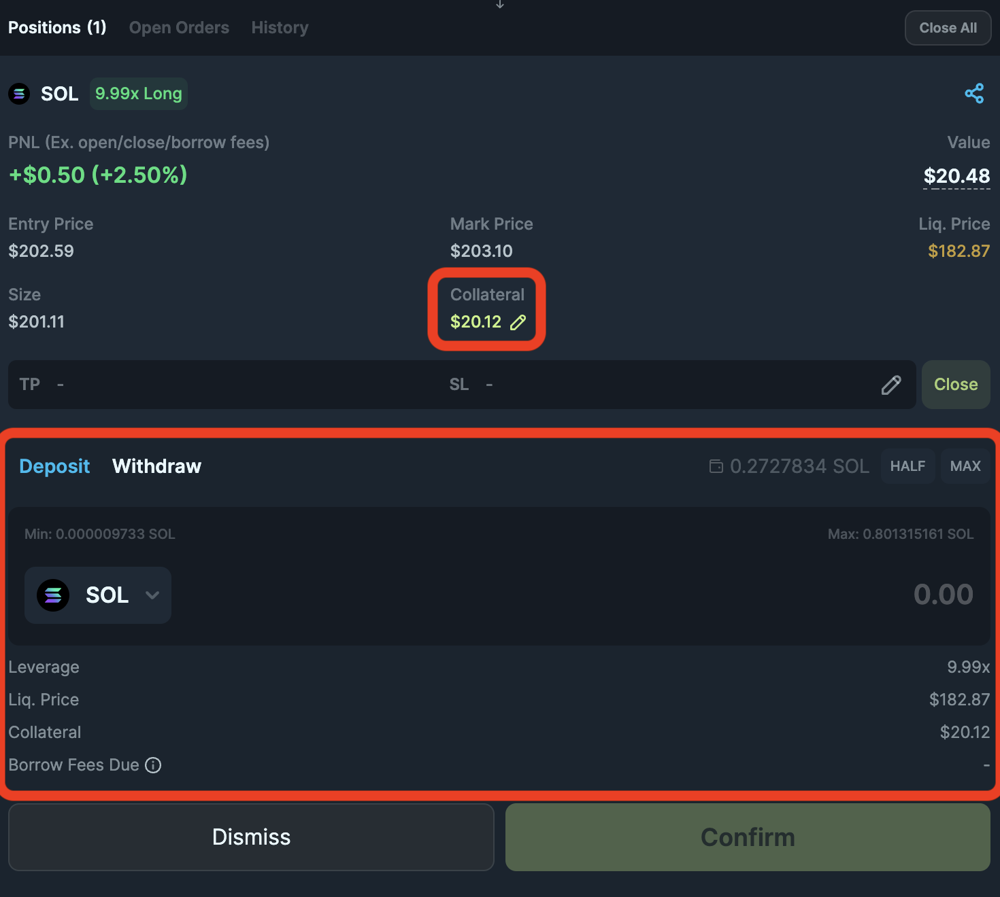
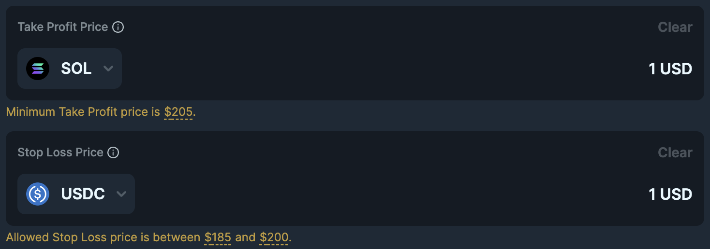
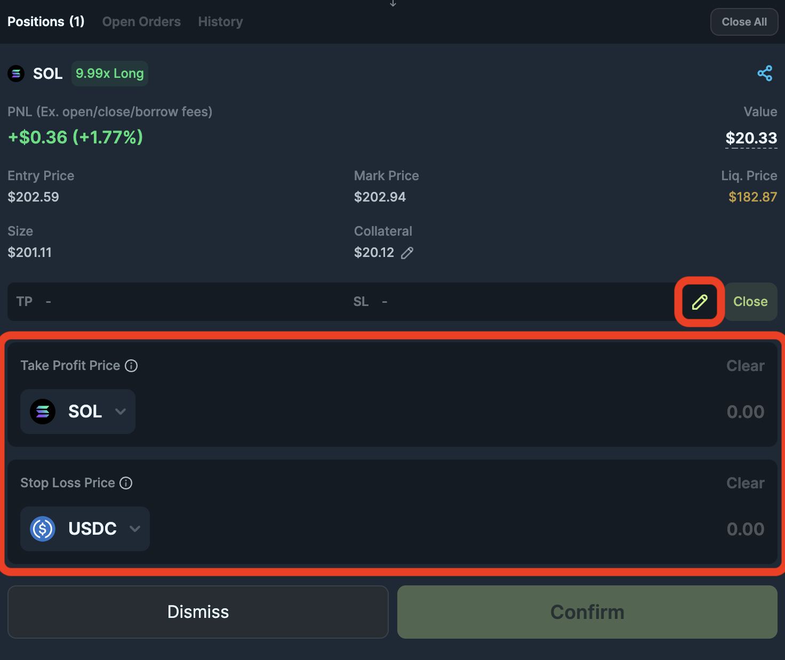

<head>
    <title>How to manage position</title>
    <meta name="twitter:card" content="summary" />
</head>

Now that you have [opened a position](./how-to-open-position), in this guide, we will show you how to manage your position.

---

## Position Details

After you have opened a position, you can view the details of your position by opening the Positions tab. In this tab, you can see the details of your position.

| Field | Description |
|-------|-------------|
| Market | The market you are trading on, SOL, ETH or wBTC. |
| Side | The side of the position, either long or short. |
| Leverage | The current leverage. |
| PNL | The profit or loss of the position.  (To include/exclude fees in PNL, navigate to the settings in Trade Form's top right corner to toggle on/off.) |
| Entry Price | The price at which you entered the position. |
| Mark Price | The current price of the market. |
| Liquidation Price | The price at which the position will be liquidated.  (The liquidation price is always changing as the market price fluctuates and your collateral is being used to pay for borrow fees to maintain the position.) |
| Size | The size of the position.  (Your collateral multiply by leverage.) |
| Collateral | The current amount of collateral in the position.  (Collateral is used to maintain the position by paying for borrow fees and is locked in the position until the position is closed.) |
| Take Profit Price | The price at which the position will be closed (used for taking profits). |
| Stop Loss Price | The price at which the position will be closed (used for stopping losses). |

:::tip How Trading Works
Refer to how trading works section in the documentation to learn more about how to better manage your position.
:::

---

## Managing Collateral

To manage your collateral, you can navigate your position's **"Collateral"** indicator and click on the **pencil icon** to edit the amount of collateral.

In the Collateral modal, you can see the current leverage, liquidation price and amount of collateral in the position in USD. By depositing or withdrawing collateral, you can visualise how it will impact your position.

:::caution Always check your transactions
You can utilise blockchain explorers like [Solscan](https://solscan.io/) to check the status of your transaction.

If your request to deposit/withdraw collateral is not confirmed, but you have attempted to submit, it does not mean your position is updated.
:::

---

## Managing Take Profit and Stop Loss

To manage your take profit price and stop loss price, you can navigate your position's **"Take Profit"** and **"Stop Loss"** indicator and click on the **pencil icon** to edit the price.

In the edit modal, you can see the current take profit price and stop loss price, manage them by editting the price fields.

:::tip Valid prices
For Take Profit price, you can only set a price higher than the entry price.

For Stop Loss price, you can only set a price lower than the entry price but higher than the liquidation price.

:::

:::caution Always check your transactions
You can utilise blockchain explorers like [Solscan](https://solscan.io/) to check the status of your transaction.

If your request to edit take profit or stop loss is not confirmed, but you have attempted to submit, it does not mean your position is updated.
:::

