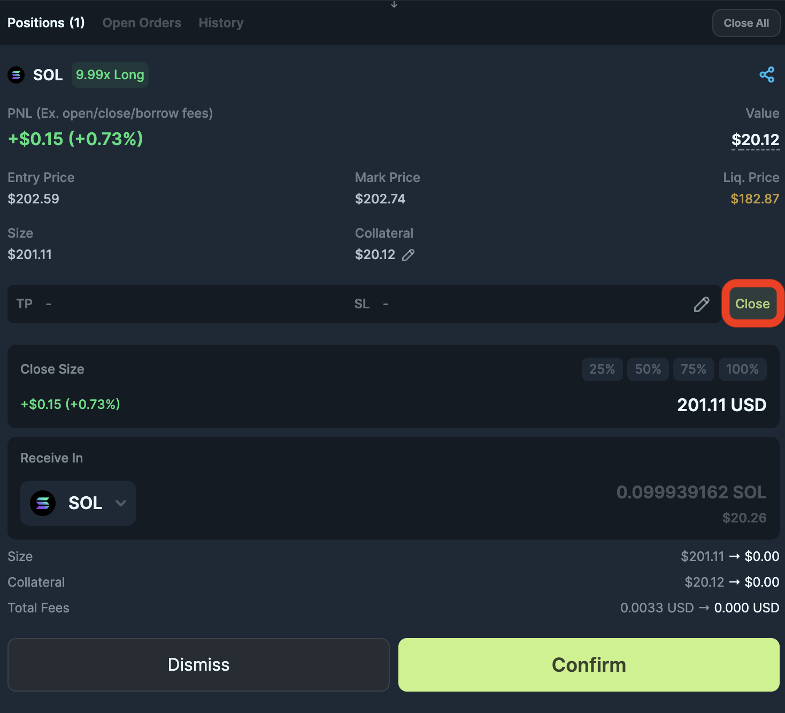
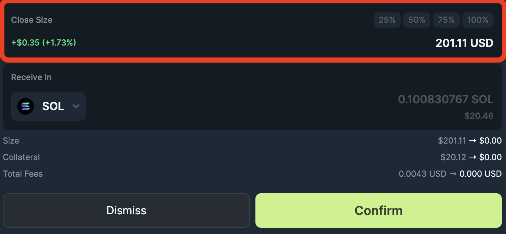
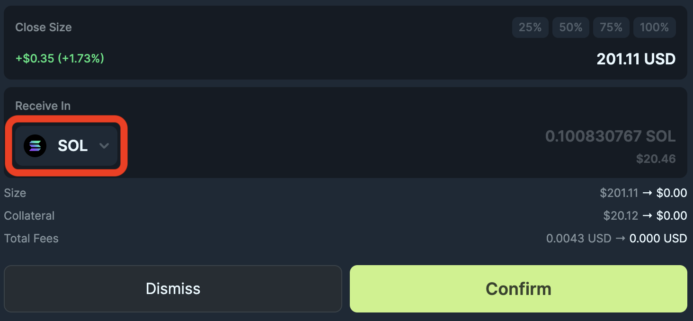
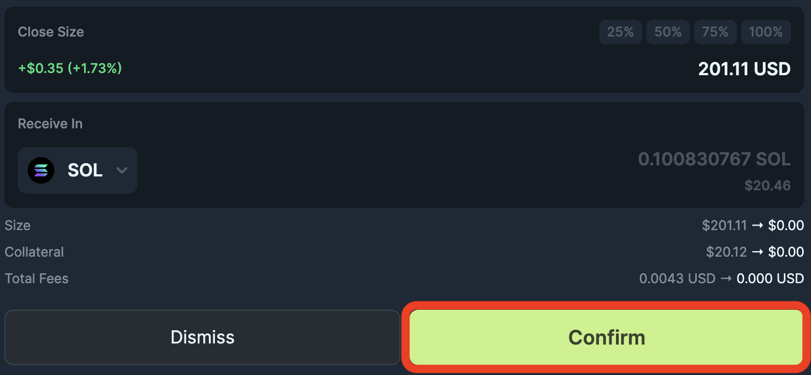

<head>
    <title>How to close position</title>
    <meta name="twitter:card" content="summary" />
</head>

In this guide, we will walk you through how to close your position on Jupiter Perps. Remember to always check your transactions on blockchain explorers like [Solscan](https://solscan.io/) to ensure your position is closed.

---

### Step 1: Navigate to Positions Tab

In the **Positions Tab**, select the position you want to close. Do take note of the position details to ensure you are closing the correct position.

### Step 2: Open Close Position Modal

In the position details, click on the **"Close"** button to open the close position modal. In this modal, you can see the current position details and the amount of collateral you will receive after closing the position.

Again, do take note of the position details to ensure you are closing the correct position.

### Step 3: Edit Close Size

You can edit the close size to close your position partially or fully.

:::tip Partial Close
If you choose to close your position partially, when you decide to open a new position in the same market, the current partially closed position will be combined with the new position, meaning you will only have 1 position for each market.

For example, if you have a 100 SOL position and you close 50 SOL. When you open a new position, the 50 SOL will be combined with the new position.
:::

### Step 4: Choose Token to Receive

You can choose which tokens you want to receive after closing the position. The collateral tokens will be swapped via Jupiter Swap to the token you choose.

### Step 5: Submit Transaction

After reviewing the position details, click on the **"Confirm"** button to agree to the details and create a transaction for your request. You’ll need to approve the transaction in your connected wallet. Once approved, your request is submitted and when it has landed and **confirmed** on the blockchain, only then your position is closed.

:::caution Always check your transactions
You can utilise blockchain explorers like [Solscan](https://solscan.io/) to check the status of your transaction.

If your request to close your position is not confirmed, but you have attempted to submit, it does not mean your position is closed.
:::

