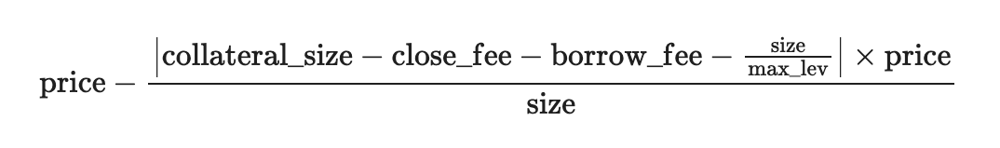

<head>
    <title>Perps: Liquidation</title>
    <meta name="twitter:card" content="summary" />
</head>

Liquidation is a mechanism that automatically closes a position when the trader's collateral is insufficient to maintain the position. On Jupiter Perps, keepers monitor the liquidation price and automatically close positions when the price falls below the liquidation price.

If you face any issues, please reach out to us on [Discord](https://discord.gg/jup).

---

:::caution Fluctuating Liquidation Price
It's crucial to note that the liquidation price is subject to change over time, particularly positions with leverage exceeding 10x and positions held across a long period of time, accumulating borrow fees.

To mitigate the risk of liquidation:
1. Collateral adjustments and leverage fine-tuning can be performed through the `Edit` button in the position row.
2. Regularly monitor your liquidation price.
:::

## Long

Liquidation for long positions occurs when the current token price falls below the liquidation price.

For example, if the liquidation price is $90, the long position will be closed if the token's price drops to $90 or lower.

## Short

Liquidation for short positions occurs when the current token price rises above the liquidation price.

For example, if the liquidation price is $110, the short position will be closed if the token price rises to $110 or higher.

## Calculating Liquidation Price

The liquidation price can be calculated with the following formula.

| Variable | Description |
|----------|-------------|
| `price` | The average price (USD) of the position |
| `collateral_size` | The collateral size (USD) for the position |
| `close_fee` | The fee (USD) charged for closing the position |
| `borrow_fee` | The accumulated borrowing fees (USD) for maintaining a leveraged position |
| `size` | The size (USD) of the position |
| `max_lev` | The maximum allowed leverage (**500x** is the maximum allowed leverage in the Jupiter Perpetuals exchange for now) |

**For long positions**

**For short positions**

