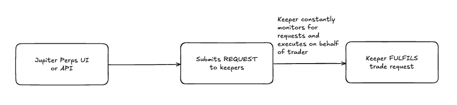

<head>
    <title>Perps: Keeper</title>
    <meta name="twitter:card" content="summary" />
</head>

Jupiter Perpetual Exchange operates using a request fulfilment model to create and execute trade requests.

---

The process for executing a typical trader action involves two key steps:

1. The **trader** submits a **request** to our backend via API.
2. The **keeper** monitors the request, then validates and **executes** it on-chain.

:::note What is a keeper?
Keepers are offchain services that listen to events and perform actions based on it. They enable automatic and timely execution of trade requests without manual intervention.
:::

## Create trade request

A trader can perform the following actions on the Jupiter Perpetuals exchange.

- Open position
- Close position
- Increase position size
- Decrease position size / close partial position
- Deposit collateral
- Withdraw collateral
- Create take profit (TP) / stop loss (SL) order
- Edit TP / SL order
- Close TP / SL order

The trader performs the actions above through the Jupiter Perpetuals platform or via the API. The frontend or API server then verifies the action and submits a request to keepers to execute the action on-chain.

For example, if the trader created an open position request, the request would contain data such as the trade size, collateral size, position side, and other data required to fulfil the request and ultimately the keeper would open the position on-chain.

## Fulfil trade request

Jupiter hosts keepers that monitors for trade requests. Once a trade request is fetched by a keeper, it verifies the trade request before creating and submitting the transaction to execute the trade on-chain.

The request is executed **only** when the transaction succeeds and is confirmed by the Solana blockchain. This means, for every trade requests, you do not need to pay for transaction fees, as the keeper will pay for it, making the Jupiter Perpetuals exchange a **zero-fee** exchange.

## Frequently Asked Questions

### Is the keeper open source?

No, the keeper is not open source. However, our keepers are audited and are tested extensively before they're deployed.

### Can I host my own keeper?

We do not allow community members to run their own keepers at the moment. As mentioned above, our keepers are audited and tested extensively so they're able to execute trade requests reliably.

### Where do I see the keeper accounts?

We currently run two keepers:

- https://solscan.io/account/A2rCQdCqQB4wu72x9Q7iq1QugtdZmcyWsiSPfgfZzu2u
- https://solscan.io/account/DFZcDnmEYNUK1khquZzx5dQYiEyjJ3N5STqaDVLZ88ZU
