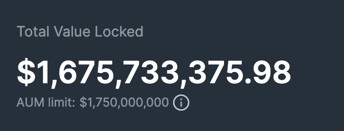

<head>
    <title>JLP Economics</title>
    <meta name="twitter:card" content="summary" />
</head>

In this section, we will discuss the economics of JLP and understand how it works.

---

## Custodies

The JLP Pool manages several custodies (tokens) for liquidity providers.

- SOL: [7xS2gz2bTp3fwCC7knJvUWTEU9Tycczu6VhJYKgi1wdz](https://solscan.io/account/7xS2gz2bTp3fwCC7knJvUWTEU9Tycczu6VhJYKgi1wdz)
- ETH: [AQCGyheWPLeo6Qp9WpYS9m3Qj479t7R636N9ey1rEjEn](https://solscan.io/account/AQCGyheWPLeo6Qp9WpYS9m3Qj479t7R636N9ey1rEjEn)
- BTC: [5Pv3gM9JrFFH883SWAhvJC9RPYmo8UNxuFtv5bMMALkm](https://solscan.io/account/5Pv3gM9JrFFH883SWAhvJC9RPYmo8UNxuFtv5bMMALkm)
- USDC: [G18jKKXQwBbrHeiK3C9MRXhkHsLHf7XgCSisykV46EZa](https://solscan.io/account/G18jKKXQwBbrHeiK3C9MRXhkHsLHf7XgCSisykV46EZa)
- USDT: [4vkNeXiYEUizLdrpdPS1eC2mccyM4NUPRtERrk6ZETkk](https://solscan.io/account/4vkNeXiYEUizLdrpdPS1eC2mccyM4NUPRtERrk6ZETkk)

:::info Custody Account
More info on the Custody account is explained in the [developer documentation](../../docs/perp-api/custody-account).
:::

### Assets Under Management

The AUM for each `Custody` account in the pool is calculated differently for stable and non-stable tokens.

The [Earn page](https://jup.ag/perps-earn) provides a simplified quick overview of the pool's AUM, however, it does not account for the traders' unrealized PnL and only shows the `owned` value in USD.

To calculate the JLP Pool's true AUM, follow these steps.

<details>
    <summary>
        True AUM Calculation
    </summary>

#### Stable Tokens

<br />


<br />

#### Non-Stable Tokens

To calculate the AUM for non-stable tokens, we need to factor in the global short position's profits or losses.

1. **Calculate the global short position's profits or losses (Unrealised PnL in USD)**

<br />


<br />

:::tip
If `current_price` > `global_short_average_prices`, traders are losing on short positions.
:::

2. **Calculate the Net Asset Value (NAV)**

<br />


<br />


<br />

:::info
The `guaranteed_usd` value in each `Custody` account represents an estimate of the total size of all long positions. It is only an estimate as `guaranteed_usd` is only updated when positions are updated (i.e. opening / closing positions, updating collateral). It does not update in real-time when asset prices change.

`guaranteed_usd` is used to calculate the pool's AUM as well as the overall PnL for all long positions efficiently.
:::

3. **Calculate the AUM**

If traders are losing on short positions, the losses are added to the pool's AUM.

Otherwise, trader's profits are deducted from the pool's AUM.

<br />


<br />


<br />

#### Total AUM

The Total AUM is then calculated as the sum of all the custodies' AUM.

<br />


</details>

:::info Fetch True AUM Programmatically
You can also fetch the true AUM programmatically using this [code snippet](https://github.com/julianfssen/jupiter-perps-anchor-idl-parsing/blob/main/src/examples/get-pool-aum.ts).
:::

### AUM Limit

Usually, users can mint new JLP or redeem (burn) them at the Virtual Price. However, when the AUM limit is hit, new minting of JLP is disabled to cap the amount of TVL in the pool.

When this happens, the demand for JLP on the market usually leads to a premium for JLP compared to the virtual price.

You may sell your JLP for the Market Price at any time. If the Market Price is below the Virtual Price, your JLP tokens are redeemed (burned) at the virtual price instead of the market price.

#### Virtual Price

<br />


<br />

#### Market Price

<br />


<br />

:::tip
You can view the current TVL and AUM Limit on the [Earn page](https://jup.ag/perps-earn).


:::

:::info Calculate JLP Virtual Price Programmatically
You can also calculate the JLP Virtual Price programmatically using this [code snippet](https://github.com/julianfssen/jupiter-perps-anchor-idl-parsing/blob/main/src/examples/get-jlp-virtual-price.ts).
:::

### Global Unrealised PnL

#### Unrealised PnL for Longs

The most accurate way to calculate the unrealized PnL for all open long positions is to loop through all open positions (by fetching them from onchain accounts) and use the unrealized PnL calculation shown in [calculating unrealized PnL](./position-management##calculating-realized-and-unrealized-pnl).

To get an estimate of the global unrealized PnL for longs, you can use the following calculation.

<details>
    <summary>
        Estimated Unrealised PnL for Longs
    </summary>

```
// 1) Get the custody account you're interested in calculating unrealized PnL for longs
// https://station.jup.ag/guides/perpetual-exchange/onchain-accounts#custody-account

// 2) Get the `assets.guaranteedUsd` field which stores the value of `position.sizeUsd - position.collateralUsd` for
// all open long positions for the custody. Note that a position's `sizeUsd` value is only updated when a trade is made, which
// is the same for `guaranteedUsd` as well. It does *not* update in real-time when the custody's price changes

guaranteedUsd = custody.assets.guaranteedUsd

// 3) Multiply `custody.assets.locked` by the custody's current price to get the USD value of the tokens locked 
// by the pool to pay off traders' profits

lockedTokensUsd = custody.assets.locked * currentTokenPriceUsd

// 4) Subtract `guaranteedUsd` from `lockedTokensUsd` to get the estimate of unrealized PnL for all open long positions. Note that
// the final value is greater than the actual unrealized PNL as it includes traders' collateral

globalUnrealizedLongPnl = lockedTokensUsd - guaranteedUsd
```
</details>

#### Unrealised PnL for Shorts

The custody accounts store a `global_short_sizes` value that stores the USD value of all open short positions in the platform. The `global_short_average_prices` value stores the average price (USD) for all open short positions and is used together with `global_short_sizes` to get an estimate of the global unrealized PnL for shorts, as shown below.

```
globalUnrealizedShortPnl = (custody.assets.globalShortSizes * (|custody.assets.globalShortAveragePrices - currentTokenPriceUsd|)) / custody.assets.globalShortAveragePrices)
```

## Yield

The JLP token adopts a growth-focused approach, similar to accumulating ETFs like VWRA or ARKK. Rather than distributing yield through airdrops or additional token mints. The JLP token's value is designed to appreciate over time and it is driven by the growth of the JLP pool's AUM, which is used to derive the virtual price.

Similarly, ETFs reinvist dividends, the JLP Pool also reinvests 75% of all fees generated from Jupiter Perpetuals trading, token swaps, and JLP minting/burning into the JLP pool. This reinvestment strategy compounds the pool's liquidity, steadily increasing the JLP token's price and intrinsic value. The remaining 25% is allocated to Jupiter as protocol fees, supporting ongoing development and maintenance.

## Exposue

The intrinsic value of the JLP token is linked to the price movements of the liquidity pool's underlying tokens (SOL, ETH, BTC, USDC, and USDT). As a JLP holder, your portfolio is exposed to market movements, particularly to the performance of the non-stablecoin tokens: SOL, ETH, and BTC. If these tokens decrease in price, the value of your JLP position will likely decrease as well.

The JLP usually outperforms its underlying assets during sideways or bearish market conditions since traders often struggle to be profitable in bear markets. However, during strong bull markets, the situation can reverse. Traders may open more long positions which can lead to trader profitability at the expense of JLP holders.

To navigate market fluctuations, JLP investors have two primary strategies:

- **Time the market**: Attempt to exit JLP positions before or during bullish trends.
- **Hedging**: Maintain JLP holdings for yield while implementing hedges against the underlying assets in the pool. This approach aims to mitigate downside risk during adverse market movements.
