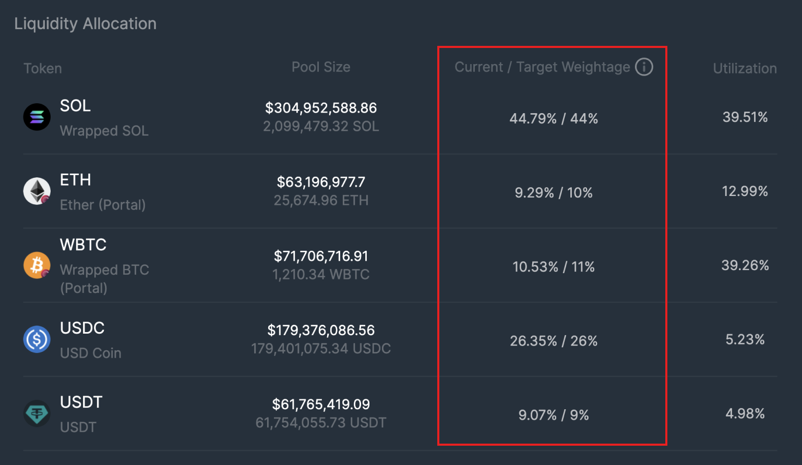
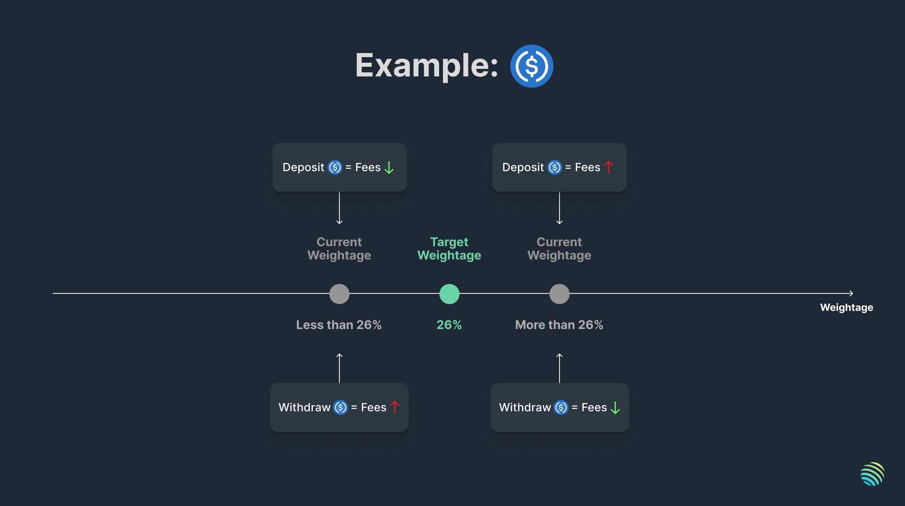

<head>
    <title>Pool Weightage</title>
    <meta name="twitter:card" content="summary" />
</head>

In the JLP Pool, each asset is assigned a target weight, which is set by the team.

---

## Managing Pool Weightage

Jupiter is working with [Chaos Labs](https://chaoslabs.xyz/) and [Gauntlet](https://gauntlet.xyz/) to conduct regular risk assessments and market analyses in response to the evolving market conditions. These assessments are also discussed with the community before they are presented to the team for deployment.

:::info
The risk assessments can be found at https://www.jupresear.ch/tag/risk.
:::

## Maintaing Target Weight

The weightages of each asset in the JLP Pool will differ based on market activity, particularly spot trading or deposit and withdrawal of assets into JLP Pool. To help maintain the Target Weight, JLP dynamically sets a Swap Fee or Mint/Redeem Fee.

**USDC Example**

- Current weightage of USDC is **higher** than its advised target weightage.

    USDC deposits into the JLP Pool will incur additional fees, while USDC withdrawals will receive a fee discount.

- Current weightage of USDC is **lower** than its advised target weightage.

    USDC deposits into the JLP Pool will receive a fee discount, while USDC withdrawals will incur additional fees.

Simply put, transactions that shift an asset’s current weightage further away from the target weightage incur additional fees while transactions that shift it closer to the target weightage will receive a discount on fees. This is based on the fee incurred when minting or burning JLP during the swap.

This allows JLP to maintain its target weight as liquidity providers are incentivized to maintain the target weightage amid high volumes of spot trading or deposit/withdrawal activity.

## Failsafe Mechanism

> How far can the current weightage of an asset deviate from its target weightage?

An asset’s current weightage can deviate from its target weightage by a maximum of 20% of the target weightage value.

**Example**

- If the advised target weightage of **USDC** in the JLP pool is **26%**, the current weightage of the asset in the JLP pool can deviate between a range of **20.8% (-20%) and 31.2% (+20%)**.
    - USDC cannot be **deposited** into the pool if the current weightage goes above **31.2%**.
    - USDC cannot be **withdrawn** from the pool if the current weightage goes below **20.8%**.

This means that during a Black Swan event where a JLP asset depegs, the maximum loss is `Target Weight * 1.2`.
