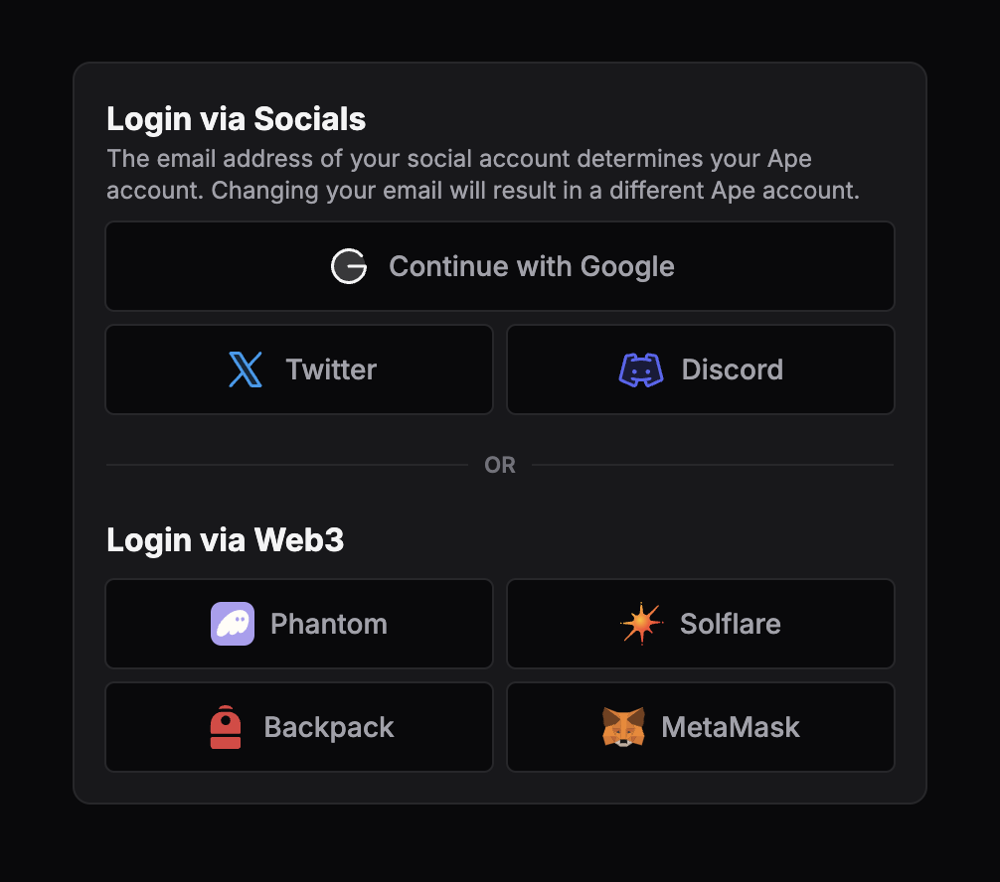
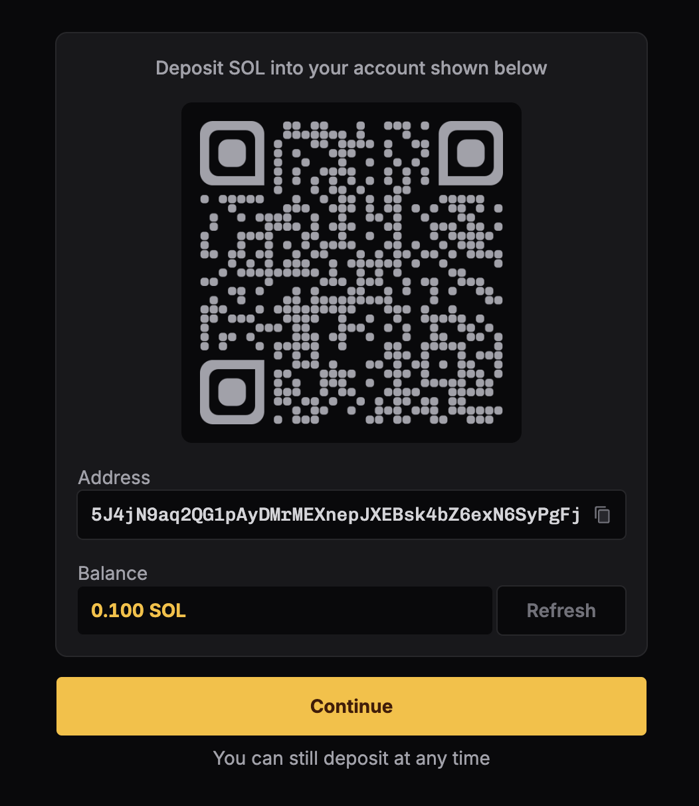
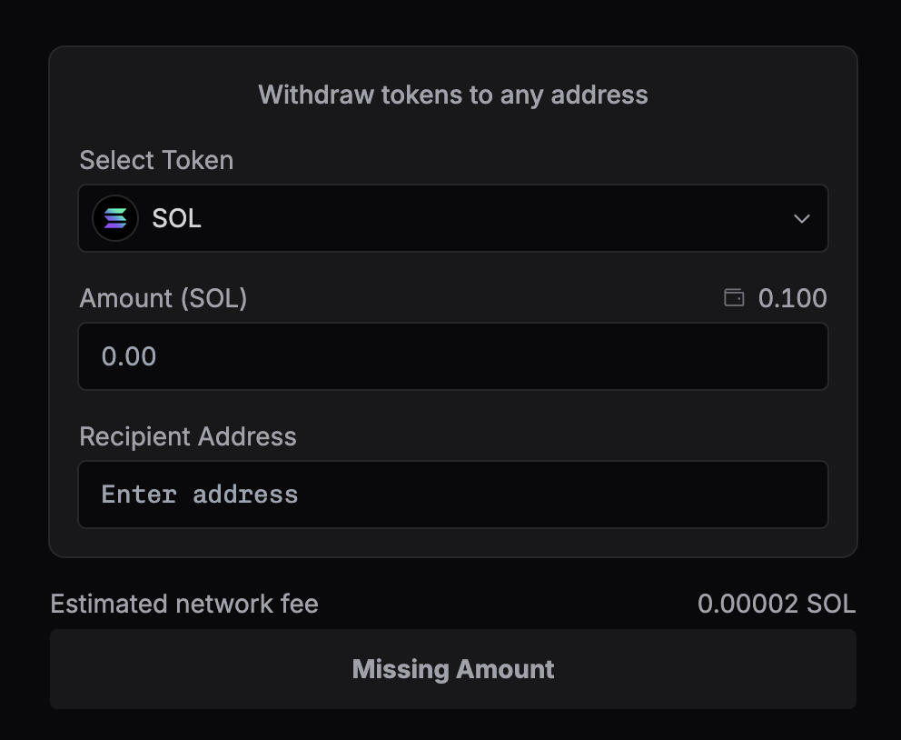

<head>
    <title>Ape Pro: Account Set Up</title>
    <meta name="twitter:card" content="summary" />
</head>

Ape Pro supports both social logins and web3 methods. They are seamless and secure, allowing you to deposit funds and trade with ease.

---

## Login

Head over to (top right corner of the page) the **"Login"** button, which will open up the Login page. From there, simply select your preferred login method and the account will be created.

You can either use social logins or web3 wallets to login.

:::caution
You will need to know the passwords or seed phrase/private key to your login method.

Please save them securely and do not share them with anyone.
:::

:::note 1 Login Method = 1 Ape Account
There is currently no way to link multiple login methods to an account. Each login method is an entirely separate Ape Account.

Additionally, the email address of your social account determines your Ape Account. Changing your email will result in a different Ape Account.
:::

## Account Activation

To begin trading, you need to activate your account, simply by depositing a minimum of 0.1 SOL into your Ape Account.

You can find your Ape Account address in 2 places.

1. **Profile page**: Click on the wallet icon at the top right corner and navigate to the deposit section.
2. **Deposit page**: The deposit address can be found here. Use this address to add funds into your Ape Account. (Or if you are logging in for the first time, we will automatically prompt you to deposit 0.1 SOL)

## Deposit Funds

To deposit funds, you will need to use your Ape Account's address and send SOL to it.

1. Copy the Ape Account's address from the Profile or Deposit page.
2. Depending on where your funds are coming from, for example:
    - If you are depositing from a Solana wallet like Backpack, Phantom or Solflare, you can use a Solana wallet to send SOL to your Ape Account.
    - If you are depositing from a centralised exchange, you can use their deposit function to send SOL to your Ape Account.
    - If you are depositing from another blockchain, you can use a bridge to send SOL to your Ape Account.

Once deposited, your Ape Account will be activated and displayed with the SOL you transferred. You can now begin aping!

## Withdraw

1. Select the wallet on top right.
2. Go to **Withdraw**.
3. Select which token you want to withdraw.
4. Enter the amount.
5. Enter the recipient address.

:::tip
Ape Pro supports withdrawal of all the tokens in your wallet.
:::

:::note Exporting Private Key
While you own the private key to the Ape Account, the platform is currently restricting access to exporting the private key. As current wallet providers like Phantom and Solflare do not support this, and this will cause more user confusion than good, hence the restriction.
:::

