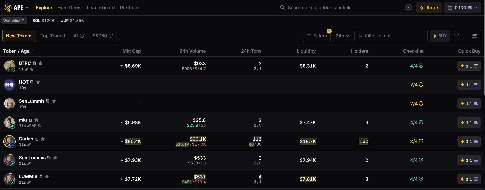
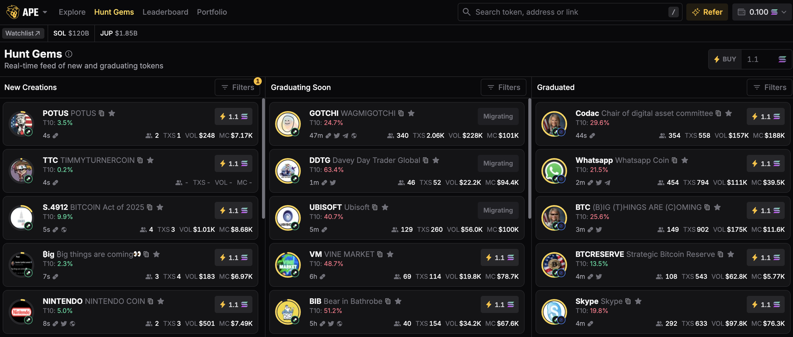
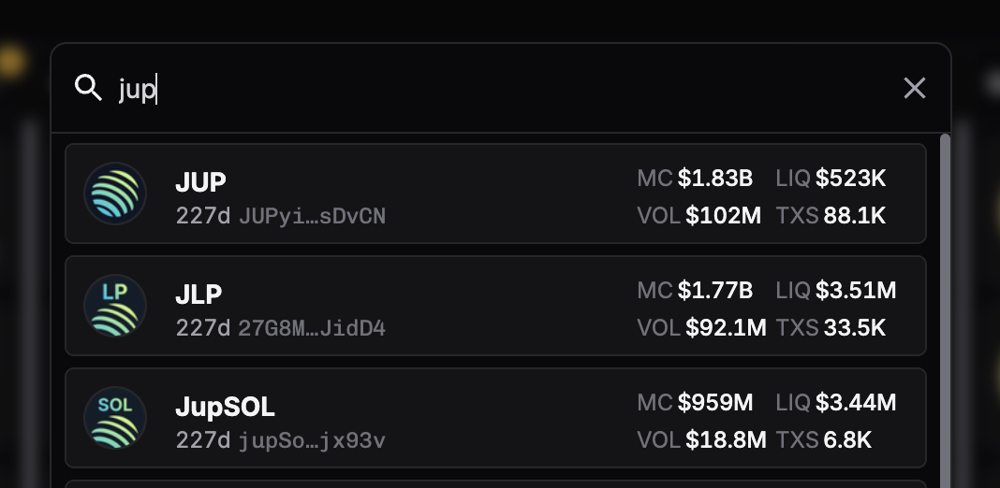

<head>
    <title>Ape Pro: Discovery Feeds</title>
    <meta name="twitter:card" content="summary" />
</head>

Solana memecoins and markets are booming and fast moving, Ape Pro gives an edge to all traders, offering a range of tools to help you discover new tokens and make informed trading decisions.

---

## Explore Feed

The Explore Feed categorises tokens to make discovery simple and efficient.

- **New Tokens**

    Discover and buy tokens launched in the past 24 hours. Tokens are arranged by launch time, with the most recently launched token displayed first.

- **Top Traded**

    See the tokens with the highest trading volumes across the platform. Helps you identify tokens with the most market activity, ensuring liquidity and price movement.

- **AI/Agent Coins**

    Trending AI and agent-based tokens, reflecting the latest trends in the AI-powered crypto space. Includes tokens with significant attention in the AI sector, ideal for tech-focused investors.

- **S&P50 Tokens**

    Top 50 tokens categorised as "Surviving and Pumped-launched," indicating longevity where they are a PumpFun launched token but yet still surviving strongly. Ideal for users seeking tokens with this specific profile.

## Hunt Gems Feed

The Hunt Gems Feed is an advanced view of the new tokens feed, designed to help you take your token discovery to the next level. Hunt Gems Feed helps you identify tokens in specific profiles such as New Creations, Graduating Soon or Graduated tokens.

- **New Creations**

    Recently launched tokens in the last 24 hours with at least 1 liquidity pool.

- **Graduating Soon**

    Pump.fun tokens with 50% and above bonding curve progress.

- **Graduated**

    Pump.fun tokens with 50% and above bonding curve progress.

## Global Search

Click on the search icon in the top navigation bar, or press a designated keyboard shortcut (Ctrl+K or Cmd+K, “/”).

- **By Name or Symbol**

    Find tokens by their name or ticker symbol (e.g., "SOL" for Solana).

- **Contract Address (CA)**

    Search directly using the token’s mint address to get precise results.

## Discovery Interface

### Narrow Your Search

Ape Pro offers multiple features to help you filter and refine token discovery according to your strategy.

- **Filters**

    Apply filters to narrow down promising tokens based on your criteria. There are over 14 filters available and we have covered them in detail (revisit).

- **Timelines**

    Analyse metrics like Volume and Transactions over specific timeframes: 5 minutes, 1 hour, 6 hours, 24 hours.

- **Search tokens**
    
    Useful for further filtering tokens with specific tickers or names, or for finding if a token is part of this filtered list.

### Metrics

Ape Pro is for both beginners and advanced traders. All the tokens have the following details available at a glance to provide all types of traders with the information they need.

| Metric | Description |
|--------|-------------|
| Token | Name of the token. |
| Age | Time since the token was minted. |
| Links | Access essential links - Pumpfun, X, Telegram, Website (whichever is available). |
| Copy | Copy the token/mint address or "CA". |
| Add to watchlist | Add the token to your personal watchlist. |
| Market Cap | Circulating Supply multiplied by Current Price. |
| 24h Volume | The total trading volume of the token in the past 24 hours. The time window can be changed to 5 minutes, 1 hour, 6 hours, 24 hours. |
| 24h Transactions | The number of token transactions executed in the past 24 hours. The time window can be changed to 5 minutes, 1 hour, 6 hours, 24 hours. |
| Liquidity | The total amount of funds available in the token's liquidity pool for trading. |
| Holders | Number of unique wallet addresses holding the token. |
| Checklist | <li>Mint Authority: Shows if developers retain the ability to mint new tokens. Tokens with restricted minting capabilities are likely safer. Green check if the Mint Authority is disabled.</li> <li>Freeze Authority: Displays whether developers can freeze token accounts. A lack of freeze authority typically indicates higher security. Green check if the Freeze authority is disabled.</li> <li>Liquidity Pool Burned/Locked: Indicates the percentage of the liquidity pool that has been burned or locked. A Green Check is shown if more than 50% is burned or locked.</li> <li>Top 10 Holders: Shows the percentage of tokens held by the top 10 wallets. A Green Check appears if the top 10 holders own less than 15%, reducing the risk of price manipulation.</li> |

### Quick Buy

Every token in the Explore Feed interface has a **"Quick Buy"** button. This button allows you to buy the token directly from the feed.

- Of course, by design, there is no transaction signing needed, making your quick buys quicker.
- Instead of opening the detailed token page, you can buy directly from the feed.

:::info
Click on any token row in the Explore Feed to view its detailed token page with information such as real-time charts, transaction history, and more order options like Limit Order!

[Read the Token Profile guide for more information.](./token-profile-and-chart)
:::
