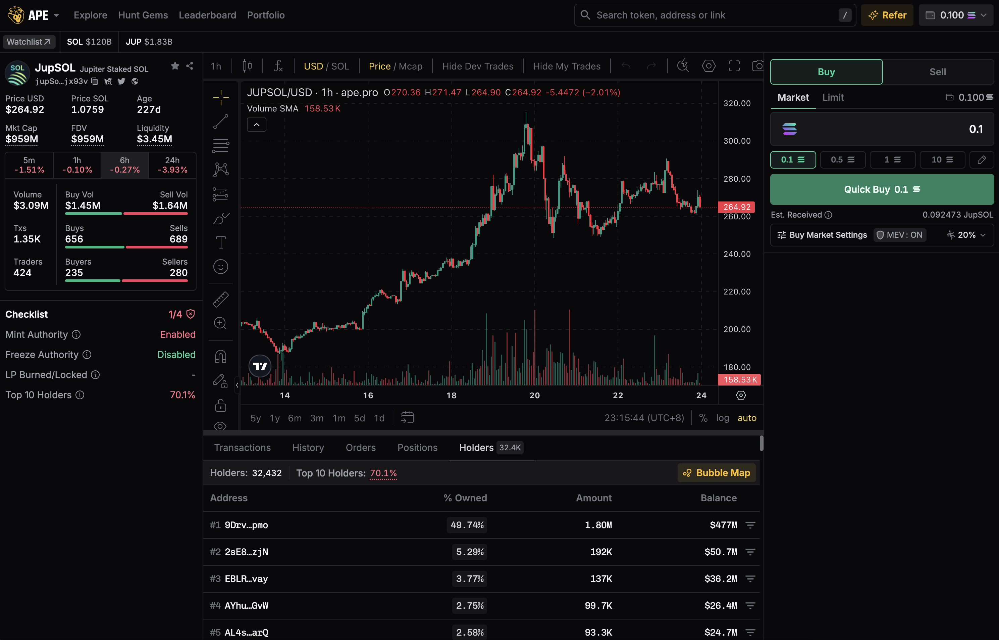

<head>
    <title>Ape Pro: Token Profile and Chart</title>
    <meta name="twitter:card" content="summary" />
</head>

Each token on Ape Pro has a dedicated profile page, offering detailed analytics and real-time charts to help users make data-driven decisions.

You can access this page by clicking on any token in the Explore Feed, Hunt Gems Feed or simply by searching for the token.

---

## Real-time Charts

This section provides real-time visual data to track token performance with prices and market cap movements

- **Show Price or Market Cap**
    
    Switch the charts by price or market cap based on your preference. Displays minute-by-minute or hour-by-hour movements for the token.

- **Quote Denomination**
    
    Toggle between USD and SOL denominations based on your preference.

- **Dev (Developer)Trades**
    
    Highlights on the chart whenever the token developer executes a buy or sell, providing transparency on developer activity.

## Transactions, History, Orders, Holders

Ape Pro provides details for monitoring token activity and personal trades.

### Transactions
    
View all recent trades involving the token, including type, volume, price and the wallet details. The transactions data are flowing in in real-time.

:::tip
Hover over the Transactions interface and the flow will be paused, allowing you to see the details of a specific transaction before it gets pushed to the bottom or out of the view.
:::

### History
    
View your Ape Account's trade history for the specific token, helping you keep track with ease.

### Orders
    
View all orders involving the token, including type, volume, price and the wallet details.

### Positions
    
Monitor your positions for the token, including amount bought and profits and losses.

### Holders
    
Access detailed insights into the token’s holder distribution, including percentages held by the wallets.

:::info
You can also view a bubble map view of the token's holders via **"Bubble Map"** button.
:::

## Token Details

The Token Details section provides essential information about a token’s underlying fundamentals.

| Metric | Description |
|--------|-------------|
| Price USD | Shows the current market price in USD. |
| Price SOL | Shows the current market price in SOL. |
| Age | Time since the token was launched. |
| Market Cap | Represents the total value of the token's circulating supply at the current market price (Circulating Supply multiplied by Current Price). |
| FDV | Fully Diluted Valuation is the valuation of the token assuming all possible tokens in its total supply are in circulation (Total Supply multiplied by Current Price). |
| Liquidity | The total amount of funds available in the token's liquidity pool for trading. Adequate liquidity reduces slippage and ensures smoother trades. |

The following metrics can be analyzed for different time windows (5 minutes, 1 hour, 6 hours, 24 hours).

| Metric | Description |
|--------|-------------|
| Volume | Total trading volume within the selected timeframe, split into Buy Volume and Sell Volume. |
| Transactions | Number of transactions during the selected time window, further divided into Buy Transactions and Sell Transactions. |
| Traders | Total number of unique wallets that traded the token during the timeframe, along with the split between Buyers and Sellers. |
| Bonding Curve Progress | Displays how far the token has progressed along its bonding curve, indicating how much supply remains available for issuance. |
| Token Mint | Token mint address is a unique blockchain address to identify the token, which is critical for verifying token authenticity. |
| Discussions on X | Ape Pro aggregates discussions about the token on platforms like X (formerly Twitter), giving insights into the token's popularity and virality. |
| Links | Links to important resources like Pump.fun, X, Telegram, and the token's official website. |
| Add to watchlist | Click to add the token to your personalized watchlist for quick access later. Your complete watchlist can be accessed here at https://ape.pro/watchlist. |
| Share | Copy the Token Profile page URL to share it easily with others. |

## Token Checklist

The Token Checklist helps users reduce risks by evaluating the token’s basic fundamentals. Each metric is highlighted in Red if it poses a risk or Green if it passes the basic safety checks.

| Metric | Description |
|--------|-------------|
| Mint Authority | Shows if developers retain the ability to mint new tokens. Tokens with restricted minting capabilities are maybe safer. Green check if the Mint Authority is disabled. |
| Freeze Authority | Displays whether developers can freeze token accounts. A lack of freeze authority typically indicates higher security. Green check if the Freeze authority is disabled. |
| Liquidity Pool Burned/Locked | Indicates the percentage of the liquidity pool that has been burned or locked. A Green Check is shown if more than 50% is burned or locked. |
| Top 10 Holders | Shows the percentage of tokens held by the top 10 wallets. A Green Check appears if the top 10 holders own less than 15%, reducing the risk of price manipulation. |

There are couple of more additional metrics also available to ensure that you know more details about the token.

| Metric | Description |
|--------|-------------|
| Dev (Developer) Address | The blockchain address associated with the token developer. |
| Dev Mints | The total number of tokens minted by the developer, helping users track potential minting abuse. |
| Info | A reminder to conduct thorough research, as meeting checklist criteria does not entirely eliminate risks. |

:::caution
A reminder to conduct thorough research, as meeting checklist criteria does not entirely eliminate risks.
:::
