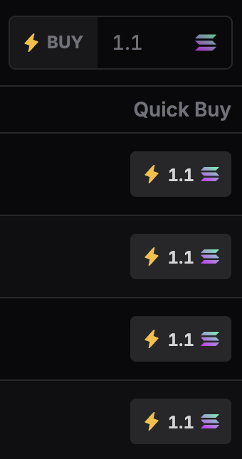
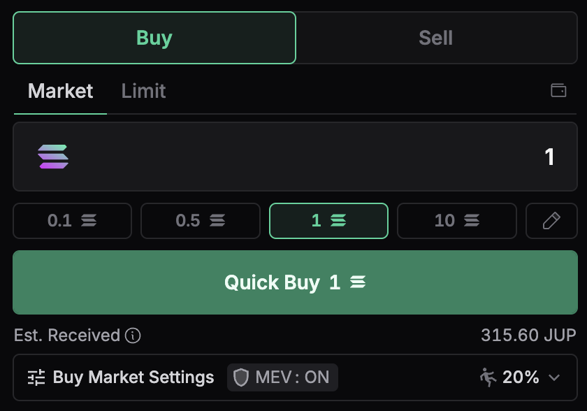
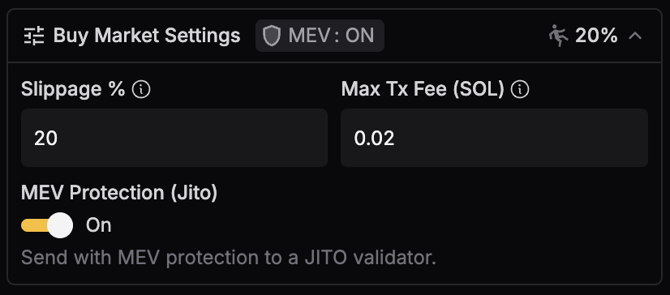
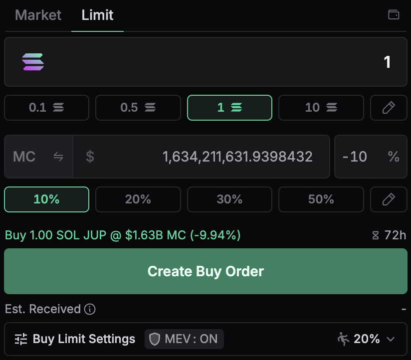
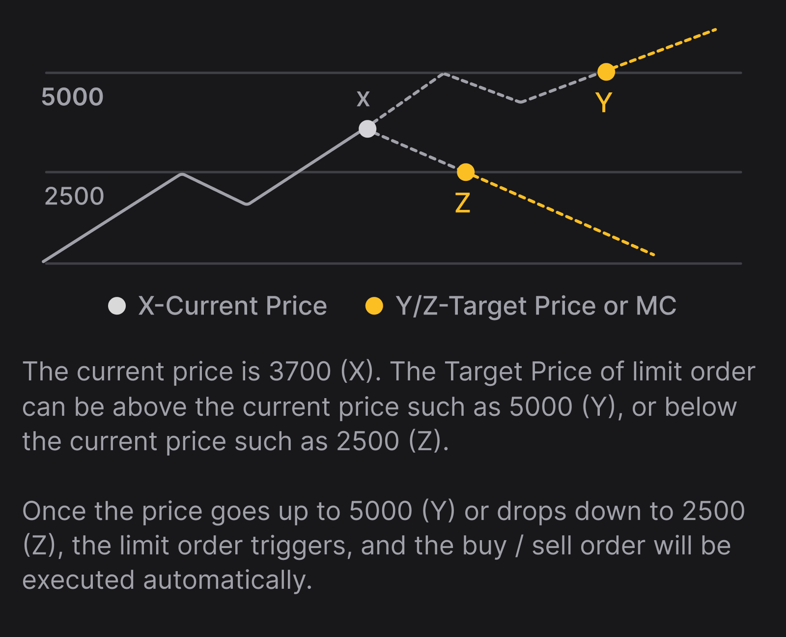

<head>
    <title>Ape Pro: Buying</title>
    <meta name="twitter:card" content="summary" />
</head>

Buying tokens on Ape Pro is easy and fast.

There are 3 ways to buy tokens on Ape Pro, Quick Buy from the New Tokens Feed or Hunt Gems Feed, Market Buy from Token Profile, and Limit Order from Token Profile.

---

## Quick Buy

You can buy tokens directly from the [Explore Feed](./feeds#explore-feed) or [Hunt Gems Feed](./feeds#hunt-gems-feed).

- Decide which token to buy with the relevant data and filters.
- Click on the **"Quick Buy"** button.
- And your tokens are bought (it has to succeed or confirmed on the blockchain to be bought)!

:::tip
You can customise how much your Quick Buy amounts are, by entering the amount in the **"BUY: ..."** field.
:::

:::info
Do note that Quick Buys are market buys, based on the current best price from Jupiter's routing engine.
:::

## Buy/ Sell

You can buy or sell tokens with more features to customise your orders.

- **Preset Amounts**

    You can preset different Quick Buy amounts and use them seamlessly.

- **Slippage Settings**
    
    You can set the slippage for your order. Your trades are MEV-Protected! You can set higher slippage for more volatile tokens, to increase the success rate of your APES!

- **Transaction Fee Settings**
    
    You can set the transaction fee for your order. Ape Pro intelligently calculates the transaction fee for you, you can set a max fee to prevent overpaying.

- **MEV Protection (Jito)**

    You can set the MEV Protection for your order (Default to ON). If turned on, your transactions will be sent to a Jito Validator to process.

## Limit Order

Ape Pro Limit Order (v1) allows users to set a Target Price / Market Cap (to be referred to interchangeably) for a trade to be automatically executed once pre-determined conditions are met. Once the order is placed, Ape Pro's Keeper will continuously monitor the target level and execute the swap when the market price reaches your specified price.

This allows you to APE with control over your price instead of being at the mercy of the market.

### Understanding Limit Orders

On Ape Pro, limit orders are executed as **market orders within a specified slippage tolerance** once certain price conditions are met. While you can input a target market cap as a reference, **the actual trigger for executing your order is the token's price**, not its market cap.

When you create your orders, **your MEV protection and slippage settings are saved** and will be applied when the target price is reached. Consequently, the success of your limit orders depends on whether sending transactions via RPC or Jito (MEV Protect) is most suitable under current market conditions.

### Types of Limit Orders

Ape Pro supports all 4 types of Limit Orders, allowing you to enter or exit at a specific price.

- **Take Profit**

    Sell a token when it hits your determined Target Price or Market Cap.

- **Stop Loss**

    Sell a token when it hits your determined Stop Loss Price or Market Cap.

- **Buy Dip**

    Buy a token when it hits your determined Buy Dip Price or Market Cap.

- **Buy Above**

    Buy a token when it hits your determined Buy Above Price or Market Cap.
